# 1장-HTTP개관

## 1.1 HTTP: 인터넷의 멀티미디어 배달부

- HTTP는 전 세계의 웹 서버로부터 대량의 정보를 빠르고, 간편하고, 정확하게 사람들의 PC에 설치된 웹브라우저로 옮겨준다
- HTTP는 신뢰성 있는 데이터 전송 프로토콜을 사용하기 때문에, 데이터가 지구 반대편에서 오더라도 전송 중 손상되거나 꼬이지 않음을 보장한다.
- 신뢰성 있는 전송은 인터넷 어플리케이션 개발자에게도 이롭다
  - HTTP 통신이 전송 중 파괴/중복/왜곡되는 것을 걱정하지 않아도 되기 때문이다.
  - 따라서 애플리케이션 고유의 기능 구현에 집중할 수 있다.

## 1.2 웹 클라이언트와 서버

- 웹 콘텐츠는 웹 서버에 존재한다.
- 웹 서버는 인터넷의 데이터를 저장하고, HTTP 클라이언트가 요청한 데이터를 제공한다.
- 클라이언트는 서버에게 HTTP 요청을 보내고 서버는 요청된 데이터를 HTTP 응답으로 돌려준다.

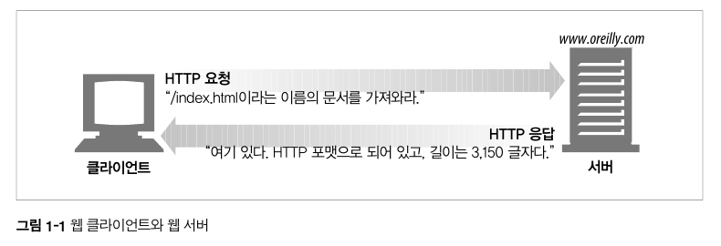

- 예를 들어 [`https://www.oreilly.com/index.html`](https://www.oreilly.com/index.html) 페이지를 열어볼 때,
  - 웹브라우저는 HTTP 요청을 [`https://www.oreilly.com`](https://www.oreilly.com) 서버로 보낸다.
  - 서버는 요청 받은 객체(이 경우 `/index.html`)을 찾고,
  - 성공했다면 그것의 타입, 길이 등의 정보와 함께 HTTP 응답에 실어서 클라이언트에게 보낸다.

## 1.3 리소스

- 웹 서버는 웹 리소스를 관리하고 제공한다.
- 웹 리소스는 텍스트 파일, HTML 파일, 이미지 등의 정적파일 뿐만 아니라 요청에 따라 콘텐츠를 생산하는 프로그램 즉, 동적 콘텐츠도 될 수 있다.

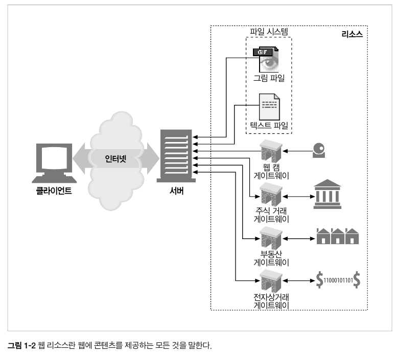

### 1.3.1 미디어 타입

- 인터넷은 수천 가지 데이터 타입을 다루기 때문에, HTTP는 웹에서 전송되는 객체 각각에 MIME 타입이라는 데이터 포맷 라벨을 붙인다.
- MIME(Multipurpose Internet Mail Extensions)
  - 클라이언트에게 전송된 문서의 다양성을 알려주기 위한 메커니즘
  - 웹에서 파일의 확장자는 별 의미가 없어 각 문서와 함께 올바른 MIME 타입을 전송하도록 서버에서 정확하게 설정하는 것이 중요함
  - **브라우저는 리소스를 내려받았을 때 해야할 기본 동작이 무엇인지 결정하기 위해 대게 MIME 타입을 사용함** ([MDN MIME 타입](https://developer.mozilla.org/ko/docs/Web/HTTP/Basics_of_HTTP/MIME_types))
  - 원래는 전자메일 시스템에서 메시지가 오갈 때 겪는 문제점을 해결하기 위해 설계
  - 이메일에서 잘 동작하여 HTTP에서도 멀티미디어 콘텐츠를 기술하고 라벨을 붙이기 위해 채택
- 웹 서버는 모든 HTTP 객체에 MIME 타입을 붙인다

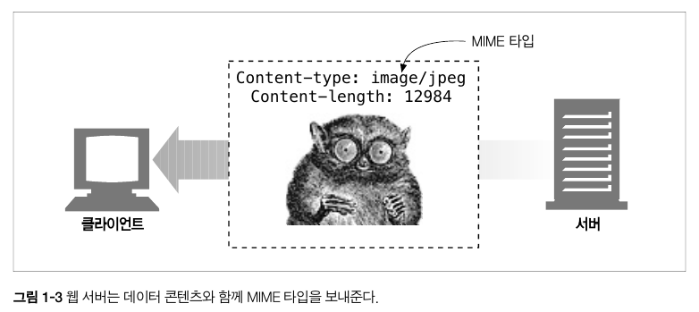

- MIME 타입 형식 및 예시

```
{primary object type}/{specific subtype}

text/html
text/plain
image/jpeg
image/png
audio/mpeg
audio/ogg
audio/*
video/mp4
application/octet-stream
...
```

### 1.3.2 URI

- 웹 서버 리소스는 각자 이름을 갖고 있기 때문에, 클라이언트는 그 리소스를 지목할 수 있다.
- 서버 리소스 이름은 URI(Uniform Resource Identifier, 통합 자원 식별자)라고 한다.
- URI는 리소스를 고유하게 식별하고 위치를 지정할 수 있다.

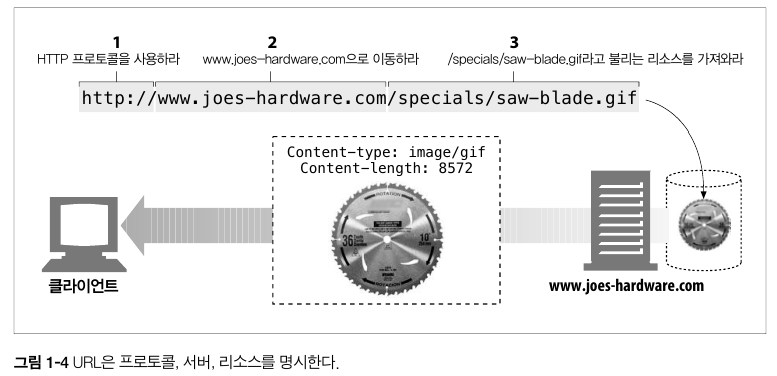

- URI는 URL과 URN 두가지가 있다

### 1.3.3 URL

- URL(Uniform Resource Locator, 통합 자원 지시자)은 특정 서버의 한 리소스에 대한 구체적인 위치를 서술한다.
- URL은 리소스가 정확히 어디에 있고 어떻게 접근할 수 있는지 분명하게 알려준다.

```
{scheme(protocol)}://{host}:{port}/{path}?{query param}

http://naver.com

http://news.naver.com/main/main.nhn?mode=LSD&mid=shm&sid1=104
...
```

### 1.3.3 URN

- URN(Uniform Resource Name, 통합 리소스 이름)은 콘텐츠를 이루는 한 리소스에 대해, 그 리소스의 위치에 영향 받지 않는 유일무이한 이름 역할을 한다.
- 위치 독립적인 URN은 리소스를 여기저기 옮기더라도 문제없이 동작한다.
- 리소스의 이름이 변하지 않는 한, 여러 종류의 네트워크 접속 프로토콜로 접근해도 문제없다.

```
예를 들어, URN은 인터넷 표준 문서 RFC2141 이 어디에 있거나 상관없이 그것을 지칭할 수 있다

urn:ietf:rfc:2141
```

## 1.4 트랜잭션

- HTTP 트랜잭션은 요청 명령(클라이언트에서 서버로 보내는)과 응답 결과(서버가 클라이언트에게 돌려주는)로 구성되어 있다.

```
HTTP 트랜잭션 = 요청 + 응답
```

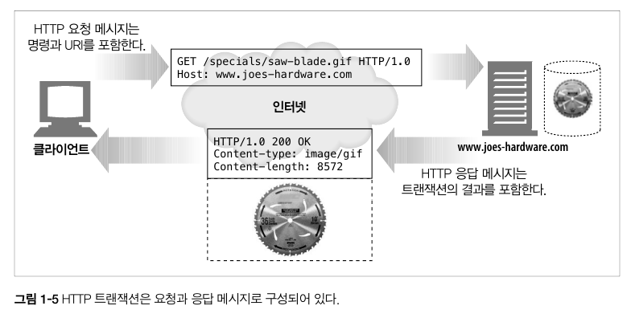

### 1.4.1 메서드

- HTTP 는 여러 종류의 요청 명령을 지원한다.
- 모든 HTTP 요청 메시지는 한 개의 메서드를 갖는다. 메서드는 서버에서 어떤 동작이 취해져야 하는지 말해준다.

| HTTP 메서드 | 설명                                                                |
| ----------- | ------------------------------------------------------------------- |
| GET         | 서버에서 클라이언트로 지정한 리소스를 보내라                        |
| PUT         | 클라이언트에서 서버로 보낸 데이터를 지정한 이름의 리소스로 저장하라 |
| DELETE      | 지정한 리소스를 서버에서 삭제하라                                   |
| POST        | 클라이언트 데이터를 서버 게이트웨이 애플리케이션으로 보내라         |
| HEAD        | 지정한 리소스에 대한 응답에서 HTTP 헤더 부분만 보내라               |

### 1.4.2 상태 코드

- HTTP 응답 메시지는 상태 코드와 함께 반환된다.
- 상태 코드는 클라이언트에게 요청이 성공했는지 아니면 추가 조치가 필요한지 알려주는 3자리 숫자다.
- 2xx, 3xx, 4xx, 500 등의 상태 코드가 있다.

### 1.4.3 웹페이지는 여러 객체로 이루어질 수 있다

- 애플리케이션은 하나의 작업을 수행하기 위해 여러 HTTP 트랜잭션을 수행한다.
- 예를 들어, 페이지 HTML 파일을 가져온 후, 이미지, 스타일, 폰트, 자바스크립트 등 추가적인 리소스에 대한 여러 HTTP 트랜잭션을 수행한다.

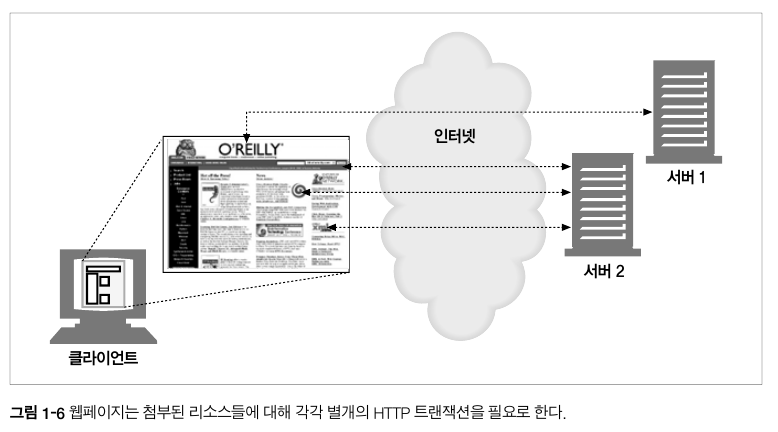

## 1.5 메시지

- **HTTP 메시지는 문자열이다.**
- 요청 메시지: 웹 클라이언트 → 웹 서버 로의 메시지
- 응답 메시지: 웹 서버 → 웹 클라이언트 로의 메시지


- 메시지는 시작줄, 헤더, 본문으로 이루어진다.
  - 본문: 요청 시 클라이언트에서 서버로 데이터를 실어 보내고, 응답 시 서버에서 클라이언트로 데이터를 반환한다.

### 1.5.1 간단한 메시지의 예

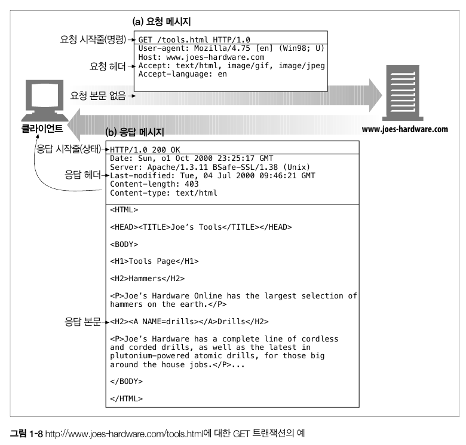

## 1.6 TCP 커넥션

### 1.6.1 TCP/IP

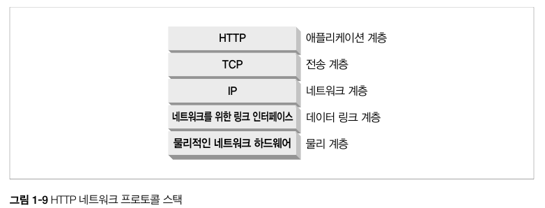

- HTTP는 애플리케이션 계층 프로토콜이다. HTTP는 네트워크 통신의 세부사항에 대해 신경쓰지 않는다. 대신 TCP/IP 프로토콜에게 맡긴다.
- TCP가 제공해주는 것
  - 오류 없는 데이터 전송
  - 순서에 맞는 전달
  - 조각나지 않는 데이터 스트림
- **TCP/IP는 각 네트워크와 하드웨어의 특성을 숨기고, 어떤 종류의 컴퓨터나 네트워크든 서로 신뢰성 있는 의사소통을 하게 해준다.**

### 1.6.2 접속, IP 주소 그리고 포트번호

HTTP 클라이언트가 서버에 메시지를 전송할 수 있게 되기 전에, 인터넷 프로토콜(IP, Internet Protocol) 주소와 포트번호를 사용해 클라이언트와 서버 사이에 TCP/IP 커넥션을 맺어야 한다.

- TCP에서는 서버 컴퓨터에 대한 IP 주소와 그 서버에서 실행 중인 프로그램이 사용 중인 포트번호가 필요하다.

> 어떻게 서버의 IP 주소와 포트번호를 알 수 있을까?

- URL을 이용하면 된다.
  - URL은 리소스에 대한 주소(위치)이다.
  ```
  http://207.200.83.29:80/index.html
  http://www.netscape.com/index.html
  ```
  - 첫번째 URL은 IP 주소 207.200.83.29 와 포트번호 80 을 갖고 있다.
  - 두번째 URL은 IP 주소가 없다. → 호스트명인 `www.netscape.com` 은 DNS를 통해 IP 주소로 변환될 수 있다.

## 1.8 웹의 구성요소

### 1.8.1 프락시

- 클라이언트와 서버 사이에 위치한 HTTP 중개자
- 웹 보안, 애플리케이션 통합, 성능 최적화를 위한 요소
- 클라이언트와 서버 사이에 위치하여 클라이언트의 모든 요청을 받아 서버로 전달한다.
  - 요청을 수정하여 서버에 전달할 수도 있고,
  - 요청과 응답을 필터링할 수도 있다.

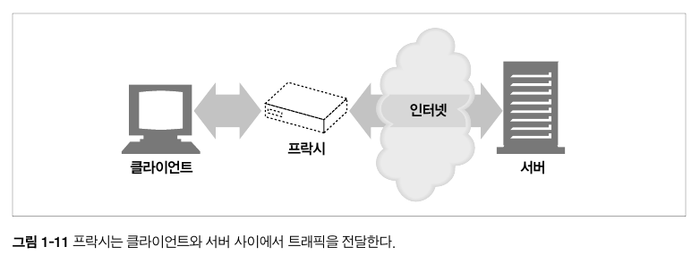

### 1.8.2 캐시

- 많이 찾는 웹페이지를 클라이언트 가까이에 보관하는 HTTP 창고
- 웹캐시와 캐시 프락시는 자신을 거쳐가는 문서들 중 자주 찾는 것의 사본을 저장해 두는, 특별한 종류의 HTTP 프락시 서버다.(ex - CDN 서버, Amazon CloudFront 서비스)
- 클라이언트는 멀리 떨어진 웹 서버보다 근처의 캐시에서 훨씬 빨리 문서를 다운받을 수 있다.

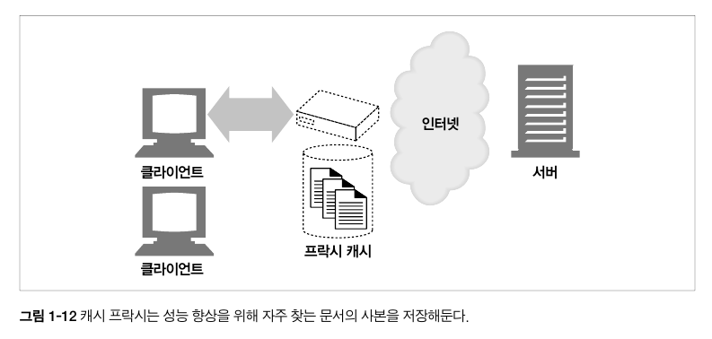

### 1.8.3 게이트웨이

- 다른 애플리케이션과 연결된 특별한 웹 서버
- 게이트웨이는 주로 HTTP 트래픽을 다른 프로토콜로 변환하기 위해 사용된다.
- 게이트웨이는 언제나 스스로가 리소스를 갖고 있는 진짜 서버인 것처럼 요청을 다룬다. 클라이언트는 게이트웨이와 통신하고 있음을 알아채지 못할 것이다.

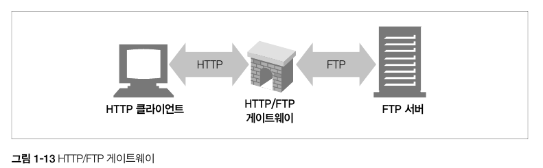

### 1.8.4 터널

- 단순히 HTTP 통신을 전달하기만 하는 특별한 프락시
- **터널은 두 커넥션 사이에 raw data를 열어보지 않고 그대로 전달해주는 HTTP 애플리케이션이다.**
- HTTP 터널은 주로 비 HTTP 데이터를 하나 이상의 HTTP 연결을 통해 그대로 전송해주기 위해 사용된다.

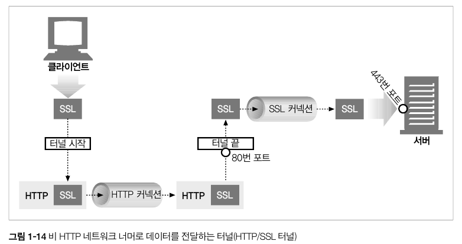

### 1.8.5 에이전트

- **자동화된 HTTP 요청을 만드는 semi-intelligent 웹 클라이언트**
- 웹 요청을 만드는 애플리케이션은 뭐든 HTTP 에이전트다.
- 웹 브라우저도 HTTP 에이전트의 한 종류다.
