# 03장 HTTP 메시지

HTTP가 인터넷의 배달원이라면, HTTP메시지 는 무언가 담아 보내는 소포와 같다

이번장에서 할 내용은

- 메세지가 어떻게 흘러가는가
- HTTP 메시지의 세 부분(시작줄, 헤더, 개체 본문)
- 요청과 응답 메세지의 차이
- 요청 메세지가 지원하는 여러 기능(메서드들)
- 응답 메세지가 반환하는 여러 상태 코드들
- 여러 HTTP 헤더들은 무슨 일을 하는가

입니다

## 3.1 메시지의 흐름

HTTP 메시지는 HTTP 애플리케이션 간에 주고받은 데이터의 블록들이다.

인바운드, 아웃바운드, 업스트림, 다운스트림은 메시지의 방향을 의미하는 용어이다, 트랜잭션 방향을 표현하기 위해 사용된다

### 3.1.1 메시지는 원 서버 방향을 인바운드로 하여 송신된다.

- 인바운드 : 메세지가 원 서버쪽으로 향하는 것
- 아웃바운드 : 메시지가 사용자 에이전트(클라이언트)로 돌아오는것


### 3.1.2 다운스트림으로 흐르는 메시지

HTTP는 요청 메시지나 응답 메시지냐에 관계없이 모든 메시지는 다운스트림으로 흐른다


요청에서는 프락시 1이 프락시 3의 업스트림이지만, 응답에서는 프록시 3의 다운스트림이다.

## 3.2 메시지의 각 부분

<aside>
💡 메시지는 시작줄, 헤더블록, 본문 세 부분으로 이루어진다.

</aside>

시작줄 : 이것이 어떤 메세지인지 서술

헤더 블록 : 속성

본문 : 데이터 , 없을수도 있다

- 시작줄과 헤더는 그냥 줄 단위로 분리된 아스키 문자열이다, 각 줄은 캐리지 리턴(ascii 13)과 개행문자(ascii 10)로 구성된 두글자 줄바꿈 문자열로 끝난다 (이 줄바꿈 문자열을 CRLF 라고 쓴다.)
- HTTP 명세대로라면 줄바꿈 문자열은 CRLF이지만 견고한 애플리케이션이라면 그냥 개행 문자도 받아들일 수 있어야 한다. (오래되거나 잘못 만들어진 HTTP 애플리케이션은 캐리지리턴과 개행문자 모두를 전송하지 않을 수 있음)

- 엔티티 본문, 메시지 본문, 본문 등으로 불리는 본문은 단순한 데이터 덩어리이다
  없을수도 텍스트일수도 이진데이터일수도 있다
- 헤더는 본문에 대한 많은 정보를 준다
  - Content-Type : 본문의 타입 (text/plain, image/jpeg 등등)
  - Content-Length : 본문의 크기
    등등 본문에 대한 많은 정보를 준다

### 3.2.1 메시지 문법


모든 HTTP 메시지는 요청 메시지나 응답 메시지로 분류된다.

요청 메시지는 서버에 어떤 동작을 요구하고, 응답 메시지는 요청의 결과를 클라이언트에게 돌려준다

요청과 응답 모두 기본적으로 구조가 같다

- 요청 메시지의 형식

  ```jsx
  <메서드> <요청 URL> <버젼>
  <헤더>
  <엔티티 본문>
  ```

- 응답 메시지의 형식

  ```jsx
  <버젼> <상태 코드> <사유 구절>
  <헤더>
  <엔티티 본문>
  ```

시작줄만 문법이 다르고 형식이 같다!

### **각 부분에 대한 설명**

- 메서드
  클라이언트 측에서 서버가 리소스에 대해 수행해주기 바라는 동작이다
  `GET` `POST` `HEAD` 와 같이 한단어로 되어있다
- 요청 URL
  요청 대상이 되는 리소스를 지칭하는 완전한 URL , 또는 URL의 경로 구성요소다
  완전하지 않아도 서버와 클라이언트가 직접 통신하고 있고, 구성요소가 리소스를 가리키는 절대 경로이기만 하면 대체로 문제가 없다, 생략된 호스트/포트는 서버가 자신을 가리키는것으로 간주할 것이다
- 버젼
  이 메시지에서 사용중인 HTTP의 버젼이다.
  `HTTP/<메이져>.<마이너>`
- 상태 코드
  요청 중에 무슨 일이 일어났는지 설명하는 세자리의 숫자이다.
  각 코드의 첫번째 자릿수는 상태의 일반적인 분류(성공, 에러 등)을 나타낸다.
- 사유 구절

  숫자로 된 상태 코드의 의미를 사람이 이해할 수 있게 설명하는 짧은 문구

  상태 코드 이후부터 줄바꿈 문자열까지가 사유 구절이다

  사유 구절은 오로지 사람에게 읽히기 위한 목적으로만 존재한다.

  > `HTTP/1.0 200 OK` || `HTTP/1.0 200 NOT OK`
  >
  > 사유가 전혀 달라 보여도 동등하게 성공을 의미하는 것으로 처리되어야 함!

- 헤더들
  이름, 콜론(:) 선택적인 공백, 값, CRLF가 순서대로 나타나는 0개 이상의 헤더들
  `Content-type : <값>`
  헤더들의 목록은 빈 줄로 끝나 헤더목록과 엔터티 본문의 시작을 표시한다
- 엔터티 본문
  엔터티 본문은 임의의 데이터 블록을 포함한다. 모든 메세지가 엔터티 본문이 있는게 아니라 때때로 메세지는 그냥 CRLF로 끝나게 된다
  
  헤더나 엔터티 본문이 없더라도, HTTP 헤더의 집합은 그냥 빈줄(CRLF)로 끝나야 한다.
  역사적으로 많은 클라이언트와 서버가 엔터티 본문이 없는경우에 실수로 CRLF를 빠뜨릴 수 있어서, CRLF 없이 끝나는 메세지도 받아들일 수 있어야 한다.

### 3.2.2 시작줄

모든 HTTP 메시지는 시작줄로 시작한다.

요청 메시지의 시작줄은 무엇을 해야하는지 말해주고

응답 메시지의 시작줄은 무엇이 일어났는지 말해준다

- 요청줄 - 요청 메세지의 시작줄
  메서드, 요청 URL, HTTP 버젼이 들어있다
  요청줄에서 모든 필드는 공백(” “)으로 구분된다
- 응답줄 - 응답 메시지의 시작줄

  HTTP버젼, 상태코드,사유구절이 들어있다

  모든 필드는 공백으로 구분한다.

- 메서드 - 서버에게 무엇을 해야하는지 말해준다
  | 메서드 | 설명 | 본문이 있는가? |
  | ------- | ------------------------------------------------------ | -------------- |
  | GET | 서버에서 문서를 가져온다 | 없음 |
  | HEAD | 서버에서 문서에 대한 헤더만 가져온다 | 없음 |
  | POST | 서버가 처리해야할 데이터를 보낸다 | 있음 |
  | PUT | 서버에 요청 메시지의 본문을 저장한다 | 있음 |
  | TRACE | 메시지가 프락시를 거쳐 서버에 도달하는 과정을 추적한다 | 없음 |
  | OPTIONS | 서버가 어떤 메서드를 수행할 수 있는지 확인한다 | 없음 |
  | DELETE | 서버에서 문서를 제거한다 | 없음 |

- 상태 코드 - 서버에 무슨 일이 일어났는지 클라이언트에게 전달
  | 전체 범위 | 정의된 범위 | 분류 |
  | --------- | ----------- | ----------------- |
  | 100-199 | 100-101 | 정보 |
  | 200~299 | 200-206 | 성공 |
  | 300-399 | 300-305 | 리다이렉션 |
  | 400-499 | 400-415 | 클라이언트측 에러 |
  | 500-599 | 500-505 | 서버측 에러 |
  현재 버전의 HTTP는 각 상태 분류에 대해 적은 수의 코드만을 정의했지만, 프로토콜이 진화하면 더 많은 상태코드가 HTTP 명세에 공식적으로 정의될 것이다. 현재 인식할 수 없는 상태 코드를 받게되면 누군가가 현재 프로토콜의 확정으로 그것을 정의했을 가능성이 있다. 그럼 그 상태 코드를 그것이 포함하는 범주의 일반적인 구성원으로 다루어야 한다.
- 사유 구절 - 사람이 이해할 수 있는 글, 상태코드에 대한 글로된 설명

  어떠한 엄격한 규칙도 없다

- 버젼 번호 - HTTP/x.y 형식, 자신들이 따르는 프로토콜의 버젼을 말해주기 위한 수단
  HTTP로 대화하는 애플리케이션에게 대화 상대에 대한 능력과 메세지 형식에 대한 단어를 제공해주기 위함.
  ex) HTTP1.1 버젼 애플리케이션과 대화하는 HTTP1.2버젼 애플리케이션은 1.2 버젼을 사용할 수 없다.
  버젼 번호는 애플리케이션이 지원하는 가장 높은 HTTP버젼을 가리킨다
  주의! 버젼 번호는 메세지의 번호가 아니라, 메세지를 보낸 애플리케이션이 이해할수 있는 가장 최신의 HTTP 버전을 의미함

### 3.2.3 헤더

HTTP 명세는 여러 헤더 필드를 정의한다. 자유롭게 자신의 헤더를 만들어 낼 수 있다.

| 헤더 분류   | 설명                                        |
| ----------- | ------------------------------------------- |
| 일반 헤더   | 요청과 응답 양쪽에 모두 나타낼 수 있음      |
| 요청 헤더   | 요청에 대한 부가 정보를 제공                |
| 응답 헤더   | 답에 대한 부가 정보를 제공                  |
| Entity 헤더 | 본문 크기와 콘텐츠, 혹은 리소스 자체를 서술 |
| 확장 헤더   | 명세에 정의되지 않은 새로운 헤더            |

헤더는 이름, 쉼표, 공백(없어도됨), 필드값, CRLF가 순서대로 온다


- 헤더를 여러 줄로 나누기.
  긴 헤더의 경우, 여러 줄로 쪼개서 읽기 좋게 만들 수 있는데, 추가 줄 앞에 최소 하나의 스페이스 또는 탭 문자가 와야한다.
  ```jsx
  HTTP/1.0 200 OK
  Content-type: image/gif
  Content-Length: 8572
  Server: Test Server
  	Version 1.0
  ```
  Server헤더의 필드는 “Test Server Version 1.0” 이지만 탭 또는 스페이스를 추가해서 여러 줄로 쪼개 작성할 수 있다

### 3.2.4 엔터티 본문

HTTP 메세지의 화물, 메시지, 이미지, 비디오, HTML 문서, 소프트웨어 애플리케이션, 신용카드 트랜잭션, 전자우편 등 다양한 데이터를 나를 수 있다

### 3.2.5 버젼 0.9 메시지


HTTP 프로토콜의 초기 버젼으로, 훨씬 단순한 프로토콜로 되어있다.

0.9 버젼으로 작성된 애플리케이션도 있어서 레거시 대비를 해야 할 수도 있으니 설명한다..

## 3.3 메서드

### 3.3.1 안전한 메서드(Safe Method)

HTTP 요청의 결과로 서버에 어떤 작용도 없는 경우를 안전한 메서드라고 한다

GET, HEAD 같은 메서드들

안전한 메서드여도 서버에 작용할 수 있지만, 안전한 메서드를 굳이 구분해놓는 이유는, 안전하지 않은 메소드를 사용할 때 사용자에게 안전하지 않을수도 있단 사실을 알려주기 위함이다

ex) 웹 브라우져에서 POST 요청이 만들어 졌을때, 그 메서드를 읽고 예를들어 서버에서 신용카드가 결제된다거나, 하는 일이 일어날 수 있다는 경고를 알려줄수도있다

### 3.3.2 GET

가장 흔히 쓰이는 메서드, 서버에게 리소스를 달라고 요청하기 위해 쓰임

HTTP/1.1 준수를 위해서는 GET 메서드가 반드시 구현되어 있어야 한다

### 3.3.3 HEAD

정확히 GET처럼 행동하지만, 응답으로 헤더만을 돌려주고 엔터티 본문은 반환되지 않는다

HEAD 사용하는 이유

- 리소스를 가져오지 않고도 그에 대한 헤더 정보를 알아낼 수 있다
- 응답의 상태코드를 통해 개체가 존재하는지 알 수 있다
- 헤더를 확인하여 리소스가 변경되었는지 검사할 수 있다

서버 개발자들은 반드시 반환되는 헤더가 GET으로 얻는 것과 정확히 일치함을 보여야 한다.

HTTP/1.1 준수를 위해서는 HEAD 메서드가 반드시 구현되어 있어야 한다

### 3.3.4 PUT

서버에 문서를 쓸 때 사용

서버가 요청의 본문을 가지고 요청 URL대로 새 문서를 만들거나, 이미 URL이 존재한다면 메시지 본문으로 교체하는 것이다.

콘텐츠를 변경할 수 있게 해주기 때문에, 웹 서버가 PUT을 수행하기 전 비밀번호를 입력해서 로그인 하도록 요구할 것이다.

### 3.3.5 POST

서버에 입력 데이터를 전송하기 위해 설계되었다

### 3.3.6 TRACE

클라이언트가 어떤 요청을 할 때, 요청은 방화벽, 프락시 게이트웨이 등의 애플리케이션을 통과할 수 있다. TRACE 메서드는 클라이언트에게 자신의 요청이 서버에 도달했을 때 어떻게 보이게 되는지 알려준다


TRACE는 주로 진단을 위해 사용된다. 예를 들면 요청이 의도한 요청/응답 연쇄를 거쳐가는지 검사할 수 있다, 또한 프락시나 다른 애플리케이션이 요청에 어떤 영향을 미치는지 확인할 때도 좋은 도구다

진단을 위해 사용할 때는 괜찮지만, GET, POST, HEAD 같은 메서드와는 다르게 다뤄질 수도 있다,

예를들어 프락시는 POST를 바로 서버로 통과시키는 반면 GET은 웹 캐시와 같은 다른 HTTP 애플리케이션으로 전송한다

TRACE는 메서드를 구분하는 메커니즘을 제공하지 않는다. 중간 애플리케이션에 따라서 TRACE 요청이 다뤄질 수도 있다

### 3.3.7 OPTIONS

웹서버에게 여러가지 종류의 지원 범위에 대해 물어본다

서버에게 특정 리소스에 대해 어떤 메서드가 지원되는지 물어볼 수 있다


### 3.3.8 DELETE

서버에게 요청 URL로 지정한 리소스를 삭제할 것을 요청한다

하지만 HTTP 명세는 서버가 클라이언트에게 알리지 않고 요청을 무시하는 것을 허용해서, 실제로 안지워질수도 있다 무시 가능

### 3.3.9 확장 메서드

HTTP는 필요에 따라 확장해도 문제가 없도록 설계되어 있으므로, 새로 기능을 추가해도 과거에 구현된 소프트웨어들의 오작동을 유발하지 않는다.,

엄격하게 보내고 관대하게 받아들여라

ex) 이해할 수 없는 메서드를 받으면 501 코드로 처리# 03장 HTTP 메시지

HTTP가 인터넷의 배달원이라면, HTTP메시지 는 무언가 담아 보내는 소포와 같다

이번장에서 할 내용은

- 메세지가 어떻게 흘러가는가
- HTTP 메시지의 세 부분(시작줄, 헤더, 개체 본문)
- 요청과 응답 메세지의 차이
- 요청 메세지가 지원하는 여러 기능(메서드들)
- 응답 메세지가 반환하는 여러 상태 코드들
- 여러 HTTP 헤더들은 무슨 일을 하는가

입니다

## 3.1 메시지의 흐름

HTTP 메시지는 HTTP 애플리케이션 간에 주고받은 데이터의 블록들이다.

인바운드, 아웃바운드, 업스트림, 다운스트림은 메시지의 방향을 의미하는 용어이다, 트랜잭션 방향을 표현하기 위해 사용된다

### 3.1.1 메시지는 원 서버 방향을 인바운드로 하여 송신된다.

- 인바운드 : 메세지가 원 서버쪽으로 향하는 것
- 아웃바운드 : 메시지가 사용자 에이전트(클라이언트)로 돌아오는것


### 3.1.2 다운스트림으로 흐르는 메시지

HTTP는 요청 메시지나 응답 메시지냐에 관계없이 모든 메시지는 다운스트림으로 흐른다


요청에서는 프락시 1이 프락시 3의 업스트림이지만, 응답에서는 프록시 3의 다운스트림이다.

## 3.2 메시지의 각 부분

<aside>
💡 메시지는 시작줄, 헤더블록, 본문 세 부분으로 이루어진다.

</aside>

시작줄 : 이것이 어떤 메세지인지 서술

헤더 블록 : 속성

본문 : 데이터 , 없을수도 있다

- 시작줄과 헤더는 그냥 줄 단위로 분리된 아스키 문자열이다, 각 줄은 캐리지 리턴(ascii 13)과 개행문자(ascii 10)로 구성된 두글자 줄바꿈 문자열로 끝난다 (이 줄바꿈 문자열을 CRLF 라고 쓴다.)
- HTTP 명세대로라면 줄바꿈 문자열은 CRLF이지만 견고한 애플리케이션이라면 그냥 개행 문자도 받아들일 수 있어야 한다. (오래되거나 잘못 만들어진 HTTP 애플리케이션은 캐리지리턴과 개행문자 모두를 전송하지 않을 수 있음)

- 엔티티 본문, 메시지 본문, 본문 등으로 불리는 본문은 단순한 데이터 덩어리이다
  없을수도 텍스트일수도 이진데이터일수도 있다
- 헤더는 본문에 대한 많은 정보를 준다
  - Content-Type : 본문의 타입 (text/plain, image/jpeg 등등)
  - Content-Length : 본문의 크기
    등등 본문에 대한 많은 정보를 준다

### 3.2.1 메시지 문법


모든 HTTP 메시지는 요청 메시지나 응답 메시지로 분류된다.

요청 메시지는 서버에 어떤 동작을 요구하고, 응답 메시지는 요청의 결과를 클라이언트에게 돌려준다

요청과 응답 모두 기본적으로 구조가 같다

- 요청 메시지의 형식

  ```jsx
  <메서드> <요청 URL> <버젼>
  <헤더>
  <엔티티 본문>
  ```

- 응답 메시지의 형식

  ```jsx
  <버젼> <상태 코드> <사유 구절>
  <헤더>
  <엔티티 본문>
  ```

시작줄만 문법이 다르고 형식이 같다!

### **각 부분에 대한 설명**

- 메서드
  클라이언트 측에서 서버가 리소스에 대해 수행해주기 바라는 동작이다
  `GET` `POST` `HEAD` 와 같이 한단어로 되어있다
- 요청 URL
  요청 대상이 되는 리소스를 지칭하는 완전한 URL , 또는 URL의 경로 구성요소다
  완전하지 않아도 서버와 클라이언트가 직접 통신하고 있고, 구성요소가 리소스를 가리키는 절대 경로이기만 하면 대체로 문제가 없다, 생략된 호스트/포트는 서버가 자신을 가리키는것으로 간주할 것이다
- 버젼
  이 메시지에서 사용중인 HTTP의 버젼이다.
  `HTTP/<메이져>.<마이너>`
- 상태 코드
  요청 중에 무슨 일이 일어났는지 설명하는 세자리의 숫자이다.
  각 코드의 첫번째 자릿수는 상태의 일반적인 분류(성공, 에러 등)을 나타낸다.
- 사유 구절

  숫자로 된 상태 코드의 의미를 사람이 이해할 수 있게 설명하는 짧은 문구

  상태 코드 이후부터 줄바꿈 문자열까지가 사유 구절이다

  사유 구절은 오로지 사람에게 읽히기 위한 목적으로만 존재한다.

  > `HTTP/1.0 200 OK` || `HTTP/1.0 200 NOT OK`
  >
  > 사유가 전혀 달라 보여도 동등하게 성공을 의미하는 것으로 처리되어야 함!

- 헤더들
  이름, 콜론(:) 선택적인 공백, 값, CRLF가 순서대로 나타나는 0개 이상의 헤더들
  `Content-type : <값>`
  헤더들의 목록은 빈 줄로 끝나 헤더목록과 엔터티 본문의 시작을 표시한다
- 엔터티 본문
  엔터티 본문은 임의의 데이터 블록을 포함한다. 모든 메세지가 엔터티 본문이 있는게 아니라 때때로 메세지는 그냥 CRLF로 끝나게 된다
  
  헤더나 엔터티 본문이 없더라도, HTTP 헤더의 집합은 그냥 빈줄(CRLF)로 끝나야 한다.
  역사적으로 많은 클라이언트와 서버가 엔터티 본문이 없는경우에 실수로 CRLF를 빠뜨릴 수 있어서, CRLF 없이 끝나는 메세지도 받아들일 수 있어야 한다.

### 3.2.2 시작줄

모든 HTTP 메시지는 시작줄로 시작한다.

요청 메시지의 시작줄은 무엇을 해야하는지 말해주고

응답 메시지의 시작줄은 무엇이 일어났는지 말해준다

- 요청줄 - 요청 메세지의 시작줄
  메서드, 요청 URL, HTTP 버젼이 들어있다
  요청줄에서 모든 필드는 공백(” “)으로 구분된다
- 응답줄 - 응답 메시지의 시작줄

  HTTP버젼, 상태코드,사유구절이 들어있다

  모든 필드는 공백으로 구분한다.

- 메서드 - 서버에게 무엇을 해야하는지 말해준다
  | 메서드 | 설명 | 본문이 있는가? |
  | ------- | ------------------------------------------------------ | -------------- |
  | GET | 서버에서 문서를 가져온다 | 없음 |
  | HEAD | 서버에서 문서에 대한 헤더만 가져온다 | 없음 |
  | POST | 서버가 처리해야할 데이터를 보낸다 | 있음 |
  | PUT | 서버에 요청 메시지의 본문을 저장한다 | 있음 |
  | TRACE | 메시지가 프락시를 거쳐 서버에 도달하는 과정을 추적한다 | 없음 |
  | OPTIONS | 서버가 어떤 메서드를 수행할 수 있는지 확인한다 | 없음 |
  | DELETE | 서버에서 문서를 제거한다 | 없음 |

- 상태 코드 - 서버에 무슨 일이 일어났는지 클라이언트에게 전달
  | 전체 범위 | 정의된 범위 | 분류 |
  | --------- | ----------- | ----------------- |
  | 100-199 | 100-101 | 정보 |
  | 200~299 | 200-206 | 성공 |
  | 300-399 | 300-305 | 리다이렉션 |
  | 400-499 | 400-415 | 클라이언트측 에러 |
  | 500-599 | 500-505 | 서버측 에러 |
  현재 버전의 HTTP는 각 상태 분류에 대해 적은 수의 코드만을 정의했지만, 프로토콜이 진화하면 더 많은 상태코드가 HTTP 명세에 공식적으로 정의될 것이다. 현재 인식할 수 없는 상태 코드를 받게되면 누군가가 현재 프로토콜의 확정으로 그것을 정의했을 가능성이 있다. 그럼 그 상태 코드를 그것이 포함하는 범주의 일반적인 구성원으로 다루어야 한다.
- 사유 구절 - 사람이 이해할 수 있는 글, 상태코드에 대한 글로된 설명

  어떠한 엄격한 규칙도 없다

- 버젼 번호 - HTTP/x.y 형식, 자신들이 따르는 프로토콜의 버젼을 말해주기 위한 수단
  HTTP로 대화하는 애플리케이션에게 대화 상대에 대한 능력과 메세지 형식에 대한 단어를 제공해주기 위함.
  ex) HTTP1.1 버젼 애플리케이션과 대화하는 HTTP1.2버젼 애플리케이션은 1.2 버젼을 사용할 수 없다.
  버젼 번호는 애플리케이션이 지원하는 가장 높은 HTTP버젼을 가리킨다
  주의! 버젼 번호는 메세지의 번호가 아니라, 메세지를 보낸 애플리케이션이 이해할수 있는 가장 최신의 HTTP 버전을 의미함

### 3.2.3 헤더

HTTP 명세는 여러 헤더 필드를 정의한다. 자유롭게 자신의 헤더를 만들어 낼 수 있다.

| 헤더 분류   | 설명                                        |
| ----------- | ------------------------------------------- |
| 일반 헤더   | 요청과 응답 양쪽에 모두 나타낼 수 있음      |
| 요청 헤더   | 요청에 대한 부가 정보를 제공                |
| 응답 헤더   | 답에 대한 부가 정보를 제공                  |
| Entity 헤더 | 본문 크기와 콘텐츠, 혹은 리소스 자체를 서술 |
| 확장 헤더   | 명세에 정의되지 않은 새로운 헤더            |

헤더는 이름, 쉼표, 공백(없어도됨), 필드값, CRLF가 순서대로 온다


- 헤더를 여러 줄로 나누기.
  긴 헤더의 경우, 여러 줄로 쪼개서 읽기 좋게 만들 수 있는데, 추가 줄 앞에 최소 하나의 스페이스 또는 탭 문자가 와야한다.
  ```jsx
  HTTP/1.0 200 OK
  Content-type: image/gif
  Content-Length: 8572
  Server: Test Server
  	Version 1.0
  ```
  Server헤더의 필드는 “Test Server Version 1.0” 이지만 탭 또는 스페이스를 추가해서 여러 줄로 쪼개 작성할 수 있다

### 3.2.4 엔터티 본문

HTTP 메세지의 화물, 메시지, 이미지, 비디오, HTML 문서, 소프트웨어 애플리케이션, 신용카드 트랜잭션, 전자우편 등 다양한 데이터를 나를 수 있다

### 3.2.5 버젼 0.9 메시지


HTTP 프로토콜의 초기 버젼으로, 훨씬 단순한 프로토콜로 되어있다.

0.9 버젼으로 작성된 애플리케이션도 있어서 레거시 대비를 해야 할 수도 있으니 설명한다..

## 3.3 메서드

### 3.3.1 안전한 메서드(Safe Method)

HTTP 요청의 결과로 서버에 어떤 작용도 없는 경우를 안전한 메서드라고 한다

GET, HEAD 같은 메서드들

안전한 메서드여도 서버에 작용할 수 있지만, 안전한 메서드를 굳이 구분해놓는 이유는, 안전하지 않은 메소드를 사용할 때 사용자에게 안전하지 않을수도 있단 사실을 알려주기 위함이다

ex) 웹 브라우져에서 POST 요청이 만들어 졌을때, 그 메서드를 읽고 예를들어 서버에서 신용카드가 결제된다거나, 하는 일이 일어날 수 있다는 경고를 알려줄수도있다

### 3.3.2 GET

가장 흔히 쓰이는 메서드, 서버에게 리소스를 달라고 요청하기 위해 쓰임

HTTP/1.1 준수를 위해서는 GET 메서드가 반드시 구현되어 있어야 한다

### 3.3.3 HEAD

정확히 GET처럼 행동하지만, 응답으로 헤더만을 돌려주고 엔터티 본문은 반환되지 않는다

HEAD 사용하는 이유

- 리소스를 가져오지 않고도 그에 대한 헤더 정보를 알아낼 수 있다
- 응답의 상태코드를 통해 개체가 존재하는지 알 수 있다
- 헤더를 확인하여 리소스가 변경되었는지 검사할 수 있다

서버 개발자들은 반드시 반환되는 헤더가 GET으로 얻는 것과 정확히 일치함을 보여야 한다.

HTTP/1.1 준수를 위해서는 HEAD 메서드가 반드시 구현되어 있어야 한다

### 3.3.4 PUT

서버에 문서를 쓸 때 사용

서버가 요청의 본문을 가지고 요청 URL대로 새 문서를 만들거나, 이미 URL이 존재한다면 메시지 본문으로 교체하는 것이다.

콘텐츠를 변경할 수 있게 해주기 때문에, 웹 서버가 PUT을 수행하기 전 비밀번호를 입력해서 로그인 하도록 요구할 것이다.

### 3.3.5 POST

서버에 입력 데이터를 전송하기 위해 설계되었다

### 3.3.6 TRACE

클라이언트가 어떤 요청을 할 때, 요청은 방화벽, 프락시 게이트웨이 등의 애플리케이션을 통과할 수 있다. TRACE 메서드는 클라이언트에게 자신의 요청이 서버에 도달했을 때 어떻게 보이게 되는지 알려준다


TRACE는 주로 진단을 위해 사용된다. 예를 들면 요청이 의도한 요청/응답 연쇄를 거쳐가는지 검사할 수 있다, 또한 프락시나 다른 애플리케이션이 요청에 어떤 영향을 미치는지 확인할 때도 좋은 도구다

진단을 위해 사용할 때는 괜찮지만, GET, POST, HEAD 같은 메서드와는 다르게 다뤄질 수도 있다,

예를들어 프락시는 POST를 바로 서버로 통과시키는 반면 GET은 웹 캐시와 같은 다른 HTTP 애플리케이션으로 전송한다

TRACE는 메서드를 구분하는 메커니즘을 제공하지 않는다. 중간 애플리케이션에 따라서 TRACE 요청이 다뤄질 수도 있다

### 3.3.7 OPTIONS

웹서버에게 여러가지 종류의 지원 범위에 대해 물어본다

서버에게 특정 리소스에 대해 어떤 메서드가 지원되는지 물어볼 수 있다


### 3.3.8 DELETE

서버에게 요청 URL로 지정한 리소스를 삭제할 것을 요청한다

하지만 HTTP 명세는 서버가 클라이언트에게 알리지 않고 요청을 무시하는 것을 허용해서, 실제로 안지워질수도 있다 무시 가능

### 3.3.9 확장 메서드

HTTP는 필요에 따라 확장해도 문제가 없도록 설계되어 있으므로, 새로 기능을 추가해도 과거에 구현된 소프트웨어들의 오작동을 유발하지 않는다.,

엄격하게 보내고 관대하게 받아들여라

ex) 이해할 수 없는 메서드를 받으면 501 코드로 처리

## 3.4 상태코드

- 상태코드는 클라이언트에게 그들의 트랜잭션이 이해할 수 있는 쉬운 방법을 제공한다

### 3.4.1 100-199: 정보성 상태 코드

- 100 Continue 는 HTTP 클라이언트 애플리케이션이 서버에 엔터티 본문을 전송하기 전에 그 엔터티 본문을 서버가 받아들일 것인지 확인하려고 할 때, 그 확인 작업을 최적화하기 위한 의도로 도입된 것
- 이는 **HTTP 프로그래머를 혼란스럽게 하는 경향이 있음**

| 상태코드 | 사유 구절           | 의미                                                                                                                                                     |
| -------- | ------------------- | -------------------------------------------------------------------------------------------------------------------------------------------------------- |
| 100      | Continue            | 요청의 시작 부분 일부가 받아들여졌으며, 클라이언트는 나머지를 계속 이어서 보내야 함을 의미한다. 이것을 보낸 후, 서버는 반드시 요청을 받아 응답해야 한다. |
| 101      | Switching Protocols | 클라이언트가 Upgrade 헤터에 나열한 것 중 하나로 서버가 프로토콜을 바꾸었음을 의미한다.                                                                   |

### 클라이언트와 100 Continue

- 최적화를 위해 100 Continue 를 사용한다.
  - 서버가 다루거나 사용할 수 없는 엔터티를 서버에 보내지 않으려는 목적으로만 사용해야 한다.
- 클라이언트가 엔티티를 서버에게 보내려고 하고, 그 전에 100 Continue 응답을 기다리겠다 → 클라이언트는 값을 100 Continue 로 하는 Expect 요청 헤더를 보낼 필요가 있다.
- 클라이언트가 엔터티를 보내지 않으려 한다 → 100 Continue Expect 헤더를 보내지 않아야 한다

### 서버와 100 Continue

- 서버가 100 Continue 값이 담긴 Expect 헤더가 포함된 요청을 받는다 → 100 Continue 응답 혹은 에러 코드로 답해야한다.
- 서버는 100 Continue 응답을 받기를 원하지 않는 클라이언트에게 100 Continue 상태코드를 보내서는 안된다.

### 3.4.2 200-299: 성공 상태 코드

| 상태코드 | 사유 구절 | 의미                                                |
| -------- | --------- | --------------------------------------------------- |
| 200      | OK        | 요청은 정상, 엔티티 본문(Body)는 요청된 리소스 포함 |
| 201      | Created   | 서버 개체를 생성하라는 요청(ex-PUT)                 |

응답으로 리소스에 대한 구체적인 참조(Location 헤더) + 그 리소스를 참조할 수 있는 여러 URL을 엔터티 본문에 포함
서버는 상태 코드를 보내기 전에 반드시 객체를 생성해야 함 |
| 202 | Accepted | 요청이 받아들여졌으나 서버가 아무런 동작도 수행하지 않았음
엔터티 본문에 요청에 대한 상태와 언제 요청이 처리될 건지에 대한 추정을 포함해야함 |
| 203 | Non-Autoritative Information | 엔터티 헤더에 들어있는 정보가 원래 서버가 아닌 리소스의 사본에서 왔다 |
| 204 | No Content | 응답 메시지는 해터와 상태줄만 표시하고 엔터티 본문을 포함하지 않는다.
주로 웹브라우저를 새 문서로 이동하지 않고 갱신하고자 할 때(ex - form 리프레시) 사용한다 |
| 205 | Reset Content | 브라우저에게 현재 페이지에 있는 HTML 폼에 채워진 모든 값을 비우라고 함 |
| 206 | Partial Content | 부분 혹은 범위 요청에 성공했음을 의미
206 응답은 Content-Range와 Date 해터를 반드시 포함해야함. Etag 와 Content-Location 중 하나를 반드시 포함해야함 |

### 3.4.3 300-399: 리다이렉션 상태 코드

- 리다이렉션 상태코드 : 클라이언트가 관심있어하는 리소스에 대해 다른 위치를 사용하라고 말해줌
- 만약 리소스가 옮겨졌으면 어디서 찾을 수 있는지 알려주기 위해 리다이렉션 상태코드와 Location 헤더를 보낼 수 있다.
- **이는 브라우저가 사용자를 귀찮게 하지 않고 알아서 새 위치로 이동할 수 있게 해준다.**

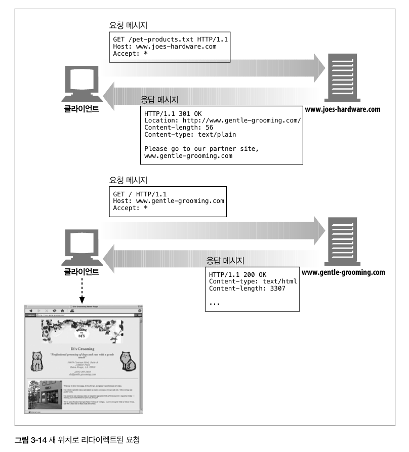

- 리다이렉션 상태 코드는 몇몇 리소스에 대해 애플리케이션 로컬 복사본이 원래 서버와 비교했을 때 유효한지 확인하기 위해 사용된다.

  - 예를 들어 로컬 복사본이 여전히 최신인지, 서버에 있는 리소스가 수정되었는지 검사할 수 있다.

    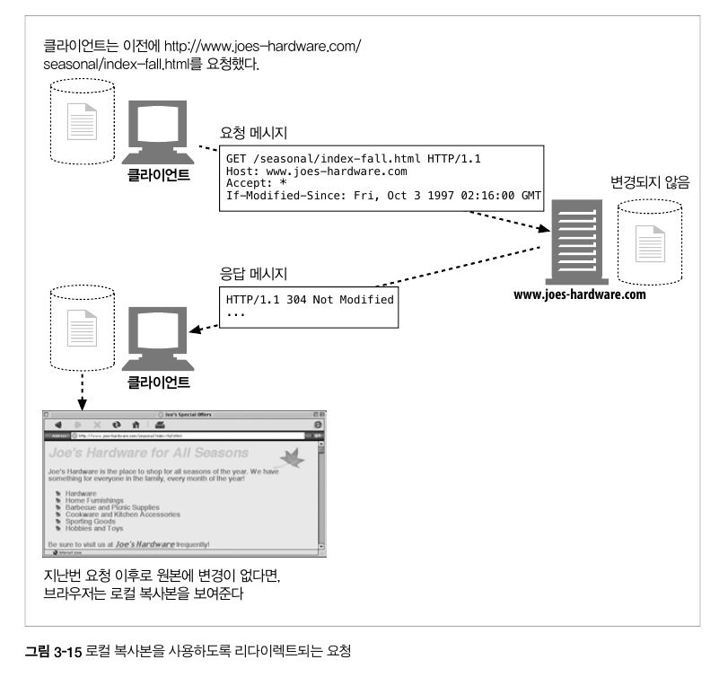

| 상태코드                                                               | 사유 구절         | 의미                                                                                      |
| ---------------------------------------------------------------------- | ----------------- | ----------------------------------------------------------------------------------------- |
| 300                                                                    | Multiple Choices  | 클라이언트가 동시에 여러 리소스를 가리키는 URL을 요청한 경우, 그 리소스의 목록을 반환한다 |
| 301                                                                    | Moved Permanently | 요청한 URL이 옮겨졌을 때 사용                                                             |
| 응답은 Location 헤더에 현재 리소스가 존재하고 있는 URL을 포함해야한다. |
| 302                                                                    | Found             | 301 상태코드와 동일                                                                       |
| 303                                                                    | See Other         | 클라이언트에게 리소르를 다른 URL에서 가져와야 한다고 말해줄 때 사용한다.                  |

다른 URL은 Location 헤더에 들어있다
주로 POST 요청에 대한 응답으로 클라이언트에게 리소스의 위치를 알려주는 것이다. |
| 304 | Not Modified | GET 과 같은 조건부 요청을 보냈고 리소스가 최근데 수정된 적이 없다면 이 코드는 리소스가 수정되지 않았음을 의미한다.
이 상태 코드를 동반한 응답은 엔터티 본문을 가져와서는 안된다. |
| 305 | Use Proxy | 리소스가 반드시 프락시를 통해 접근되어야 함을 의미한다. |
| 307 | Temporary Redirect | 301 상태코드와 비슷 |

### 3.4.4 400-499: 클라이언트 에러 상태 코드

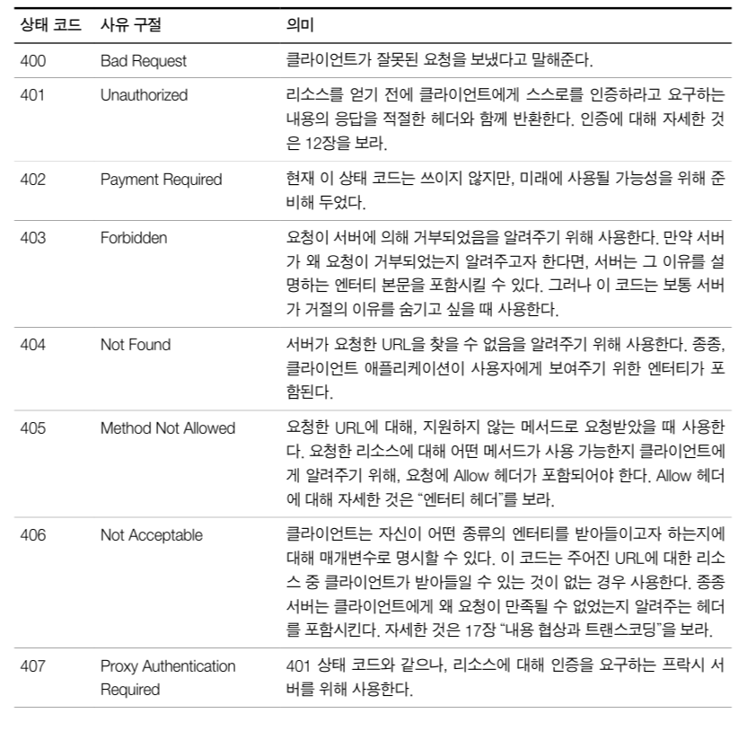

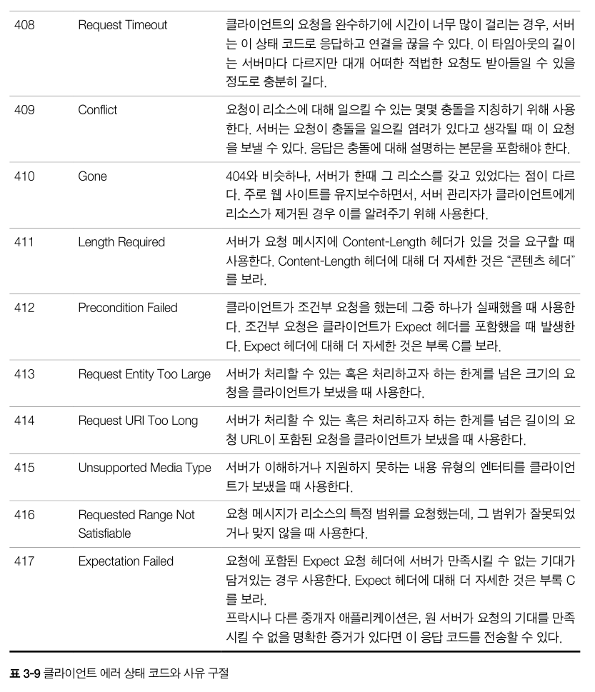

### 3.4.5 500-599: 서버 에러 상태 코드

- 때때로 클라이언트가 올바른 요청을 보냈음에도 서버 자체에서 에러가 발생하는 경우가 있다.

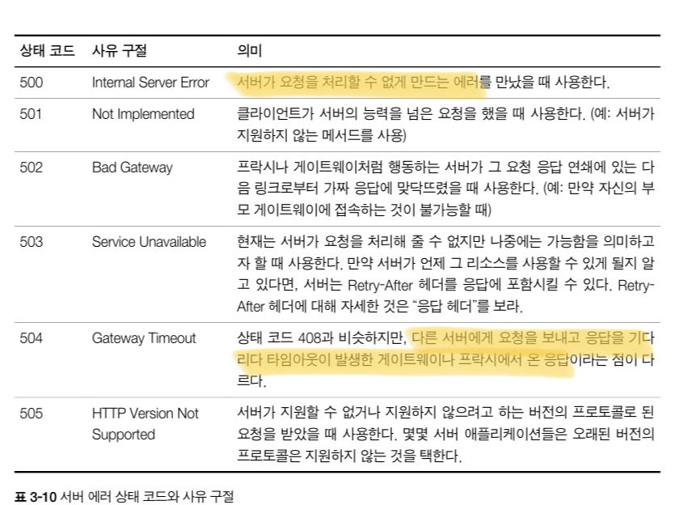

## 3.5 헤더

- 헤더와 메서드는 클라이언트와 서버가 무엇을 하는지 결정하기 위해 함께 사용된다.

### 3.5.1 일반 헤더

- 일반 헤더는 클라이언트와 서버 양쪽 모두가 사용한다.
- 메시지의 아주 기본적인 설명을 제공한다.

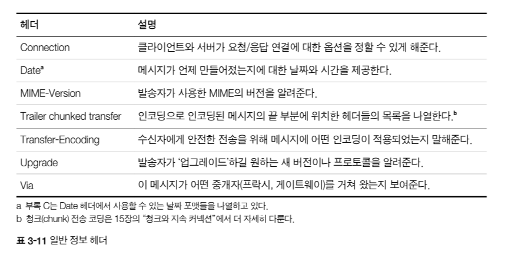

- 일반 캐시 헤더
  - HTTP/1.0 은 HTTP 애플리케이션에게 매번 원 서버로부터 객체를 가져오는 대신 로컬 복사본으로 캐시할 수 있도록 해주는 헤더를 도입했다
    | 헤더 | 설명 |
    | ------------------ | ------------------------------------------------------------------ |
    | Cache-Control | 메시지와 함께 캐시 지시자를 전달하기 위해 사용한다. |
    | Pragma(deprecated) | 메시지와 함께 지시자를 전달하는 또 다른 방법. 캐시에 국한되지 않음 |

### 3.5.2 요청 헤더

- 요청 헤더는 요청 메시지를 위한 헤더다
- 서버에게 클라이언트가 받고자 하는 데이터 타입이 무엇인지와 같은 부가 정보를 제공한다.
- 요청이 최초 발생한 곳에서 누가 혹은 무엇이 그 요청을 보냈는지에 대한 정보, 클라이언트의 선호나 능력에 대한 정보 → 클라이언트에게 더 나은 응답을 주기 위해 활용할 수 있다.

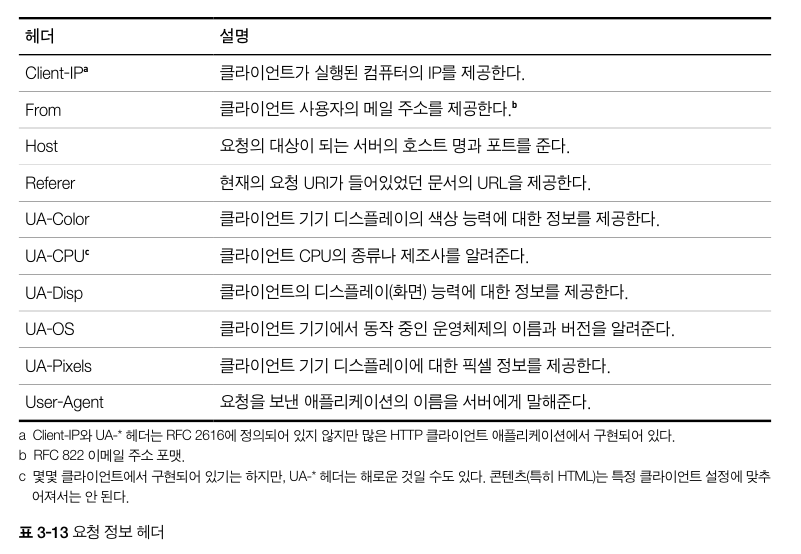

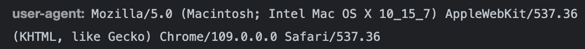

- Accept 관련 헤더
  - 클라이언트의 Accept 관련 헤더를 이용해 서버어게 클라이언트의 선호나 능력을 알려줄 수 있다.
  - **즉, 클라이언트가 무엇을 원하고 무엇을 할 수 있고 무엇을 원하지 않는지 등 말이다.**
- 조건부 요청 헤더
  - 예를 들어, 클라이언트가 이미 어떤 문서의 사본을 갖고 있는 상태(조건) → 그 사본과 서버의 것과 다를 때만 전송해달라고 요청할 수도 있다.
- 요청 보안 헤더

  - HTTP 는 자체적으로 요청을 위한 간단한 인증 요구/응답 체계가 있다.
  - **요청하는 클라이언트가 어느정도 리소스에 접근하기 전에 자신을 인증하게 함으로써 트랜잭션을 더 안전하게 만들고자 한다.**

    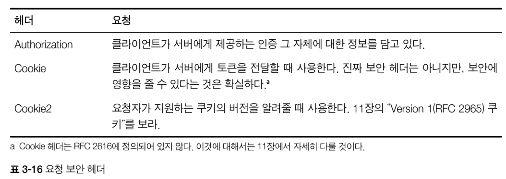

### 3.5.3 응답 헤더

- 응답 메시지는 클라이언트에게 부가적인 정보를 제공하기 위한 자신만의 헤더를 갖고 있다.(ex - 클라이언트가 어떤 종류의 서버와 대화하고 있는가)
- 누가 응답을 보내고 있고 응답자의 능력은 어떻게 되는지, 응답에 대한 특별한 설명도 제공
- 클라이언트가 응답을 잘 다루고 나주에 더 나은 요청을 할 수 있도록 도와줌

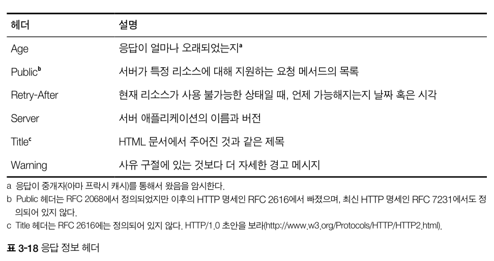

- 응답 보안 헤더

  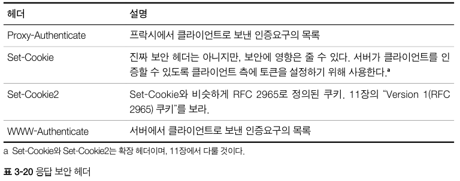

### 3.5.4 엔터티 헤더

- 엔터티 헤더는 엔터티 본문에 대한 헤더
- 예를 들어, 엔터티 헤더는 엔터티 본문에 들어있는 데이터의 타입이 무엇인지 말해줄 수 있다.
- 일반적으로 엔티티 헤더는 메시지의 수신자에게 자신이 다루고 있는 것이 무엇인지 말해줌
  - 엔티티와 그것의 내용물이 무엇인지
  - 개체의 타입, 주어진 리소스에 요청할 수 있는 유효한 메서드가 무엇인지

```html
에플리케이션에게 데이터의 형식을 알려줄 수 있다 Content-Type: text/html;
charset=iso-latin-1
```

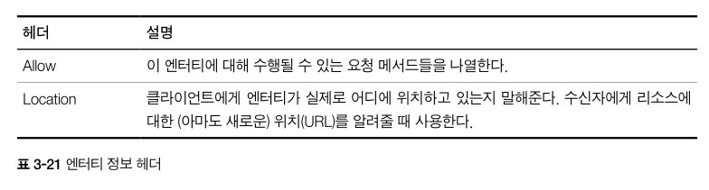

### 3.5.5 확장 헤더

- 확장 헤더는 애플리케이션 개발자들에 의해 만들어졌지만 아직 승인된 HTTP 명세에는 추가되지 않는 비표준 헤더다.
