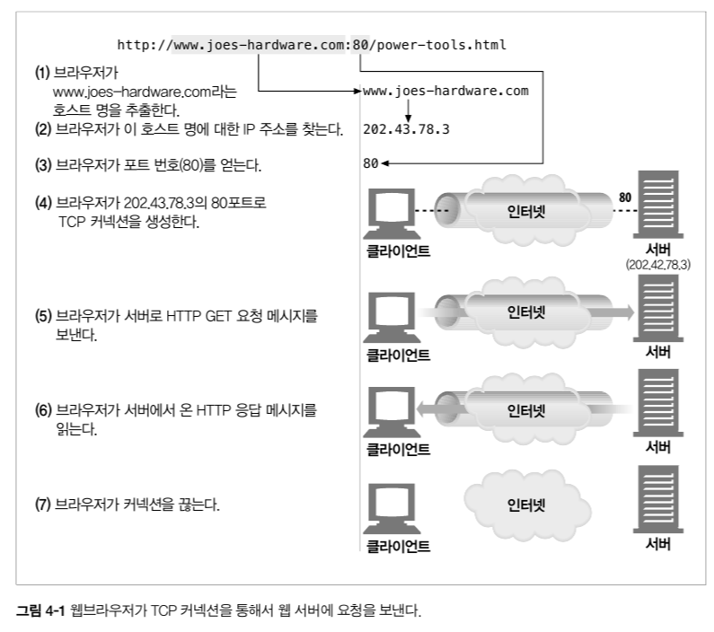
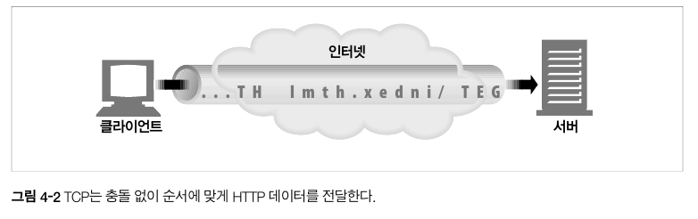
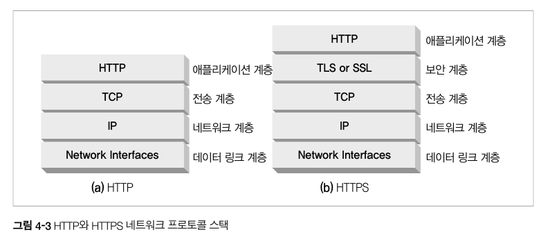
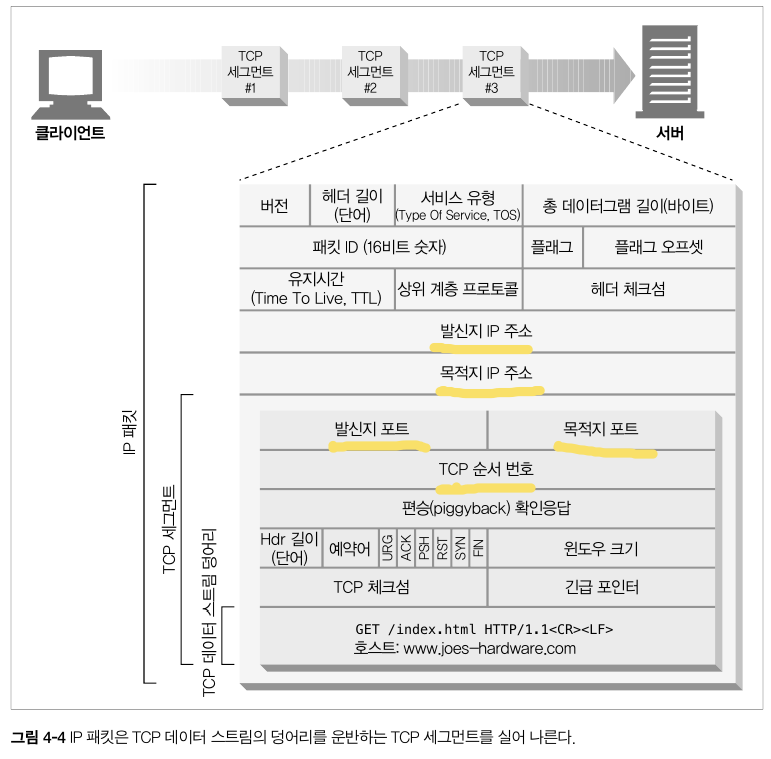
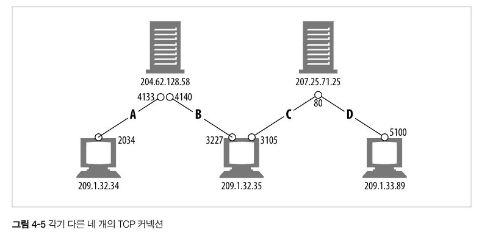
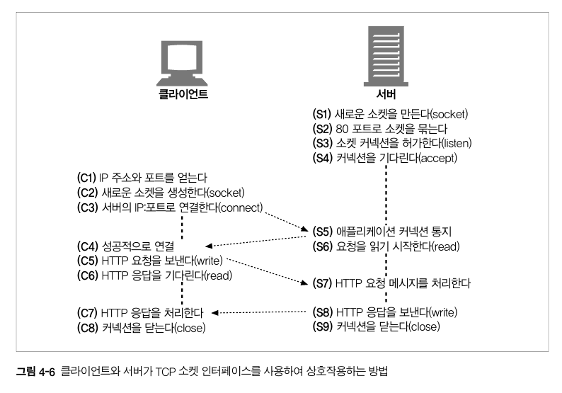
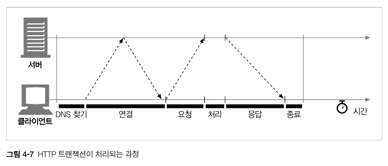
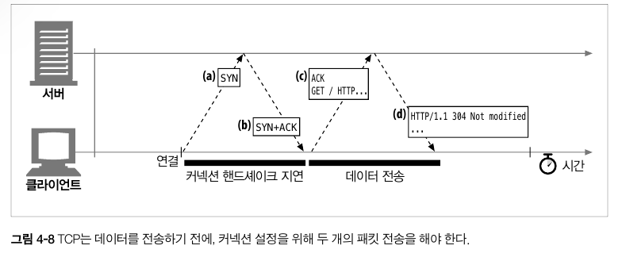
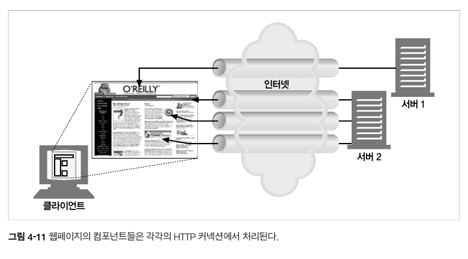
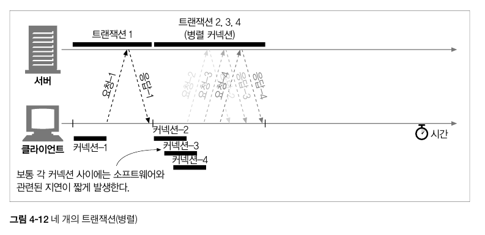

# 4장-커넥션 관리

- HTTP 애플리케이션을 개발하고 있다면 HTTP 커넥션과 그것이 어떻게 사용되는지 잘 이해하고 있어야한다.

## 4.1 TCP 커넥션

- TCP/IP 커넥션을 맺게되면 클라이언트와 서버 간에 주고 맞는 메시지들은 손실/손상되거나 순서가 바뀌지 않고 안전하게 전달된다.



### 4.1.1 신뢰할 수 있는 데이터 전송 통로인 TCP

- TCP는 HTTP 에게 신뢰할 만한 통신 방식을 제공한다.
- TCP 커넥션의 한쪽에 있는 바이트들은 반대쪽으로 순서에 맞게 정확히 전달된다.



### 4.1.2 TCP 스트림은 세그먼트로 나뉘어 IP 패킷을 통해 전송된다

- TCP는 IP 패킷(IP 데이터그램)이라 불리는 작은 조각을 통해 데이터를 전송한다.
- HTTP는 IP, TCP, HTTP 로 구성된 프로토콜 스택의 최상위 계층이다.
- HTTPS는 HTTP에 보안기능을 더했고, TLS 또는 SSL이라 불리기도 하며 HTTP와 TCP 사이에 있는 암호화(crptographic encryption) 계층이다.



- HTTP 가 메시지를 전송하고자 할 경우, 현재 연결되어 있는 TCP 커넥션을 통해 메시지 내용을 순서대로 보낸다.
- TCP는 세그먼트 단위로 데이터 스트림을 잘게 나누고, 세크먼트를 IP 패킷에 담아 인터넷을 통해 데이터를 전달한다.
- 각 세그먼트는 하나의 IP에서 다른 IP로 IP 패킷에 담겨 전달된다.
- IP 패킷

  - IP 패킷 헤더
  - TCP 세그먼트 헤더
  - TCP 데이터 조각

    

### 4.1.3 TCP 커넥션 유지하기

- TCP는 포트번호를 통해 여러개의 커넥션을 유지한다.

> 회사 대표 번호(IP주소)는 안내 데스크(IP주소)로 연결
> 내선 전화(포트번호)로 특정 직원(해당 어플리케이션)에게 연결

- TCP 커넥션은 아래 네가지 값으로 식별한다
  - `<발신지 IP주소, 발신지 포트, 수신지 IP주소, 수신지 포트>`



### 4.1.4 TCP 소켓 프로그래밍

- 운영체제는 TCP 커넥션의 생성과 관련된 기능들을 제공한다.
- 소켓 API는 HTTP 프로그래머에게 TCP 와 IP의 세부사항들을 숨긴다.
- 소켓 API를 사용하면 TCP 종단(endpoint) 데이터 구조를 생성하고, 원격 서버의 TCP 종단에 그 종단 데이터 구조를 연결하여 데이터 스트림을 읽고 쓸 수 있다.
- TCP API는 네트워크 프로토콜의 핸드셰이킹, TCP 데이터 스트림과 IP 패킷 간의 분할/재조립에 대한 세부사항을 숨긴다.



## 4.2 TCP의 성능에 대한 고려

- HTTP 트랜잭션 성능은 TCP 성능에 영향을 받는다.

### 4.2.1 HTTP 트랜잭션 지연

- 너무 많은 데이터를 내려받거나 복잡하고 동적인 자원을 실행하지 않는한 대부분의 HTTP 지연은 TCP 네트워크 지연때문에 발생한다.



- 트랜잭션을 지연시키는 원인
  - 클라이언트가 URI에서 웹서버의 IP주소와 포트번호를 알아내야한다. 해당 호스트에 최근에 방문한 적이 없다면 DNS resolution 인프라를 사용해 호스트명을 IP주소로 변환하는데 수십초의 시간이 걸린다.
  - 클라이언트가 TCP 커넥션 요청을 서버에 보내고 서버가 커넥션 허가 응답을 회신하기를 기다린다. 커넥션 설정 시간은 항상 발생하며 보통 1 -2초 소요되지만 HTTP 트랜잭션이 많아지면 소요시간이 증가할 것이다.
  - 커넥션이 맺어지면 클라이언트는 HTTP 요청을 새로 생성된 TCP 파이프라인을 통해 전송한다. 웹 서버는 데이터가 도착하면 TCP 커넥션에서 요청 메시지를 읽고 처리한다.
  - HTTP 응답을 보내는 것 역시 시간이 소요된다.
- 하드웨어 성능, 네트워크와 서버의 전송속도, 요청과 응답 메시지 크기, client-server 거리에 따라 TCP 네트워크 지연이 크게 달라진다. 또한 TCP 프로토콜의 복잡성도 지연에 영향을 준다.

### 4.2.2 성능 관련 중요 요소

- TCP 관련 지연 및 성능 요소 → 아래 나오는 것들을 이해해야 최적화 적용 가능!
  - TCP 커넥션 핸드세이크
  - 인터넷 혼잡 제어를 위한
  - ….

### 4.2.3 TCP 커넥션 핸드셰이크 지연

- TCP 커넥션을 열때면 커넥션을 맺기 위한 조건을 맞추기 위해 연속으로 IP 패킷을 교환한다.
- 작은 크기의 데이터 전송에 커넥션이 사용된다면 이런 패킷 교환은 HTTP 성능을 크게 저하시킨다.
- TCP 핸드셰이크 순서
  - 클라이언트는 새로운 TCP 커넥션을 생성하기 위해 작은 TCP 패킷(40-60바이트)을 서버에 보낸다. 이러한 패킷을 SYN 이라는 플래그를 가지는데, 이 요청이 **커넥션 요청**이라는 뜻이다.
  - 서버가 그 커넥션을 받으면 몇가지 처리를 진행하고 커넥션 요청이 받아들여졌음을 의미하는 SYN과 ACK 플래그를 포함한 TCP 패킷을 클라이언트에 보낸다.
  - 클라이언트는 커넥션이 잘 맺어졌음을 알리기 위해 서버에게 다시 확인 응답신호를 보낸다. 이 확인응답 패킷에 데이터를 함께 보낼 수 있다.



### 4.2.4 확인응답 지연

- 인터넷 자체가 패킷 전송을 완벽히 보장하지 않기 때문에(인터넷 라우터는 과부하 시 패킷을 마음대로 파기할 수 있다), TCP 는 성공적인 데이터 전송을 보장하기 위해 자체적인 확인체계가 있다.
- TCP 세그먼트는 순번과 데이터 무결성 체크섬을 가진다.
  - 각 세그먼트의 수신자는 세그먼트를 온전히 받으면 작은 확인응답 패킷을 송신자에게 전송한다.
  - 만약 송신자가 특정시간안에 확인응답을 받지 못하면 패킷이 파기되엇거나 오류가 있는것으로 판단하고 데이터를 다시 전송한다.
  - 확인 응답은 그 크기가 작기 때문에 데이터 패킷에 확인응답을 편승(piggyback)시킨다.
  - 그러나 요청과 응답 두가시 형식으로만 이루어진 HTTP 동작방식은 확인응답이 데이터에 편승할 기회를 감소시킨다.

### 4.2.5 TCP 느린 시작(slow start)

- TCP 의 데이터 전송 속도는 TCP 커넥션이 만들어진지 얼마나 지났는지에 따라 그 속도가 달라진다.
  - 처음에는 최대 속도를 제한하다가(slow start) 시간이 지나면서 점점 “튜닝”되어 데이터가 성공적으로 전송됨에 따라 속도 제한을 높여나간다.
  - 갑작스러운 부하를 막는다.
- 느린시작은 전송되는 패킷의 수를 제한한다.
- **튜닝된 커넥션은 더 빠르기 때문에 HTTP 에는 이미 존재하는 커넥션을 재사용하는 기능이 있다.**

### 4.2.6 네이글(Nagle) 알고리즘과 TCP_NODELAY

- 애플리케이션이 어떤 크기의 데이터든 TCP 스택으로 전송할 수 있도록 TCP는 데이터 스트림 인터페이스를 제공한다.(심지어 1바이트일지라도)
  - 그러나 TCP 세그먼트는 40바이트 상당의 플래그와 헤더를 포함하여 전송하기 때문에 작은 크기의 데이터를 많은 수의 패킷으로 전송한다면 네트워크 성능이 크게 떨어진다.
- 네이글 알고리즘은 패킷 전송하기 전에 많은 양의 TCP 데이터를 한 개의 덩어리로 합친다.
  - 세그먼트가 최대 크기가 되지 않으면 전송을 하지 않는다.
  - 다른 패킷들이 아직 전송중이면 데이터는 버퍼에 저장된다.
  - 전송되고나서 확인응답을 기다리던 패킷이 확인응답을 받았거나 충분할 만큼의 패킷이 쌓였을 때 버퍼에 저장되어 있던 데이터가 전송된다.

## 4.4 병렬 커넥션

- HTTP 는 클라이언트가 여러 개의 커넥션을 맺음으로써 여러개의 HTTP 트랜잭션을 병렬로 처리할 수 있게 한다.



### 4.4.1 병렬 커넥션은 페이지를 더 빠르게 내려받는다.

- 단일 커넥션의 대역폭 제한과 커넥션이 동작하지 않는 시간을 활용하면 객체가 여러개 있는 웹페이지를 더 빠르게 내려받을 수 있다

  - 하나의 커넥션이 객체를 로드하는 대역폭 제한과 대기시간을 줄인다
  - 각 커넥션의 지연시간을 곂쳐놓아 총 지연시간을 줄인다.

    

### 4.4.2 병렬 커넥션은 항상 더 빠르지는 않다

- 네트워크 대역폭이 좁을 때 대부분 시간을 데이터 전송하는데만 쓴다
  - 객체를 병렬로 내려받는 경우 이 제한된 대역폭 내에서 각 객체를 전송받는 것은 느리기 때문에 선응상의 이점은 거의 없다
- 또한 다수의 커넥션은 메모리를 많이 소모한다.
  - 서버와 백명의 사용자가 100개의 커넥션을 맺고 있다면 10000개의 커넥션을 떠앉게 된다.

### 4.4.3 병렬 커넥션은 더 빠르게 느껴질 수 있다

- 병렬 커넥션은 실제로 페이지를 더 빠르게 내려받는 것은 아니지만 화면에 여러 개의 객체가 동시에 보이면서 더 빠르게 내려받는 것처럼 보인다.

## 4.5 지속 커넥션

처리가 완료된 후에도 계속 연결된 상태로 있는 TCP 커넥션을 `지속 커넥션` 이라고 부른다.
지속 커넥션은 클라이언트나 서버가 커넥션을 끊기 전까지는 트랜젝션 간에도 커넥션을 유지한다.

### 4.5.1 지속 커넥션 vs 병렬 커넥션

병렬 커넥션에는 다음과 같은 단점이 있다.

- 각 트랜젝션마다 새로운 커넥션을 맺고 끊기 때문에 시간과 대역폭 소요
- 각각의 새로운 커넥션은 TCP 느린 시작 때문에 성능 저하
- 실제로 연결할 수 있는 병렬 커넥션의 수에는 제한이 있음

지속커넥션은 병렬 커넥션에 비해 몇 가지 장점이 있다.

- 커넥션 사전 작업과 지연 감소
- 튜닝된 커넥션(패킷을 수차례 성공적으로 전송한 결과로 한 번에 다수의 패킷을 전송할 수 있는 권한을 얻은 커넥션 상태) 유지
- 커넥션 수를 감소시킴

하지만, 잘못 관리할 경우, 계속 연결된 상태로 있는 수많은 커넥션이 쌓여 불필요한 소모를 발생시킨다.

지속 커넥션과 병렬 커넥션이 함께 사용될 때 가장 효과적이다.
오늘날 웹애플리케이션은 적은 수의 병렬커넥션을 맺고 그것을 유지한다.

HTTP/1.0+ 에는 `keep-alive` 커넥션이 있고 HTTP/1.1에는 `지속` 커넥션이 있다.

### 4.5.2 HTTP/1.0+의 Keep-Alive 커넥션

HTTP/1.0 브라우저와 서버들은 keep-alive 커넥션이라는 지속 커넥션을 지원하기 위해 확장되었다.
초기의 지속 커넥션은 상호 운용과 관련된 설계에 문제가 있었지만, 아직 많은 클라이언트와 서버는
이 초기 keep-alive 커넥션을 사용하고 있다. 설계상의 문제는 HTTP/1.1에서 수정되었다.


위의 그림은 네 개의 HTTP 트랜젝션에 대해서, 연속적으로 네 개의 커넥션을 생성하여 처리하는 방식과
하나의 지속 커넥션으로만 처리하는 방식을 비교하였다.

**커넥션을 맺고 끊는 데 필요한 작업이 없어서 시간이 단축되었다**

### 4.5.3 Keep-Alive 동작

keep-alive는 사용하지 않기로 결정되어 HTTP/1.1 명세에서 빠졌다.
하지만 아직도 브라우저와 서버 간에 keep-alive 핸드셰이크가 널리 사용되므로, HTTP 애플리케이션은
그것을 처리할 수 있게 개발해야한다.

```
GET /index.html HTTP/1.0
...
Connection: Keep-Alive

HTTP/1.0 200 OK
...
Connection: Keep-Alive
```

커넥션을 요청하기 위해서는 헤더에 `Connection:Keep-Alive` 헤더를 포함시킨다.
서버가 요청을 받고 그 다음 요청도 이 커넥션을 통해 받고자 한다면, 응답 메시지에도 같은 헤더를 포함시켜 응답한다.

### 4.5.4 Keep-Alive 옵션

- timeout
- max

```
Connection: Keep-Alive
Keep-Alive: max=5, timeout=120
```

서버가 5개의 트랜젝션이 처리될 동안 커넥션을 유지하거나, 2분 동안 커넥션을 유지하라는 Keep-Alive 응답헤더다.

### 4.5.5 Keep-Alive 커넥션 제한과 규칙

- HTTP/1.0에서 기본으로 사용되지 않음
- 커넥션을 계속 유지하려면 모든 메시지에 헤더를 포함해야 함
- 엔터티 본문이 정확한 Content-Length 값과 함께 멀티파트 미디어형식을 가지거나
  청크 전송 인코딩으로 인코드 되어여 함
- 프락시와 게이트웨이는 메시지를 전달하거나 캐시에 넣기 전 Connection 헤더에 명시된 모든 헤더 필드와
  Connection 헤더를 제거해야함
- 프락시 서버와는 맺어지면 안된다.
- HTTP/1.0을 따르는 기기로 부터 받는 모든 Connection 헤더 필드는 무시해야 함

### 4.5.6 Keep-Alive와 멍청한 프락시

_Connection 헤더의 무조건 전달_

프락시는 Connection 헤더를 이해하지 못하므로 서버에게 그대로 전달한다.
즉, 서버와 프락시가 keep-alive가 맺어지고 멍청한 프락시는 서버로부터 받은 응답 메시지를
클라이언트에게 전달한다. 클라이언트는 응답 메시지를 받고, 다음 요청을 보내는데
이 때, 프락시는 같은 커넥션 상에서 다른 요청이 오는 경우를 예상하지 못하기 때문에 응답 없이 기다리고만 있다.(서버 커넥션이 끊기기를)

_프락시와 홉별 헤더_

잘못을 피하려면, 프락시는 Connection 헤더와 명시된 헤더들은 절대 전달하면 안 된다.
또한, 다른 홉별 헤더들 역시 전달하거나 캐시하면 안 된다.


### 4.5.7 Proxy-Connection 살펴보기

넷스케이프는 멍청한 프락시 문제를 해결하기 위해 일반적인 Connection 헤더 대신 비표준인 `Proxy-Connection 확장 헤더`를 프락시에게 전달한다.

서버는 Proxy-Connection을 무시하기 때문에 문제가 되지않는다.
그러나 영리한 프락시는 Proxy-Connection 헤더가 keep-alive를 요청하는 것임을 인식하여,
자체적으로 Connection:keep-Alive 헤더를 웹 서버로 전송한다.


그러나 여러 멍청한 프락시와 영리한 프락시가 연결되어 있으면 여전히 잘못된 헤더를 만들어내는 문제가 발생한다.


### 4.5.8 HTTP/1.1의 지속 커넥션

HTTP/1.1에서 keep-alive 커넥션을 지원하지 않는 대신 설계가 더 개선된 `지속 커넥션`을 지원한다.
별도 설정을 하지 않는 한, 모든 커넥션을 지속커넥션으로 취급한다.

### 4.5.9 지속 커넥션의 제한과 규칙

- 클라이언트가 요청에 `Connection: close`헤더를 포함하면, 그 커넥션으로 추가 요청을 보낼 수 없음
- 커넥션에 있는 모든 메시지가 자신의 길이를 정확히 가지고 있을 때에만 커넥션 지속 가능
- HTTP/1.1 프락시는 클라이언트와 서버 각각에 대해 별도 지속 커넥션을 맺고 관리
- HTTP/1.1 프락시는 클라이언트의 지원 범위를 알고 있지 않은 한 지속 커넥션을 맺으면 안된다
- 클라이언트는 전체 응답을 받기 전에 커넥션이 끊어지면, 요청을 반복해서 보내도 문제 없는 경우에는
  요청을 다시 보낼 준비가 되어야함
- N명의 사용자가 서버로 접근하려 하면, 프락시는 서버나 상위 프락시에 넉넉잡아 2N개의 커넥션을 유지해야함

---

## 4.6 파이프라인 커넥션

HTTP/1.1은 지속 커넥션을 통해서 요청을 `파이프라이닝`할 수 있다.


파이프라인에는 여러 가지 제약 사항이 있다.

- HTTP 클라이언트는 커넥션이 지속 커넥션인지 확인하기 전까지는 파이프라인을 이어서 안됨
- HTTP 응답은 요청 순서와 같게 와야 함
- HTTP 클라이언트는 완료되지 않은 요청이 파이프라인에 있으면 언제든지 다시 요청을 보낼 준비가 되어있어야 함
- `POST` 요청같이 반복해서 보낼 경우 문제가 생기는 요청은 파이프라인을 통해 보내면 안됨

---

## 4.7 커넥션 끊기에 대한 미스터리

### 4.7.1 마음대로 커넥션 끊기

HTTP 애플리케이션은 언제든지 지속 커넥션을 임의로 끊을 수 있다.

### 4.7.2 Content-Length와 Truncation

클라이언트나 프락시가 커넥션이 끊어진 HTTP 응답을 받은 후, 실제 전달된 엔터티의 길이와
Content-Length의 값이 일치하지 않거나 Content-Length 자체가 존재하지 않으면
수신자는 데이터의 정확한 길이를 서버에게 물어봐야 한다.

### 4.7.3 커넥션 끊기의 허용, 재시도, 멱등성

정적인 페이지를 Get 하는 요청들은 반복 요청하더라도 결과적으로 아무런 영향을 끼치지 않는다.
반면 POST 부류의 요청은 반복될 경우 여러 번 중복될 것이므로 반복은 피해야 한다.

클라이언트는 POST와 같이 멱등이 아닌 요청은 파이프라인을 통해 요청하면 안 된다. 전송 커넥션이
예상치 못하게 끊기면 알 수 없는 결과를 초래하기 때문이다.

한 번 혹은 여러번 실행됐는지에 상관없이 같은 결과를 반환한다면 그 트랜잭션은 멱등하다고 한다.
GET, HEAD, PUT, DELETE, OPTIONS, TRACE는 멱등하다.

### 4.7.4 우아한 커넥션 끊기

TCP 커넥션은 양방향이다. 한쪽 출력 큐에 있는 데이터는 다른 쪽 입력 큐에 보내질 것이다.


**전체 끊기와 절반 끊기**

- `전체끊기 close()` : TCP 커넥션이 입력, 출력 채널의 모든 커넥션을 끊음
- `절반끊기 shutdown()` : 입력, 출력 채널 중 하나를 개별적으로 끊음

**TCP 끊기와 리셋 에러**

커넥션의 반대편에 있는 기기는 모든 데이터를 버퍼로부터 읽고 나서 데이터 전송이 끝남과 동시에 당신이 커넥션을 끊었다는 것을 알게 될 것이다. 클라이언트에서 더는 데이터를 보내지 않을 것임을 확신할 수 없는 이상, 커넥션의 입력 채널을 끊는 것은 위험하다.

만약 클라이언트에서 이미 끊긴 입력 채널에 데이터를 전송하면 서버의 운영체제는 TCP 'connection reset by peer' 메시지를 클라이언트에 보낼 것이고 대부분 운영체제는 이것을 심각한 에러로 취급하여 버퍼에 저장된, 아직 읽히지 않은 데이터를 모두 삭제한다.

따라서 예상치 못한 쓰기 에러를 발생하는 것을 예방하기 위해 `절반 끊기`를 사용해야 한다.
보통은 `출력 채널`을 끊는 것이 안전하다.

**우아하게 커넥션 끊기**

일반적으로 애플리케이션 자신의 `출력 채널을 먼저 끊고 다른 쪽 기기의 출력 채널이 끊기는 것을 기다리는 것`이다.

하지만 상대방이 절발 끊기를 구현했다는 보장도 없고, 검사해준다는 보장도 없다.
따라서, 절반 끊기를 하고 난 후에도 데이터나 스트림의 끝을 식별하기 위해 입력 채널에 대해 상태 검사를 주기적으로 해야한다.
