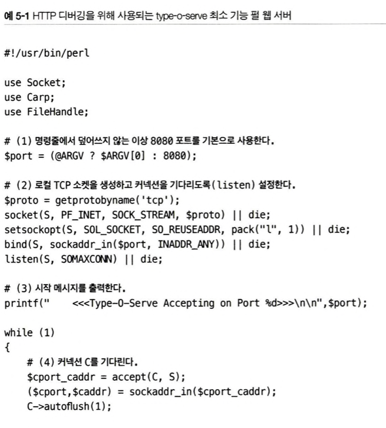
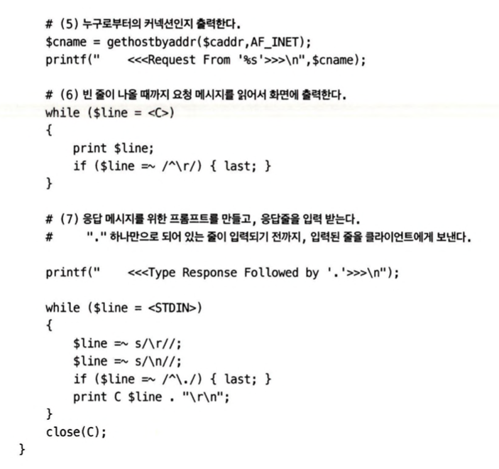
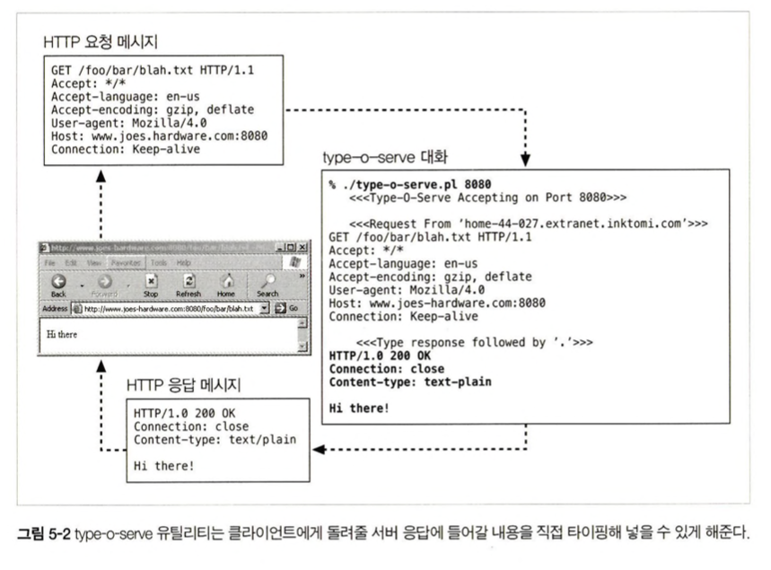
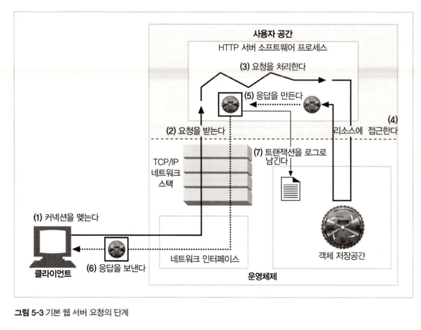
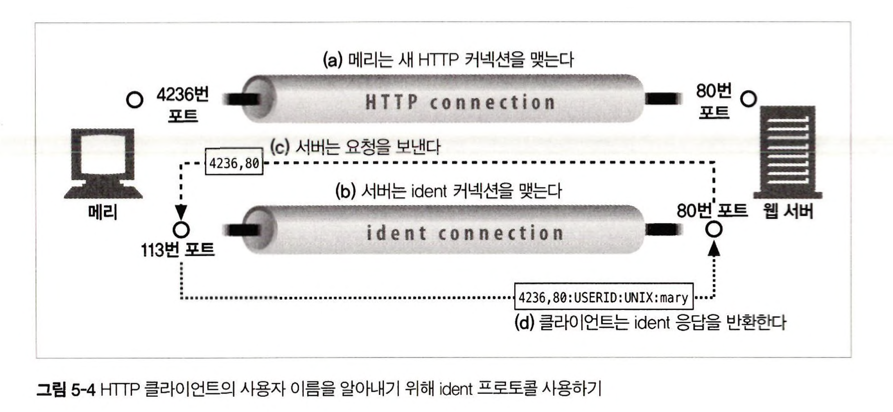
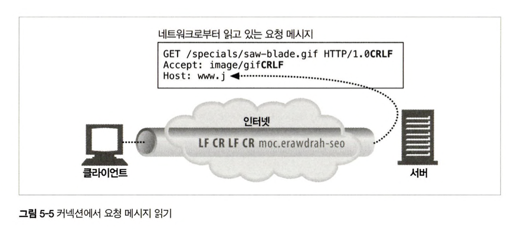
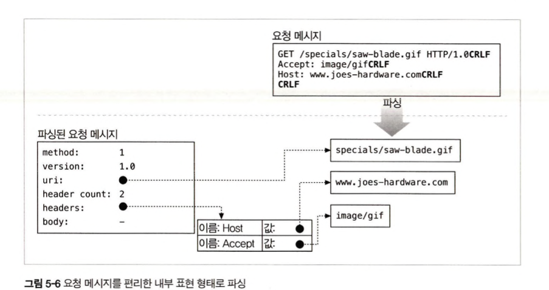
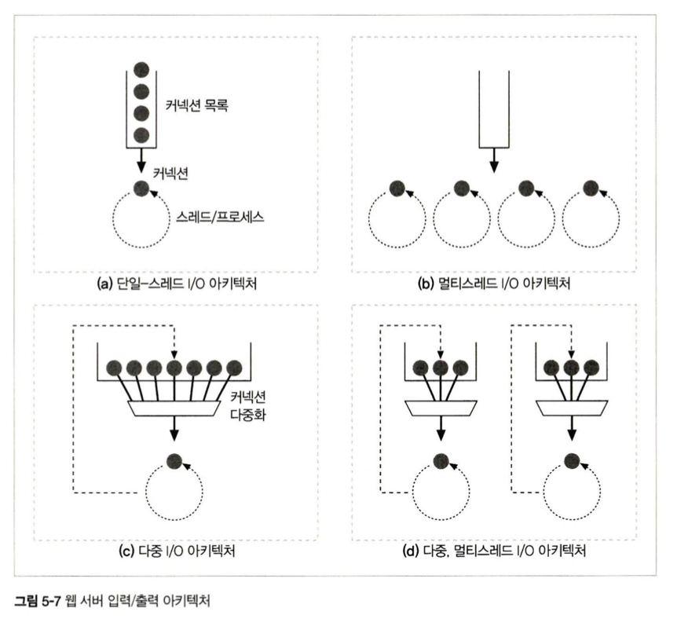

# 5장 웹 서버

이 장에서는 다음과 같은 내용을 다룹니다

- 여러 종류의 소프트웨어 및 하드웨어 웹 서버에 대해 조사한다
- HTTP 통신을 진단해주는 간단한 웹 서 버를 Perl로 작성해본다
- 어떻게 웹 서버가 HTTP 트랜잭션을 처리하는지 단계별로 설명한다

## 5.1 다채로운 웹 서버

웹 서버는 HTTP 요청을 처리하고 응답을 제공한다. “웹 서버”라는 용어는 웹 서버 소프트웨어와 웹페이지 제공에 특화된 장비(컴퓨터와 같은)양쪽 모두를 가리킨다

웹서버는 기능, 형태, 크기가 모두 다양하다. 기능은 달라도 모든 웹 서버는 리소스에 대한 HTTP 요청을 받아서 콘텐츠를 클라이언트에게 돌려준다

### 5.1.1 웹 서버 구현

- 웹서버란 무엇일까
  웹 서버 - HTTP및 그와 관련된 TCP 처리를 구현한 것이다.
  자신이 제공하는 리소스를 관리하고, 웹 서버 관리 기능또한 제공한다
- 웹 서버와 운영체제의 관계
  웹 서버 : HTTP 프로토콜 구현, 웹 리소스 관리, 웹 서버 관리기능 제공 , TCP 커넥션 관리를 운영체제와 나눠 가짐
  운영체제 : 시스템 하드웨어 관리, TCP/IP 네트워크 지원, 웹 리소스에 대한 파일시스템, 현재 연산활동을 제어하기 위한 프로세스 관리를 제공
- 웹 서버의 여러가지 형태

  1. 다목적 소프트웨어 웹 서버를 표준 컴퓨터 시스템에 설치하고 실행할 수 있다.
  2. 전자기기 안에 몇개의 컴퓨터 칩만으로 구현된 웹 서버를 내장시켜서 완전한 관리 콘솔로 제공한다

     (ex. 공유기에서 제공하는 관리 기능을 웹브라우저로 접근 가능한 것)

### 5.1.2 다목적 소프트웨어 서버

네트워크에 연결된 표준 컴퓨터 시스템에서 동작한다(보통 우리가 서버라고 부르는 것들)

세상에 수만가지 웹 서버 프로그램이 존재하지만 몇가지 웹 서버 소프트웨어만 널리 사용된다

ex) 마이크로소프트 아파치, nginx, google NCSIA

넷크래프트의 자료중에서 현재 인터넷 웹 사이트들이 어떤 서버를 통해 서비스되고 있는지 볼 수 있다

[https://news.netcraft.com/archives/2023/01/27/january-2023-web-server-survey.html](https://news.netcraft.com/archives/2023/01/27/january-2023-web-server-survey.html)

현재 nginx가 1위..!

### 5.1.3 임베디드 웹 서버

일반 소비자용 제품에 내장될 목적으로 만들어진 작은 웹 서버, 제품을 간편한 웹 브라우저 인터페이스로 관리할 수 있게 해준다. (ex. 프린터나 가전제품)

## 5.2 간단한 펄 웹 서버

완전한 기능을 갖춘 HTTP 서버를 만들고자 한다면 할 일이 좀 많다.(아파치 웹 서버 코어는 50000줄이 넘고, 부가 처리 모듈들을 달면 더 커짐)

하지만 최소한으로 기능하는 HTTP 는 40줄 이하의 Perl 코드로도 만들 수 있다.





이 프로그램은 type-o-serve라고 이름 붙은 작은 펄 프로그램을 보여준다. 클라이언트와 프락시 간의 상호작용 테스트에 유용한 진단 툴이다.

type-o-serve가 웹 서버를 흉내내는 이 방식은, HTTP요청 메세지를 정확하게 기록하고, 어떤 HTTP 응답 메세지라도 돌려보내줄 수 있도록 해준다

어떤식으로 Http 통신이 되는가



1. type-o-serve 진단 서버 실행
2. 브라우저에서 80번 포트로 접근(http 요청)
3. 프로그램은 브라우저로부터 HTTP 요청 메시지를 받아 화면에 출력한 뒤, 관리자가 응답 메시지를 입력할때까지 대기
4. 프로그램이 HTTP 응답 메시지를 브라우저에게 돌려주고, 브라우저는 응답 메시지 본문을 출력

## 5.3 진짜 웹 서버가 하는 일

위의 예시는 간단한 웹 서버이고 최신식 웹 서버는 그보다 복잡하지만,

공통적으로 다음 일들을 수행한다.



1. 커넥션을 맺는다 - 클라이언트 접속을 받아들이거나, 원치 않는 클라이언트라면 커넥션을 닫는다
2. 요청을 받는다 - HTTP 요청 메세지를 네트워크로부터 읽어들인다.
3. 요청을 처리한다 - 요청 메시지를 해석하고 행동을 취한다
4. 리소스에 접근한다 - 메시지에서 지정한 리소스에 접근한다
5. 응답을 만든다 - 올바른 헤더를 포함한 HTTP 응답 메시지를 생성한다
6. 응답을 보낸다 - 응답을 클라이언트에게 돌려준다
7. 트랜잭션을 로그로 넘긴다 - 로그파일에 트랜잭션 완료에 대한 기록을 남긴다

## 5.4 단계1 : 클라이언트 커넥션 수락

클라이언트가 이미 서버에 열려있는 지속적 커넥션을 갖고있다면, 클라이언트는 요청을 보내기 위해 그 커넥션을 사용할 수 있다, 커넥션이 없다면, 클라이언트는 서버에 대한 새 커넥션을 열 필요가 있다.

### 5.4.1 새 커넥션 다루기

> IP주소를 통해 어떤 클라이언트인지 확인 - 커넥션 추가

클라이언트가 웹 서버에 TCP 커넥션을 요청하면, 웹서버는 그 커넥션을 맺고, TCP 커넥션에서 IP주소를 추출하여 커넥션에 어떤 클라이언트가 있는지 확인한다.

새 커넥션이 맺어지고 받아들여지면, 새 커넥션을 커넥션 목록에 추가하고, 오가는 데이터를 지켜보기 위한 준비를 한다.

웹 서버는 어떤 커넥션이든 마음대로 거절하거나 즉시 닫을 수 있다.

IP주소나 호스트 명이 인가되지 않았거나 악의적이라고 알려진 경우 커넥션을 닫는다

### 5.4.2 클라이언트 호스트 명 식별

> 역방향 DNS로 ip주소에서 클라이언트 호스트명 식별

대부분 웹 서버는 역방향 DNS를 사용해서 ip주소를 클라이언트 호스트 명으로 변경한다.

이 호스트 명을 구체적인 접근 제어와 로깅을 위해 사용한다

호스트명 룩업은 시간이 많이 걸릴 수 있어서 트랜잭션을 느려지게 할 수 있다. 많은 대용량 웹 서버는 호스트 명 분석을 꺼두거나 특정 콘텐츠에서만 사용한다

### 5.4.3 ident를 통해 클라이언트 사용자 알아내기

> ident 프로토콜로 클라이언트 식별

몇몇 웹 서버는 또한 IETF ident 프로토콜을 지원한다. ident 프로토콜은 서버에게 어떤 사용자 이름이 HTTP 커넥션을 초기화했는지 찾아낼 수 있게 해준다. 이 정보는 특히 웹 서버 로깅에서 유용하기 때문에, 널리 쓰이는 일반 로그 포맷의 두번째 필드는 각 HTTP 요청의 ident 사용자 이름을 담고 있다..



만약 클라이언트가 ident 프로토콜을 지원한다면, 클라이언트는 ident 결과를 위해 TCP 포트 113번을 listen한다.

클라이언트는 HTTP 커넥션을 연다. 서버는 그 후 자신의 커넥션을 클라이언트의 identd 서버 포트(113)를 향해 열고, 새 커넥션(클라이언트와 서버 포트 번호로 지정되는)에 대응하는 사용자 이름을 묻는 간단한 요청을 보낸다.

- 많은 클라이언트는 ident 데몬 소프트웨어를 실행하지 않음
- HTTP 트랜잭션을 유의미하게 지연시켜서
- 방화벽이 ident 트래픽을 막아서
- 안전하지 않고 조작하기 쉬워서
- 가상 ip 주소를 잘 지원하지 않아서.
- 클라이언트 사용자 이름 노출로 인한 프라이버시 침해가 있어서

와 같은 이유로 공공 인터넷에서는 잘 사용되지는 않고 조직 내부에서는 잘 사용한다

## 5.5 단계2 : 요청 메시지 수신

커넥션에 데이터가 도착하면, 웹 서버는 네트워크 커넥션에서 그 데이터를 읽어들이고 파싱하여 요청 메세지를 구성한다.



요청 메시지를 파싱할 때 웹서버가 하는 일

1. 요청줄을 파싱하여 요청메서드, 식별자, 버전번호를 찾는다.

   각키워드는 스페이스 한 개로 분리, 요청줄은 CRLF 문자열로 끝난다

2. 메시지 헤더들을 읽는다. 각 메시지 헤더는 CRLF로 끝난다.
3. 헤더의 끝을 의미하는 CRLF로 끝나는 빈 줄을 찾는다(있다면)
4. 요청 본문이 있다면, Content-Length만큼 읽어들인다

요청 메시지를 파싱할 때 입력 데이터는 네트워크로부터 불규칙적으로 들어오고, 네트워크 커넥션 또한 언제라도 무효화 될 수 있다.

웹서버는 하나의 메세지에 대해 메시지를 파싱해서 이해하는 것이 가능한 수준의 분량을 확보할때까지 데이터를 네트워크로부터 읽어서 메시지 일부분을 메모리에 임시로 저장해둘 필요가 있다

### 5.5.1 메시지의 내부 표현

몇몇 웹 서버는 요청 메시지를 쉽게 다루기 위해 메시지를 내부 자료 구조에 저장한다

ex) 요청 메시지의 각 조각에 대한 포인터와 길이 담기

헤더는 속도가 빠른 룩업 테이블에 저장하여 각 필드에 신속하게 접근



### 5.5.2 커넥션 입력/출력 처리 아키텍쳐

고성능 웹 서버는 수천개의 커넥션을 동시에 열수 있도록 지원한다. 이 커넥션들은 웹 서버가 전세계의 클라이언트들과 각각 한개 이상의 커넥션을 통해 통신할 수 있게 해준다.

언제라도 요청이 들어올 수 있기 때문에 웹 서버는 항상 새 요청을 주시한다.

웹 서버 아키텍쳐의 차이에 따라 요청을 처리하는 방식이 달라진다.



- 단일 스레드 웹 서버
  한번에 하나씩 요청을 처리한다. 하나의 트랜잭션 이후에 다음 커넥션이 처리된다.
  구현하기 간단하지만 처리 도중에 다른 커넥션은 모두 무시된다.
  심각한 성능 문제가 있으므로 로드가 적은 서버나 type-o-serve같은 진단도구에서만 적당하다
- 멀티 프로세스와 멀티스레드 웹 서버
  여러개의 요청을 동시에 처리하기 위해 여러개의 프로세스 혹은 고효율 스레드를 할당한다
  스레드/프로세스는 필요할 때마다 만들어질 수도 있고, 미리 만들어질 수 있다.
  몇몇 서버는 매 커넥션마다 프로세스/스레드를 할당하지만, 그렇게 되는 경우 수많은 커넥션을 동시에 처리할 때 너무 많은 메모리나 시스템 리소스를 소비하므로, 많은 멀티스레드 웹 서비스가 스레드, 프로세스의 최대 개수에 제한을 둔다
- 다중 I/O 서버
  대량의 커넥션을 위해 많은 웹 서버가 다중 아키텍쳐를 채택했다.
  커넥션의 수락과 동시에 그 활동을 감시한다.
  커넥션의 상태가 바뀌면(데이터를 사용할 수 있게 되거나 에러가 발생) 그 커넥션에 대한 작은양의 처리를 수행한다.
  그 처리가 완료되면 커넥션은 다음번 상태 변경을 위해 열린 커넥션 목록으로 돌아간다
  즉 어떤 커넥션에 대해 작업이 이루어지는 것은, 그 커넥션에 실제로 해야할 일이 있을 때 뿐이다
  스레드와 프로세스가 유휴상태의 커넥션에 매여 기다리느라 리소스를 낭비하지 않는다
- 다중 멀티스레드 웹 서버
  멀티 스레드 + 다중 I/O 서버
  여러개의 스레드가 각각 열려있는 커넥션을 감시하고, 각 커넥션의 상태 변화에 따라 작업을 처리한다.

## 5.6 단계 3: 요청처리

- 웹 서버가 요청을 받으면, 서버는 요청으로부터 메서드, 리소스, 헤더, 본문(없는 경우도 있다)을 얻어내어 처리한다.
- POST를 비롯한 몇몇 메서드는 요청 메시지에 엔터티 본문이 있을 것을 요구한다
- 그 외 OPTIONS를 비롯한 다수의 메서드는 요청에 본문이 있는 것을 허용하되 요구하진 않는다.
- 많진 않지만 GET과 같이 요청 메시지에 엔터티 본문이 있는 것을 금지하는 메서드도 있다.

## 5.7 단계 4: 리소스의 매핑과 접근

웹 서버는 리소스 서버이다.

웹 서버는 미리 만들어진 콘텐츠를 제공하고, 리소스 생성 어플리케이션을 통해 동적 콘텐츠도 제공한다.

> 웹 서버가 클라이언트에 콘텐츠를 전달하려면, 그 전에 요청 메시지의 URI에 대응하는 알맞은 콘텐츠나 콘텐츠 생성기를 웹 서버에서 찾아서 콘텐츠의 원천을 식별해야한다.

### 5.7.1 Docroot

- 웹 서버는 여러 종류의 리소스 매핑을 지원한다.
- 리소스 매핑의 가장 단순한 형태는 요청 URI를 웹 서버의 파일 시스템 안에 있는 파일 이름으로 사용하는 것이다.
- 일반적으로 웹 서버 파일 시스템의 문서 루트(docroot)를 웹 콘텐츠를 위해 예약해둔다.


- 위 그림을 보았을 때, 웹 서버는 문서루트 `/usr/local/httpd/files` 를 가지고 있다.
- 웹 서버는 `/special/saw-blade.gif` 에 대한 요청이 도착하면 `/usr/local/httpd/files/special/saw-blade.gif` 를 반환한다.
  ```tsx
  DocumentRoot / usr / local / httpd / files;
  ```
  위 처럼 httpd.conf 설정 파일에 DocumentRoot 줄을 추가해서 아파치 웹 서버의 문서 루트를 설정할 수 있다.
- 가상 호스팅된 docroot

  - 가상 호스팅 웹 서버는 각 사이트에 그들만의 분리된 문서 루트를 주는 방법으로 한 웹 서버에서 여러 개의 웹 사이트를 호스팅한다.
  - 가상 호스팅 웹 서버는 URI나 Host 헤더에서 얻은 IP 주소나 호스팅 명을 이용해 올바른 문서 루트를 식별한다.
  - 이 방법으로 하나의 웹 서버 위에서 두 개의 사이트가 완전히 분리된 콘텐츠를 갖고 호스팅 되도록 할 수 있다.

    

    요청 A가 도착하면 /docs/joe/index.html 파일을 가져온다.

    요청 B가 도착하면 /docs/mary/index.html 파일을 가져온다.

  - 가상으로 호스팅 되는 docroot 설정은 대부분의 웹 서버에서 간단하다.
    자세한 내용은 18장 가상 호스팅 참고

    ```tsx
    <VirtualHost www.joes-hardware.com>
    	ServerName www.joes-hardware.com
    	DocumentRoot /docs/joe
    	TransferLog /logs/joe.access_log
    	ErrorLog /logs/joe.error_log
    </VirtualHost>

    <VirtualHost www.marys-antiques.com>
    	ServerName www.marys-antiques.com
    	DocumentRoot /docs/mary
    	TransferLog /logs/mary.access_log
    	ErrorLog /logs/mary.error_log
    </VirtualHost>
    ...
    ```

- 사용자 홈 디렉터리 docroots
  - docroot는 사용자들이 한 대의 웹 서버에서 각자의 개인 웹 사이트를 만들 수 있도록 해준다.
  - 보통 빗금(`/`)과 물결표(`~`) 다음에 사용자 이름이 오는 것으로 시작하는 URI는 그 사용자의 개인 문서 루트를 가리킨다.
  - 개인 docroot는 주로 사용자 홈 디렉터리 안에 있는 public_html로 불리는 디렉터리지만 설정에 따라 다르다.

### 5.7.2 디렉터리 목록

- 웹 서버는 경로가 파일이 아닌 디렉터리를 가리키는, 디렉터리 URL에 대한 요청을 받을 수 있다.
- 대부분의 웹 서버는 클라이언트가 디렉터리 URL을 요청했을 때 다음과 같이 몇 가지 다른 행동을 취하도록 설정할 수 있다.
  - 에러를 반환
  - 디랙터리 대신 특별한 ‘색인 파일’을 반환
  - 디랙터리 탐색 후 그 내용을 담은 HTML 페이지 반환
- 대부분의 웹 서버는
  - 요청한 URL에 대응되는 디렉터리 안에서 index.html 혹은 index.htm으로 이름 붙은 파일을 찾는다.
  - 사용자가 어떤 디렉터리에 대한 URL을 요청했는데, 그 디렉터리가 index.html 혹은 index.htm이란 이름을 가진 파일을 갖고 있다면, 서버는 그 파일의 콘텐츠를 반환할 것이다.
  - 아파치 웹 서버에서 DirectoryIndex 설정 지시자를 사용해서 기본 디렉터리 파일로 사용될 모든 파일의 이름을 우선순위로 나열한다.
    다음 설정은 아파치가 디렉토리 URL 요청에 대한 응답으로 나열된 파일 중 하나를 찾게 만든다.
    ```tsx
    DirectoryIndex index.html index.htm home.html home.htm index.cgi
    ```
  - 사용자가 디렉터리 URI를 요청했을 때 기본 색인 파일이 없고 디렉터리 색인 기능이 꺼져 있지 않다면, 웹 서버는 자동으로 그 디렉터리의 파일들을 크기, 변경일 및 그 파일에 대한 링크와 함께 열거한 HTML 파일을 반환한다.
    다음과 같이 디렉터리 색인 파일 자동 생성을 끌 수 있다.
  ```tsx
  Options - Indexs;
  ```

### 5.7.3 동적 콘텐츠 리소스 매핑

- 웹 서버는 URI를 동적 리소스에 매핑할 수도 있다.
- 요청에 맞게 콘텐츠를 생성하는 프로그램에 URI를 매핑하는 것이다.
  
- 대부분의 웹 서버는 동적 리소스를 식별하고 매핑할 수 있는 기본적인 매커니즘을 갖고 있다.
- 아파치는 URI의 경로명이 실행 가능한 프로그램이 위치한 디렉터리로 매핑되도록 하는 기능을 제공한다.
  ```tsx
  ScriptAlias /cgi-bin/ /usr/local/etc/httpd/cgi-programs/
  ```
  위 예시를 보았을 때, URI의 경로가 `/cgi-bin/` 으로 시작한다면 `/` 이하에서 프로그램을 찾아 실행하라는 의미이다.
- 아파치에서 특정 확장자의 파일만 실행하도록 설정 가능하다.
  ```tsx
  AddHandler cgi-script .cgi // .cgi로 끝나는 모든 웹 리소스는 실행되어야 함을 명시
  ```

### 5.7.4 서버사이드 인클루드(Server-Side Includes, SSI)

- SSI를 사용하면 다른 동적인 기술을 이용해 페이지 전체를 만들어 서비스하지 않고 HTML에 동적으로 생성된 파일을 추가할 수 있다.
- 만일 어떤 리소스가 SSI를 포함하는 것으로 설정되어있다면 서버는 그 리소스의 콘텐츠를 클라이언트에게 보내기 전에 처리한다.
- 서버는 콘텐츠에 변수 이름이나 내장된 스크립트가 될 수 있는 어떤 특별한 패턴이 있는 지 검사를 받는다.
- 특별한 패턴은 변수 값이나 스크립트의 출력 값으로 치환되며 이는 동적 콘텐츠를 만드는 쉬운 방법이다.

### 5.7.5 접근 제어

- 웹 서버는 각각의 리소스에 접근 제어를 할당할 수 있다.
- 접근 제어되는 리소스 요청이 도착했을 때 웹 서버는 클라이언트 IP 주소에 근거하여 접근을 제여 할 수 있다
- 리소스에 접근을 위한 비밀번호를 물어볼 수도 있다.

## 5.8 단계 5: 응답 만들기

한번 서버가 리소스를 식별하면, 서버는 요청 메서드로 서술되는 동작을 수행한 뒤 응답 메시지를 반환한다.

### 5.8.1 응답 엔티티

만약 트랜잭션이 응답 본문을 생성한다면, 그 내용을 응답 메시지와 함께 돌려보낸다. 만약 본문이 있다면 응답 메시지는 주로 다음을 포함한다.

- 응답 본문의 MIME 타입을 서술하는 Content-Type 헤더
- 응답 본문의 길이를 서술하는 Content-Length 헤더
- 실제 응답 본문의 내용

### 5.8.2 MIME 타입 결정하기

- 웹 서버에게는 응답 본문의 MIME 타입을 결정해야 하는 책임이 있다.
- MIME 타입과 리소스를 연결하는 여러가지 방법이 있다.

  - mime.types
    웹 서버는 MIME 타입을 나타내기 위해 파일 이름이 확장자를 사용할 수 있다. 각 리소스의 MIME 타입을 계산하기 위해 확장자 기반 타입 연계가 가장 흔한 방법이다.
    
  - 매직 타이핑(Magic typing)
    아파치 웹 서버는 각 파일의 MIME 타입을 알아내기 위해 파일의 내용을 검사해서 알려진 패턴에 대한 테이블에 해당하는 패턴이 있는 지 찾아본다.
    이 방식이 느리긴 하지만 표준 확장자 없이 이름이 지어진 경우엔 특히 편리하다.
  - 유형 명시 (Explicit typing)
    특정 파일이나 디렉터리 안의 파일들이 파일 확장자나 내용에 상관 없이 어떤 MIME 타입을 갖도록 웹 서버를 설정할 수 있다.
  - 유형 협상(Type negotiation)
    한 리소스가 여러 종류의 문서 형식에 속하도록 설정할 수 있다. 이때 웹 서버가 사용자와의 협상 과정을 통해 사용하기 가장 좋은 형식을 판별할 것인 지의 여부도 설정 가능하다. 또 특정 파일이 특정 MIME 타입을 갖게끔 설정 가능하다.

### 5.8.3 리다이렉션

- 웹 서버는 성공 메시지 대신 리다이렉션 응답을 반환한다.
- 웹 서버는 요청을 수행하기 위해 브라우저가 다른 곳에 가도록 리다이렉트 할 수 있다.
- 리 다이렉션 응답은 3XX 상태 코드로 지칭된다.
- 리다이렉션이 유용한 경우
  - 영구히 리소스가 옮겨지면 (301 Moved Permanetly)
    클라이언트는 북마크를 갱신할 수 있다고 말해줄 수 있다.
  - 임시로 리소스가 옮겨진 경우 (303 See Other, 307 Temporary Redirect)
    임시로 옮긴거기 때문에 나중에 원래 URL로 찾아오고, 북마크도 갱신 하지 않길 원함
  - URL 증강 (303 See Other, 307 Temporary Redirect)
    문맥정보를 포함시키기 위해 요청이 도착했을 때 상태 정보를 내포한 새 URL 생성. 트랜잭션 간 상태를 유지하는 유용한 방법
  - 부하 균형 (303 See Other, 307 Temporary Redirect)
    과부하된 서버가 요청을 받으면 덜 부하기 걸린 서버로 클라이언트를 리다이렉트 할 수 있다
  - 친밀한 다른 서버가 있을 때 (303 See Other, 307 Temporary Redirect)
    클라이언트에 대한 정보를 가지고 있는 다른 서버가 있다면 그 다른 서버로 리다이렉트
  - 디렉터리 이름 정규화
    클라이언트가 URI를 요청하는데 끝에 빗금을 빠트렸다면 슬래시를 추가한 URI로 리다이렉트

## 5.9 단계 6: 응답 보내기

- 서버는 여러 클라이언트에 대한 많은 커넥션을 가질 수 있다.
- 그들 중 일부는 아무것도 안 하고, 일부는 서버로 데이터를 보낸다.
- 다른 일부는 클라이언트로 돌려줄 응답을 실어 나르고 있다.
- 서버는 커넥션 상태를 추적해야하며 지속적인 커넥션은 특별히 주의해서 다룰 필요가 있다.
- 비지속적인 커넥션이라면, 서버는 모든 메시지를 전송했을 때 자신 쪽의 커넥션을 닫을 것이다.
- 지속적인 커넥션이라면, 서버가 Content-Length 헤더를 바르게 계산하기 위해 특별한 주의를 필요로 하는 경우나 클라이언트가 응답이 언제 끝나는 지 알 수 없는 경우에 커넥션은 열린 채로 유지될 것이다.

## 5.10 단계 7: 로깅

트랜잭션이 완료됐을 때 웹 서버는 트랜잭션이 어떻게 수행되었는 지에 대한 로그를 기록한다. 자세한 것은 21장 참고

## 5.11 추가정보

**Apache: The Definitive Guide**

**Professional Apache**

[World Wide Web Consortium (W3C)](https://www.w3.org/)

[https://www.ietf.org/rfc/rfc1413.txt](https://www.ietf.org/rfc/rfc1413.txt)
