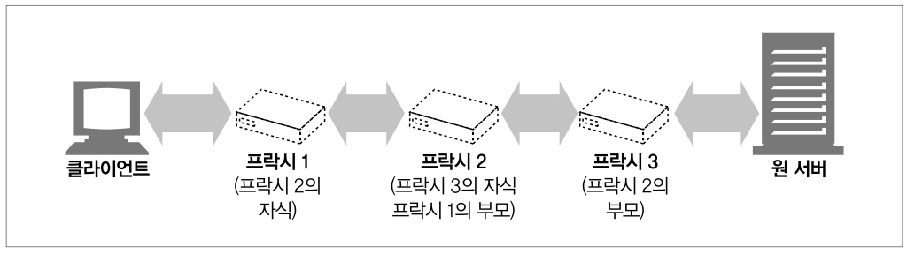

# 6장 프락시

### 웹 프락시 서버는 중개자이다

프락시는 클라이언트와 서버 사이에 위치하여 그들 사이의 HTTP 메시지를 정리하는 중개인처럼 동작한다

### 이 장에서 다룰 내용

- HTTP 프락시와 웹 게이트웨이를 비교하고, HTTP 프락시가 어떻게 배치되는지
- 몇가지 유용한 활용방법
- 프락시가 실제 네트워크에 어떻게 배치되어 있는지, 트래픽이 어떻게 프락시 서버로 가게 되는지
- 브라우저에서 프락시를 사용하려면 어떻게 설정해야 하는지
- HTTP 프락시 요청이 서버 요청과 어떻게 다른지, 프락시가 어떻게 브라우저 동작을 미묘하게 바꾸는지
- 프락시 서버들을 통과하는 메시지의 경로를 Via 헤더와 TRACE 메서드를 이용해 기록하는 방법을 설명
- 프락시에 기반한 HTTP 접근 제어
- 어떻게 프락시가 클라이언트와 서버 사이에서 각각 다른 기능과 버전들을 지원하며 상호작용 할수 있는지

## 6.1 웹 중개자

<aside>
💡 웹 프락시 서버는 클라이언트 입장에서 트랜잭션을 수행하는 중개인이다

</aside>


- 웹 프락시 서버는 트랜잭션을 수행하는 중개인이다
  웹 프락시가 있다면, 클라이언트는 HTTP 서버와 대화하는 대신, 자신의 입장에서 서버와 대화해주는 프락시와 대화한다
  트랜잭션을 완료하는 것이 클라이언트라는 점은 변하지 않지만, 프락시 서버는 중개인으로서 여러 서비스를 제공할 수 있다
- HTTP 프락시 서버는 웹 서버이기도 하고 웹 클라이언트 이기도 하다
  프락시는 HTTP 클라이언트에게 요청을 받게 되므로, 반드시 웹 서버처럼 요청과 커넥션을 적절히 다루고 응답을 돌려주어야 한다
  동시에 프락시는 요청을 서버로 보내기도 하므로, 요청을 보내고 응답을 받는 올바른 HTTP 클라이언트처럼 동작해야한다.
  따라서 만약 직접 HTTP 프락시를 만든다면, HTTP 클라이언트와 HTTP 서버의 양쪽 규칙 모두를 깊게 따라야 한다.

### 6.1.1 개인 프락시와 공유 프락시

프락시는 서버는 하나의 클라이언트가 독점적으로 사용할 수도 있고, 여러 클라이언트가 공유할 수도 있다.

하나의 클라이언트만을 위한 프락시를 개인 프락시, 여러 클라이언트가 함께 사용하는 프락시는 공용 프락시라고 한다

- 공용 프락시
  대부분의 프락시는 공용이며 공유된 프락시이다.
  중앙 집중형 프락시를 관리하는게 더 비용 효율이 높고 쉽다. 캐시 프락시 서버와 같은 몇몇 프락시 애플리캐이션은 여러 사용자들의 공통된 요청에서 이득을 취할 수 있기 때문에 사용자가 많을수록 유리하다
- 개인 프락시
  그다지 흔하지는 않지만 꾸준히 사용된다. 클라이언트 컴퓨터에서 직접 실행되는 형태로 특시 사용된다
  어떤 브라우저 보조 제품들은 브라우저의 기능을 확장하거나 성능을 개선하거나 무료 ISP 서비스를 위한 광고를 운영하기 위해 작은 프락시를 사용자의 컴퓨터에서 직접 실행한다.

### 6.1.2 프락시 대 게이트웨이

<aside>
💡 프락시 : 같은 프로토콜을 사용하는 둘 이상의 애플리케이션을 연결
게이트웨이 : 다른 프로토콜을 사용하는 둘 이상의 애플리케이션 연결

</aside>


1. a의 중개장치는 클라이언트와 서버 양쪽 모두에게 HTTP로 말하고 있으므로 HTTP 프락시이다
2. b의 중개장치는 HTTP 프론트엔드에 메여 POP 이메일 백엔드를 향하고 있으므로, HTTP/POP 게이트웨이다.

   이 게이트웨이는 웹 트랜잭션을 적절한 POP 트랜잭션으로 변환하고, 사용자가 HTTP를 통해 읽을 수 있게 해준다.

- 실질적으로 프락시와 게이트웨이의 차이점은 모호하다.
  브라우저와 서버는 다른 버전의 HTTP를 구현하기 때문에, 프락시는 때때로 약간의 프로토콜 변환을 하기도 한다
  상용 프락시 서버는 SSL 보안 프로토콜, SOCKS 방화벽, FTP 접근, 웹기반 애플리케이션을 지원하기 위해 게이트웨이 기능을 구현한다.

## 6.2 왜 프락시를 사용하는가?

<aside>
💡 프락시 서버는 실용적이고 유용한 것이라면 무슨 일이든 한다
보안 개선, 성능 개선, 비용 절약

</aside>

프락시 서버는 모든 HTTP 트래픽을 들여다보고 건드릴 수 있기 때문에, 부가적인 가치를 주는 여러 유용한 웹 서비스를 구현하기 위해 트래픽을 감시하고 수정할 수 있다

### 프락시 사용 예

- 어린이 필터

  어린이들에게 교육사이트를 제공하면서 동시에 성인 콘텐츠를 차단하려고 필터링 프락시를 사용할 수 있다.
  교육 콘텐츠에는 제한 없는 접근을 허용하면서, 부적절한 사이트의 접근은 강제로 거부할 수 있다.
  

- 문서 접근 제어자

  프락시 서버는 많은 웹 서버들과 웹 리소스에 대한 단일한 접근 제어 전략을 구현하고, 감사추적을 하기 위해 사용될 수 있다.

  각기 다른 조직에서 관리되는 다양한 종류의 수많은 웹 서버들에 대한 접근 제어를 수시로 갱신할 필요 없이. 중앙 프락시 서버에서 접근 제어를 설정할 수 있다.

  - 클라이언트 1에는 제약없이 서버의 뉴스 페이지에 접근 허가
  - 클라이언트 2에는 제약 없이 인터넷 컨텐츠 접근 허가
  - 클라이언트 3에는 서버 B에 접근하기 전 먼저 비밀번호를 요구
    → 클라이언트들의 웹 서버,웹 리소스에 대한 전략을 중앙 프락시 서버에서 모두 관리

  

- 보안 방화벽

  보안을 강화하기 위해 프락시 서버를 사용하기도 한다.

  조직안에 들어오거나 나가는 응용 레벨 프로토콜의 흐름을 네트워크 한 지점에서 통제한다

  바이러스를 제거하는 웹이나 이메일 프락시가 사용할 수 있는, 트래픽을 세심히 사용할 수 있는 후크를 제공한다

  

- 웹 캐시  
  인기 있는 문서의 로컬 사본을 관리하고, 해당 문서에 대한 요청이 오면 빠르게 제공하여 느리고 비싼 인터넷 커뮤니케이션을 줄인다.
  클라이언트 3, 4가 원 서버에 접근하는데 비해 클라이언트 1,2는 근처 웹 캐시의 문서에 접근한다
  

- 대리 프락시  
  어떤 프락시는 실제 웹 서버인 것처럼 위장한다.  
  대리 프락시, 리버스 프락시는 진짜 웹 서버 요청을 받지만, 웹 서버와는 달리 요청받은 콘텐츠를 응답해주기 위해 다른 서버와 커뮤니케이션을 시작한다.  
  공용 컨텐츠에 대한 느린 웹 서버의 성능을 개선하기 위해 사용될 수 있다. 이런식으로 사용하는 대리 프락시를 서버 가속기라고 부른다, 또한 콘텐츠 라우팅 기능과 결합되어 주문형 복제 콘텐츠의 분산 네트워크를 만들기 위해 사용될 수 있다.
  
- 콘텐츠 라우터

  인터넷 트래픽 조건과 콘텐츠의 종류에따라 요청을 특정 웹 서버로 유도하는 콘텐츠 라우터로 동작할 수 있다.

  사용자에게 제공할 여러 서비스를 구현하는데 사용할 수 있다

  사용자나 컨텐츠 제공자가 더 높은 성능을 위해 돈을 지불한다면, 콘텐츠 라우터는 요청을 가까운 복제 캐시로 전달한다.

  사용자가 필터링 서비스에 가입했다면, HTTP 요청이 필터링 프락시를 통과하도록 할 수 있다.

  

- 트랜스코더

  콘텐츠를 클라이언트에게 전달하기 전에, 본문 포맷을 수정할수 있다.

  이런식으로 데이터 표현 방식을 자연스럽게 변환하는 것을 트랜스코딩이라고 부른다

  트랜스코딩 프락시는 크기를 줄이기 위해 자신을 거쳐가는 GIF 이미지를 JPG 이미지로 변환할 수 있다.

  이미지 크기 줄이기. 텍스트 압축하기, 작은 텍스트로 줄인 웹페이지 생성, 문서를 외국어로 번역 등등 가능

  

- 익명화 프락시  
  HTTP 메시지에서 신원을 식별할 수 있는 특성들 (클라이언트 IP주소, From 헤더, Referer 헤더, 쿠키, URI 세션 아이디) 등을 적극적으로 제거함으로서 개인 정보 보호와 익명성 보장에 기여한다
  익명화 프락시는 개인정보를 보호하기 위해 사용자의 메시지를 다음과 같이 변경한다
  - User-Agent 헤더에서 사용자 컴퓨터와 OS 종류 제거
  - 이메일 주소를 보호하기 위해 From 헤더 제거
  - 어떤 사이트를 거쳤는지 어렵게하기 위해 Referer 헤더 제거
  - 프로필과 신원 정보를 없애기 위해 cookie 헤더 제거
    

## 6.3 프락시는 어디에 있는가?

프락시가 어떤 기능을 하고 어떤 방식으로 사용되는지는 알겠는데, 그럼 프락시는 어디에 있고 언제 네트워크 아키텍쳐 상에 배치되는가?

### 6.3.1 프락시 서버 배치

어떻게 사용할지에 따라서 프락시는 어디에든 배치할 수 있다.


- 출구 프락시 (Egress)
  로컬 네트워크와 더 큰 인터넷 사이를 오가는 트래픽을 제어하기 위해, 프락시를 로컬 네트워크의 출구에 박아넣을 수 있다.
  회사 밖의 해커들을 막는 방화벽을 제공하기 위해, 인터넷 요금을 절약하고 인터넷 트래픽 성능을 개선하기 위해, 초등학생의 부적절한 콘텐츠를 브라우징 하는것을 막기 위해 필터링 출구 프락시를 사용할 수 있다.
- 접근 프락시
  고객으로부터의 모든 요청을 종합적으로 처리하기 위해, 프락시는 ISP 접근 지점에 위치하기도 한다
  ISP는 사용자들의 다운로드 속도를 개선하고, 인터넷 대역폭 비용을 줄이기 위해 캐시 프락시를 사용해 많이 찾는 문서들의 사본을 저장한다
- 대리 프락시 (리버스 프락시)
  대리 프락시, 리버스 프락시라고도 하는 프락시는 네트워크 가장 끝에 있는 웹 서버들의 바로 앞에 위치하여, 웹 서버로 향하는 모든 요청을 처리하고 필요할 때만 웹 서버에게 자원을 요청할 수 있다.
  웹 서버에 보안 기능을 추가하거나 빠른 웹 서버 캐시를 느린 웹 서버 앞에 놓음4으로써 성능을 개선할 수도 있다.
  일반적으로 웹 서버의 이름과 IP 주소로 스스로를 가장하기 때문에 모든 요청은 서버가 아닌 이 프락시로 가게 된다
- 네트워크 교환 프락시
  캐시를 이용해 인터넷 교차로의 혼잡을 완화하고 트래픽 흐름을 감시하기 위해, 충분한 처리 능력을 갖춘 프락시가 네트워크 사이의 인터넷 피어링 교환 지점들에 놓일 수 있다.

### 6.3.2 프락시 계층



프락시는 프락시 계층이라고 불리는 연쇄를 구성할 수 있다.

메시지는 최종적으로 원 서버에 도착할 때 까지 프락시와 프락시를 거쳐 이동한다.( 그 후 다시 프락시들을 거쳐 클라이언트로 돌아온다)

프락시 계층에서 프락시 서버들은 부모와 자식의 관계를 갖는다.

서버에 가까운 쪽(다음 인바운드 프락시)을 부모라고 부르고,클라이언트에 가까운 쪽 (다음 아웃바운드 프락시)을 자식이라고 부른다.

- 프락시 계층 콘텐츠 라우팅
  위의 사진에서 프락시 1은 언제나 메세지를 프락시 2로, 프락시 2는 언제나 프락시 3으로 보낸다. 그러나 계층이 반드시 정적이어야 하는것은 아니다.
  여러가지 판단 근거에 의해 메시지를 다양하고 유동적인 프락시 서버와 원 서버들의 집합에게 보낼 수 있다.
  1. 콘텐츠 분산을 위해 프락시는 요청을 가까운 캐시 서버에게 보내 캐시된 객체를 반환하거나, 그럴수 없을땐 원 서버에서 가져오게 할 수 있다.
  2. 특정 종류의 이미지를 요청받았을 때, 접근 프락시는 그 요청을 특화된 압축 프락시에게 보내어, 그 프락시가 이미지를 가져오고, 압축하게 하여 느린 모뎀에서도 빠르게 클라이언트가 다운로드 할 수 있게 한다.
- 동적 부모 선택의 몇가지 예
  - 부하 균형
    자식 프락시는 부하를 분산하기 위해 현재 부모들의 작업량 수준에 근거하여 부모프락시를 고른다
  - 지리적 인접성에 근거한 라우팅
    자식 프락시는 원 서버의 지역을 담당하는 부모를 선택할 수도 있다.
  - 프로토콜/타입 라우팅
    어떤 자식 프락시는 URI에 근거하여 다른 부모나 원 서버로 라우팅 할 수 있다. 어떤 특정 종류의 URI를 갖고 있는 요청을 특별한 프락시 서버로 보내쳐 특별한 프토토콜로 처리될 수도 있다.
  - 유료 서비스 가입자를 위한 라우팅
    돈을 내서 빠른 서비스를 사용한다고 했을 때, 그 URI는 대형 캐시나 성능 개선을 위한 압축 엔진쪽으로 라우팅 될 수 있다.

### 6.3.3 어떻게 프락시가 트래픽을 처리하는가

클라이언트는 보통 웹 서버와 직접 대화하기 때문에, 우리는 먼저 어떻게 HTTP 트래픽이 프락시로 향하는 길을 찾아내는지 설명할 필요가 있다. 클라이언트 트래픽이 프락시로 가도록 만드는 방법에는 다음 네가지가 있다.

1. 클라이언트를 수정한다.

   구글 크롬을 포함한 많은 웹 클라이언트들은 수동 혹은 자동 프락시 설정을 지원한다. 클라이언트가 프락시를 사용하도록 설정되어 있다면 클라이언트는 HTTP 요청을 의도적으로 바로 원 서버가 아닌 프락시로 보낸다.

1. 네트워크를 수정한다.

   클라이언트가 모르게, 또 간섭도 할 수 없는 상태에서 네트워크 인프라를 가로채서 웹 트래픽을 프락시로 가도록 할 수 있는 몇가지 기법이 있다. 이 가로챔은 일반적으로 HTTP 트래픽을 지켜보고 가로채어 클라이언트 모르게 트래픽을 프락시로 보내는 스위칭 장치와 라우팅 장치를 필요로 한다. 이것을 인터셉트 프락시라고 부른다.

1. DNS 이름공간을 수정한다.

   웹서버 앞에 위치하는 프락시인 대리 프락시는 웹 서버의 이름과 IP 주소를 자신이 직접 사용한다. 그래서 모든 요청은 서버 대신 대리 프락시로 간다.

   이는 특별한 동적 DNS 서버를 이용해서 조정될 수 있다. DNS 이름 테이블을 수동으로 편집하거나 사용되는 적절한 프락시나 서버를 계산해주게 된다.

   예를 들어, 몇몇 설치본에서는 실제 서버의 IP 주소와 이름이 변경되고, 대리 프락시에 이전 서버의 주소와 이름이 주어지게 된다.

1. 웹 서버를 수정한다.

   웹 서버에서 HTTP 리다이렉션 명령(305) 코드를 클라이언트에게 돌려줌으로써 클라이언트의 요청을 프락시로 리다이렉트 하도록 설정할 수 있다. 리다이렉트 즉시 클라이언트는 프락시와 트랜잭션을 시작한다.

## 6.4 클라이언트 프락시 설정

모든 현대적인 브라우저는 프락시를 사용하도록 설정할 수 있다. 사실 많은 브라우저가 프락시를 설정하는 여러가지 방법을 제공한다.

1. 수동 설정

   프락시를 사용하겠다고 명시적으로 설정한다.

2. 브라우저 기본 설정

   브라우저 벤더나 배포자는 브라우저를 소비자에게 전달하기 전에 프락시를 미리 설정해놓을 수 있다.

3. 프락시 자동 설정(PAC Proxy Auto-Configuration)

   자바스크립트 프락시 자동 설정(PAC) 파일에 대한 URI를 제공할 수 있다.

   클라이언트는 프락시를 써야하는지, 만약 그렇다면 어떤 프락시 서버를 써야 하는지 판단하기 위해 그 자바스크립트 파일을 가져와서 실행한다.

4. WPAD 프락시 발견

   대부분의 브라우저는 자동설정 파일을 다운받을 수 있는 ‘설정 서버’를 자동으로 찾아주는, 웹 프락시 자동발견 프로토콜(WPAD, Web Proxy Autodiscovery Protocol)을 제공한다

### 6.4.1 클라이언트 프락시 설정: 수동

많은 웹 클라이언트는 프락시를 수동으로 설정할 수 있도록 하고있다.

구글 크롬

설정 - 고급설정 표시 - 프록시 설정 변경

MS 인터넷 익스플로러

도구 - 인터넷 옵션 - 연결 -LAN 설정 - 사용자 LAN에 프락시 서버 사용

다른 브라우저들도 설정 방법은 다르지만 아이디어 자체는 같다

프락시의 호스트와 포트를 지정한다. - 몇몇 ISP는 그들의 요구에 맞춰 미리 설정된 브라우저나 웹 트래픽을 프락시 서버로 리다이렉트 하는 맞춤형 운영체제를 구입한다.

### 6.4.2 클라이언트 프락시 설정 :PAC 파일

수동 프락시 설정은 단순하지만 유연하지 못하다

모든 컨텐츠에 대해 단 하나의 프락시 서버만을 지정

장애 시의 대체 작동에 대한 지원이 없다.

브라우저가 많다면 모든 브라우저를 원하는대로 설정하기는 어렵거나 불가능하다

PAC는 프락시 설정에 대한 보다 동적인 해결책이다.

프락시 설정을 그때그때 상황에 맞게 계산해주는 작은 자바스크립트 프로그램이기 때문이다.

문서에 접근할 때마다, 자바스크립트 함수가 적절한 프락시 서버를 선택한다.

PAC 파일을 활용한 프락시 사용법

자바스크립트 PAC 파일의 URI를 브라우저에 설정해주어야 한다.

설정 자체는 수동 설정과 비슷, 설정할 내용이 있는 PAC 파일에 대한 URI를 브라우저에 제공해주어야 한다.

브라우저는 URI로부터 PAC 파일을 가져와서 매 접근마다 적절한 프락시 서버를 계산하기 위해 자바스크립트 로직을 이용한다.

PAC파일은 일반적으로 .pac 확장자를 가지며 MIME 타입은 ‘application/x-ns-proxy-autocoding’이다.

각 PAC 파일은 반드시 접근할 때 사용할 적절한 프락시 서버를 계산해주는 FindProxyForUrl(url,host)라는 함수를 정의해야 한다. 이 함수의 반환값은 다음 표에 있는 값들 중 하나다.

| FindProxyForURL 반환값 | 설명                                      |
| ---------------------- | ----------------------------------------- |
| DIRECT                 | 프락시 없이 연결이 직접 이루어저야 할 때. |
| PROXY host:port        | 지정한 프락시 사용.                       |
| SOCKS host:port        | 지정한 SOCKS 서버 사용.                   |

```tsx
// 프락시 자동설정 파일의 예
function FindProxyForURL(url, host) {
  if (url.substring(0, 5) == "http:") {
    return "PROXY http-proxy.mydomain.com:8080";
  } else if (url.substring(0, 4) == "ftp:") {
    return "PROXT ftp-proxy.mydomain.com:8080";
  } else {
    return "DIRECT";
  }
}
```

### 6.4.3 클라이언트 프락시 설정:WPAD

WPAD는 브라우저에게 알맞은 PAC 파일을 자동으로 찾아주는 알고리즘이다.

여러 발견 메커니즘들의 상승 전략을 이용한다.?

WPAD 프로토콜이 구현된 클라이언트들은 다음과 같은 일들을 한다.

- PAC URI를 찾기 위해 WPAD를 사용한다.
- 주어진 URI에서 PAC 파일을 가져온다.
- 프락시 서버를 알아내기 위해 PAC 파일을 실행한다
- 알아낸 프락시 서버를 이용해서 요청을 처리한다.

WPAD가 올바른 PAC 파일을 찾기 위해 하는 일

여러가지 발견 기법을 사용하게 되는데, 모든 조직이 모든 기법을 사용할 수 있지는 않기 때문에

WPAD는 성공할 때 까지 다음 기법을 순서대로 시도한다.

현재의 WPAD 명세

- 동적 호스트 발견 규약(DHCP)
- 서비스 위치 규약(SLP)
- DNS 잘 알려진 호스트명
- DNS SRV 레코드
- DNS TXT 레코드 안의 서비스 URI

자세한 내용은 20장에….

## 6.5 프락시 요청의 미묘한 특징들

### 6.5.1 프락시 URI는 서버 URI와 다르다

클라이언트가 웹 서버로 요청을 보낼 때,

```
GET /index.html HTTP/1.0
User-Agent: SuperBrower v1.3
```

클라이언트가 프락시로 요청을 보낼 때,

```
GET http://www.google.com/index.html HTTP/1.0
User-Agent: SuperBrowser v1.3
```

프락시로 요청을 보낼 경우, 완전한 URI 형태를 갖는다.

- 클라이언트가 프락시를 사용하지 않도록 설정되어 있다면, 부분 URI를 보낸다
- 클라이언트가 프락시를 사용하도록 설정되어 있다면, 완전한 URI를 보낸다

### 6.5.2 가상 호스팅에서 일어나는 같은 문제

가상으로 호스팅 되는 웹 서버는 여러 웹 사이트가 같은 물리적 웹 서버를 공유한다.
요청 하나가 부분 URI로 오면, 가상 호스팅 되는 웹 서버는 그 요청이 접근하고자 하는 웹 사이트의
호스트 명을 알 필요가 있다.


- 명시적인 프락시는 요청 메세지가 완전한 URI를 갖도록 함으로써 이 문제를 해결했다.
- 가상으로 호스팅 되는 웹 서버는 호스트와 포트에 대한 정보가 담겨 있는 `Host 헤더`를 요구한다.

### 6.5.3 인터셉트 프락시는 부분 URI를 받는다

클라이언트는 자신이 프락시와 대화하고 있음을 항상 알고 있는 것은 아니다.
이유는 몇몇 프락시는 클라이언트에게 보이지 않을 수 있기 때문이다.

대리 프락시나 인터셉트 프락시를 지날 때, 클라이언트는 자신이 웹 서버와 대화하고 있다고 생각하여
완전한 URI를 보내지 않을 것이다.

### 6.5.4 프락시는 프락시 요청과 서버 요청을 모두 다룰 수 있다

프락시는 명시적인 프락시 요청에 대해서는 **완전한 URI**를 사용하고 아니면 **부분 URI**를 사용해야한다.
웹 서버 요청의 경우에는 가상 Host 헤더를 사용해야 한다.

규칙은 다음과 같다.

- 완전한 URI가 주어졌다면, 그것을 사용
- 부분 URI가 주어졌고 Host 헤더가 있다면, Host 헤더를 이용
- 부분 URI가 주어졌으나 Host 헤더가 없다면,
  - 대리 프락시라면, 프락시에 실제 서버의 주소와 포트번호가 설정되어있다
  - 이전에 인터셉트 프락시가 가로챈 트래픽에서 사용한 IP 주소와 포트번호를 사용
  - 모두 실패라면, 충분한 정보가 없는것이므로 반드시 에러 메시지를 반환해야한다

### 6.5.5 전송 중 URI 변경

프락시 서버는 요청 URI의 변경에 매우 신경을 써야 한다. 무해해 보이는 사소한 URI 변경이라도
다운스트림 서버와 상호운용성 문제를 일으킬 수 있다.

### 6.5.6 URI 클라이언트 자동확장과 호스트 명 분석

브라우저는 프락시의 존재 여부에 따라 요청 URI를 다르게 분석한다.
프락시가 없다면 사용자가 타이핑한 URI를 가지고 그에 대응하는 IP 주소를 찾는다.

### 6.5.7 프락시 없는 URI 분석


브라우저는 명시적인 프락시가 존재하지 않는 경우 부분 호스트 명을 자동으로 확장한다.

### 6.5.8 명시적인 프락시를 사용할 때의 URI 분석

명시적인 프락시를 사용한다면, **브라우저의 URI가 프락시를 그냥 지나쳐버리기 때문에** 확장 기능을 수행할 수 없다.


이러한 이유로 몇몇 프락시는 www...com 자동 확장이나 지역 도메인 접미사 추가와 같은 브라우저의 편리한 서비스를 할 수 있다면 최대한 흉내 내려고 시도한다.

### 6.5.9 인터셉트 프락시를 이용한 URI 분석


클라이언트는 성공할 때까지 모든 IP 주소에 대해 접속을 시도하지만,
어떤 IP 주소들은 죽은 것일 수 있다. 그러나, 인터셉트 프락시와 함께라면,
**첫 번째 접속 시도 원 서버가 아닌 프락시 서버에 의해 종료된다.**

클라이언트는 성공적으로 웹 서버와 대화했다고 믿지만, 웹 서버는 죽어있다.

프락시가 최종적으로 원 서버와 상호작용할 준비가 되었을 때, 프락시는 그 IP 주소가 실제로는 다운된 서버를
가리키고 있음을 알게 될 것이다. 프락시는 호스트 헤더에 들어 있는 호스트 명을 다시 분석하든 IP 주소에 대한
역방향 DNS 룩업을 해서든 다른 IP 주소를 시도해야한다.

## 6.6 메시지 추적

프락시가 점점 더 흔해지면서, 서로 다른 스위치와 라우터를 넘나드는 IP 패킷의 흐름을
추적하는 것 못지않게 프락시를 넘나드는 메시지의 흐름을 추적하고 문제점을 찾아내는 것이 필요해졌다.

### 6.6.1 Via 헤더

Via 헤더 필드는 메시지가 지나는 각 중간 노드의 정보를 나열한다.
메시지가 또 다른 노드를 지날 때마다, 중간 노드는 Via 목록의 끝에 반드시 추가되어야 한다.

```
Via: 1.1 proxy-62.irenes-isp.net, 1.0 cache.joes-hardware.com
```

첫 번째 프락시는 HTTP/1.1 프로토콜을 구현했으며 proxy-62.irenes-isp.net라 불리고,
두 번째 프락시는 HTTP/1.0 프로토콜을 구현했고, cache.joes-hardware.com로 불린다.


프락시는 또한 네트워크의 라우팅 루프를 탐지하기 위해 Via 헤더를 사용할 수 있다.
요청을 보내기 전에 자신을 가리키는 유일한(unique) 문자열을 Via 헤더에 삽입해야 하며
네트워크에 라우팅 루프가 있는지 탐지하기 위해 이 문자열이 들어온 요청에 있는지 검사해야 한다.

_Via 문법_

각 Via waypoint는 프로토콜 이름(선택. 기본은 HTTP), 프로토콜 버전(필수), 노드 이름(필수), 코멘트(선택)
최대 4개의 구성요소를 담을 수 있다.

_프로토콜 이름_

중개자가 받은 프로토콜. 프로토콜이 HTTP라면 프로토콜 이름은 없어도 된다.

_프로토콜 버전_

수신한 메시지의 버전. 버전의 포맷은 프로토콜에 따라 다르다.

_노드 이름_

호스트와 포트 번호.(포트 번호 생략됐을 시, 프로토콜의 기본 포트번호) 몇몇 조직은 정보 보호를 이유로
진짜 호스트 명을 밝히고 싶어 하지 않을 수 있는데, 그러한 경우 가명으로 대체

_Via 요청과 응답 경로_

요청과 응답 모두 프락시를 지나므로 Via 헤더를 가진다.
응답 메시지는 요청과 같은 경로를 되돌아간다.
만약 요청 메시지가 프락시 A, B, C를 지나간다면, 그에 대한 응답 메시지는
프락시 C, B, A를 지나간다.


_Via와 게이트웨이_

몇몇 프락시는 서버에게 비 HTTP 프로토콜을 사용할 수 있는 게이트웨이 기능을 제공한다.


_Server 헤더와 Via 헤더_

Server 응답 헤더 필드는 원 서버에 의해 사용되는 소프트웨어를 알려준다.

```
Server: Apache/1.3.14 (Unix) PHP/4.0.4
Server: Netscape-Enterprise/4.1
Server: Microsoft-IIS/5.0
```

응답 메시지가 프락시를 통과할 때, 프락시는 Server 헤더를 수정해서는 안 된다.

_Via가 개인정보 보호와 보안에 미치는 영향_

내부 네트워크 아키텍처의 설계와 토폴로지를 알아내기 어렵게 하기 위한 아주 강력한 보안 요구사항을
갖고 있는 조직을 위해, 프락시는 정렬된 일련의 Via 경유지 항목들(수신된 프로토콜 값이 동일한)을
하나로 합칠 수 있다.

```
Via: 1.0 foo, 1.1 devirus.company.com, 1.1 access-logger.company.com

Via: 1.0 foo, 1.1 concealed-stuff
```

수신된 프로토콜이 다르거나, 가명으로 교체되지 않은 이상 항목들을 합쳐서는 안 된다.

### 6.6.2 TRACE 메서드

HTTP/1.1의 TRACE 메서드는 요청 메시지를 프락시의 연쇄를 따라가면서 어떤 프락시를
지나가고 어떻게 각 프락시가 요청 메시지를 수정하는지 관찰/추적할 수 있도록 해준다.

TRACE 요청이 목적지 서버에 도착했을 때, 서버는 전체 요청 메시지를 HTTP 응답 메시지의 본문에
포함시켜 송신자에게 그대로 돌려보낸다. TRACE 응답이 도착했을 때, 클라이언트는 서버가 받은 메시지와
그 메시지가 지나간 프락시들의 목록(Via 헤더 안)을 검사할 수 있다.

TRACE 응답의 Content-Type은 message/http이며 상태는 200 OK 이다


_Max-Forwards_

전달되는 메시지가 무한 루프에 빠지지 않는지 프락시 연쇄를 테스트 하거나 연쇄 중간의 특정 프락시 서버들의
효과를 체크할 때 유용하다.

## 6.7 프락시 인증

프락시는 **접근 제어 장치**로서 제공될 수 있다. HTTP는 사용자가 유효한 접근 권한 자격을 프락시에
제출하지 않는 한 콘텐츠에 대한 요청을 차단하는 프락시 인증이라는 메커니즘을 정의하고 있다.


- 제한된 콘텐츠에 대한 요청이 프락시 서버에 도착했을 때, 프락시 서버는
  접근 자격을 요구하는 **407 Proxy Authorization Required** 상태 코드를 어떻게 그러한
  자격을 제출할 수 있는지 설명해주는 **Proxy-Authenticate** 헤더 필드와 함께 반환할 수 있다.
- 클라이언트는 407 응답을 받으면, 로컬 데이터베이스를 확인해서든 사용자에게 물어봐서든 요구되는 자격을 수집한다.
- 자격을 획득하면, 클라이언트는 요구 자격을 Proxy-Authorization 헤더 필드에 담아서 요청을 다시 보낸다.
- 자격이 유효하면, 프락시는 원 요청을 연쇄를 따라 통과시킨다. 유효하지 않다면 407 응답을 보낸다.


## 6.8 프락시 상호운용성

### 6.8.1 지원하지 않는 헤더와 메서드 다루기

프락시는 이해할 수 없는 헤더는 반드시 그대로 전달해야 하며, 같은 이름의 헤더 필드가 여러 개 있는 경우,
그들의 상대적인 순서도 반드시 유지해야 한다.

### 6.8.2 OPTIONS: 어떤 기능을 지원하는지 알아보기

HTTP OPTIONS 메서드는 서버나 웹 서버의 특정 리소스가 어떤 기능을 지원하는지 클라이언트(혹은 프락시)가
알아볼 수 있게 해준다.


```
OPTIONS * HTTP/1.1
```

위의 요청처럼 별표(\*)라면, 요청은 서버 전체의 능력에 대해 묻는 것이다.

```
OPTIONS http://www.joes-hardware.com/index.html HTTP/1.1
static HTML file wouldn't accept a POST method.
```

만약 URI가 실제 리소스라면, OPTIONS 요청은 특정 리소스에 대한 가능한 기능들을 묻는 것이다.

### 6.8.3 Allow 헤더

요청 URI에 의해 식별되는 자원에 대해 지원되는 **메서드들이나 서버가 지원하는 모든 메서드(\*인 경우)**를 열거한다.

```
Allow: GET, HEAD, PUT
```

만약 프락시가 지정된 모든 메서드를 이해할 수 없다해도, 프락시는 Allow 헤더 필드를 수정할 수 없다.
이유는 클라이언트는 원 서버와 대화하는 다른 경로를 갖고 있을 수도 있기 때문이다.
