# 7장-캐시

- 웹 캐시는 자주 쓰이는 문서의 사본을 자동으로 보관하는 HTTP 장치다.
- 웹 요청이 캐시에 도착했을 때, 캐시된 로컬 사본이 존재한다면 그 문서는 원 서버가 아닌 캐시로부터 제공된다.
- 캐시의 혜택
  - 불필요한 데이터 전송을 줄여 네트워크 비용을 줄여줌
  - 네트워크 병목을 줄여줌, 대역폭을 늘리지 않고도 페이지를 빨리 불러올 수 있게 됨
  - 원 서버에 대한 요청을 줄여줌, 서버의 부하가 줄어들며 빨리 응답할 수 있게 됨
  - 페이지를 먼 곳에서 불러올 수록 시간이 많이 걸리는데, 캐시는 거리로 인한 지연을 줄여줌

## 7.1 불필요한 데이터 전송

- 여러 클라이언트가 자주 쓰이는 원 서버 페이지에 접근할 때, 서버는 **같은 문서**를 클라이언트들에게 한번씩 전송하게 된다
- 똑같은 바이트들이 네트워크를 통해 **반복해서** 이동한다. → 불필요한 데이터 전송은 값비싼 네트워크 대역폭을 잡아먹게 된다 → 전송이 느려지고, 서버에 부하를 준다
- 캐시를 이용하면 첫번째 서버 응답은 캐시에 보관된다 → 캐시된 사본이 뒤이은 요청들에 대한 응답으로 사용된다
- 캐시된 사본으로 원 서버가 증폭해서 트래픽을 주고받는 낭비가 줄어들게 된다

## 7.2 대역폭 병목

- 캐시는 네트워크 병목을 줄여준다
- 클라이언트가 빠른 LAN에 있는 캐시로부터 사본을 가져온다면 캐싱은 성능을 대폭 개선할 수 있을 것이다(특히 큰 문서에 대해서는)

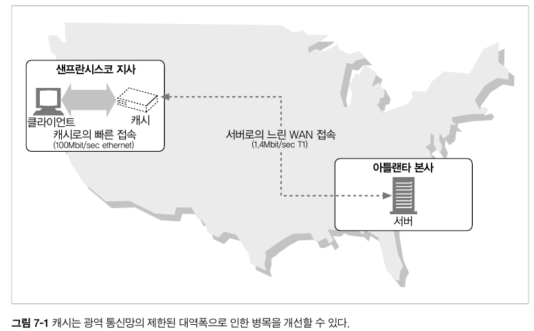

## 7.3 갑작스런 요청 쇄도(Flash Crowds)

- 캐싱은 갑작스런 요청 쇄도에 대처하기 위해 중요하다
- 갑작스런 사건(뉴스 속보, 스팸 메일, 유명 인사와 관련된 사건 등)으로 많은 사람이 거의 동시에 웹 문서에 접근할 때 이런 일이 발생한다
- 이 결과로 초래된 불필요한 트래픽 증가는 서버에 심각한 장애를 야기시킨다

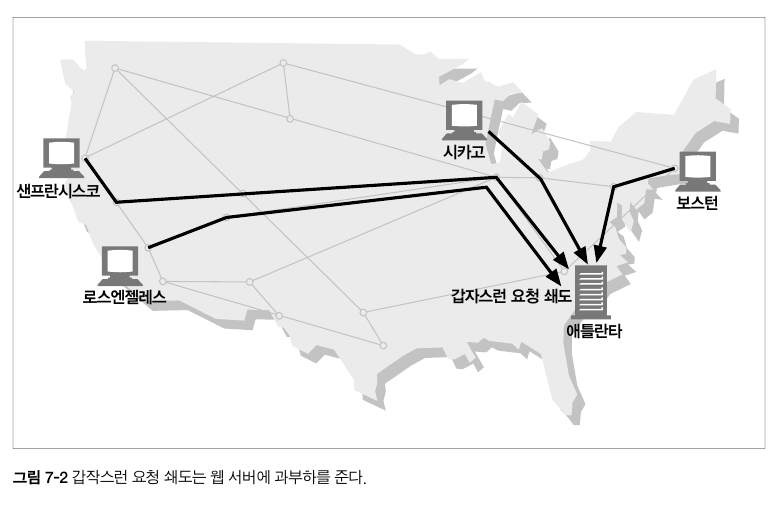

## 7.4 거리로 인한 지연

- 거리로 인한 지연 → 모든 네트워크 라우터는 제각각 인터넷 트래픽을 지연시킨다
- 클라이언트-서버 사이의 라우터가 많지는 않더라도 빛의 속도 그 자체가 유의미한 지연을 유발한다
- 만약 웹 페이지가 20개의 이미지를 포함하고 있고 이 모두가 샌프란치스코에 있는 한 서버에 들어가 있다고 가정해보자
  ```markdown
  보스턴과 샌프란시스코 거리: 약 4,400km
  빛의 속도로 왕복하는 시간: 30ms
  ```
  - 보스턴에 있는 클라이언트가 4개의 커넥션을 열고 그 커넥션을 유지한다면 이미지를 다운받는데 빛의 속도로 인한 지연은 거의 1/4초(240ms)가 된다
  - 신호는 빛의 속도보다는 약간 느리게 이동하므로 240ms보다 더 많은 시간이 소요될 것이다
  - 또한 거리가 더 멀다면 더 많은 시간을 소요할 것이다
  - 하지만 보스턴 근처에 캐시를 설치해서 문서가 전송되는 거리를 줄일 수 있다 → 지연시간을 줄일 수 있다

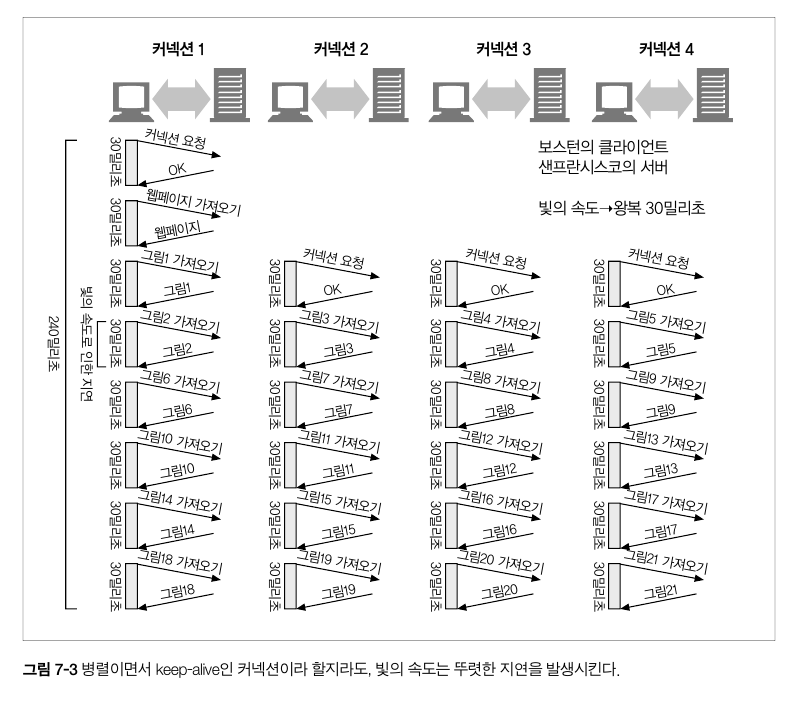

## 7.5 적중과 부적중

- 캐시가 모든 문서의 사본을 저장하지는 않는다
  - 때로는 자주 변경되는 문서의 경우 캐시를 항상 신선하게 유지하지는 못한다
- 캐시 요청이 도착했을 때 그에 대응하는 사본이 있다면 이 사본으로 요청을 처리할 수 있다. 이것을 캐시 적중(cache hit) 이라고 부른다
- 만약 사본이 없다면 그냥 원 서버로 전달하기만 할 뿐이다. 이것을 캐시 부적중(cache miss)이라고 부른다.

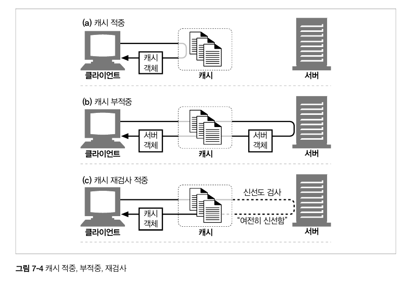

### 7.5.1 재검사(Revalidation)

- 원 서버는 콘텐츠는 변경될 수 있기 때문에 캐시는 반드시 그들이 갖고 있는 사본이 최신인지 서버를 통해 때때로 점검해야 한다. 이를 **HTTP 재검사**라고 부른다
  - 효과적인 재검사를 위해 HTTP는 서버로부터 전체 객체를 가져오지 않고도 콘텐츠가 여전히 신선한지 빠르게 검사할 수 있는 특별한 요청을 정의했다
- 캐시는 스스로 언제든지 사본을 재검사할 수 있다
  - 하지만 캐시된 문서는 수백만개인 경우가 흔한데 비해 네트워크 대역폭은 부족하다
  - **따라서 대부분의 캐시는 클라이언트가 사본을 요청했으며 그 사본이 검사가 필요할 수 있을 정도로 충분히 오래됐을 때만 재검사를 한다**
- 캐시는 재검사가 필요할 때 원 서버에 작은 재검사 요청을 보낸다

  - 콘텐츠가 변경되지 않았다면 `304 Not Modified` 응답을 보낸다 → 여전히 캐시가 유효하므로 그 사본이 신선하다고 임시로 표시하고 클라이언트에게 제공한다 이를 **재검사 적중, 느린적중**이라고 한다.
  - 재검사 적중은 원 서버와 검사할 필요가 있기 때문에 순수 캐시 적중보다 느리다
  - 캐시 부적중 보다는 빠르다.(서버에서 데이터를 받아올 필요가 없기 때문)

  ```markdown
  속도
  캐시 부적중 < 캐시 재검사 적중 < 캐시 적중
  ```

  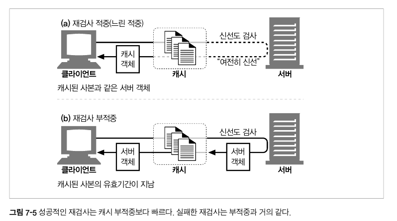

- 재검증 요청 헤더

  - **If-Modified-Since** 헤더: 캐시된 리소스의 `Last-Modified` 값 이후에 서버 리소스가 수정되었는지 확인합니다.
  - **If-None-Match** 헤더: 캐시된 리소스의 `ETag` 값과 현재 서버 리소스의 `ETag` 값이 같은지 확인합니다.

    > `Etag`: 응답 헤더는 특정 버전의 리소스를 식별하는 식별자
    > 웹 서버가 내용을 확인하고 변하지 않았으면 웹 서버로 full 요청을 보내지 않기 때문에 캐시가 더 효율적이게 되고 대역폭을 아낄 수 있다.
    > [https://developer.mozilla.org/ko/docs/Web/HTTP/Headers/ETag](https://developer.mozilla.org/ko/docs/Web/HTTP/Headers/ETag)
    >
    > 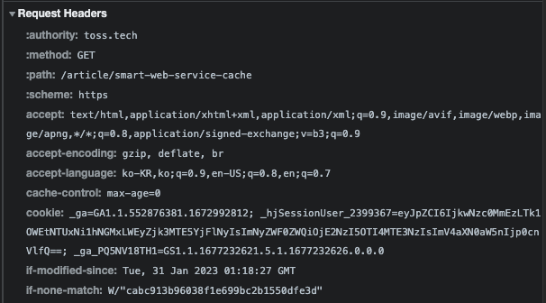

- 재검사 적중

  - 서버 객체가 변경되지 않았다면 서버는 클라이언트에게 304 Not Modified 응답을 보낸다

    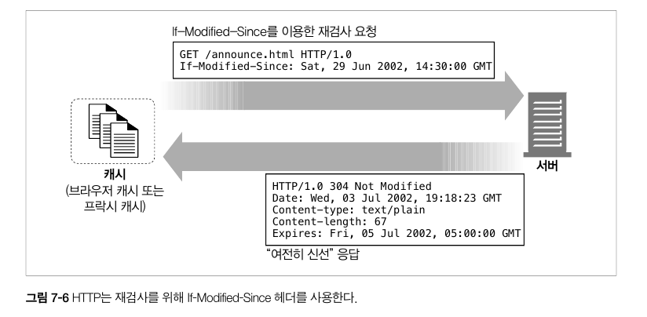

- 재검사 부적중
  - 서버 객체가 캐시된 사본과 다르다면 서버는 콘텐츠 전체와 함께 평범한 200 OK 응답을 클라이언트에게 보낸다
- 객체 삭제
  - 서버 객체가 삭제되었다면 서버는 404 Not Found 응답을 보내고, 캐시를 삭제한다.

### 7.5.2 적중률

- 캐시가 요청을 처리하는 비율, 0 - 1 사이의 값
- 0%는 모든 요청이 캐시 부적중임을, 100%는 모든 요청이 캐시 적중임을 의미한다
- 이런 적중률을 예측하기란 어려운일이지만 40%의 적중률이면 괜찮은 편이다

### 7.5.3 바이트 적중률

- 문서들이 모두 같은 크기는 아니기 때문에 문서 적중률이 모든 것을 말해주지는 않는다
  → 큰 객체는 덜 접근되지만 그 크기가 크기때문에 전체 트래픽에서 더 크게 기여한다
- 문서 중 캐시된 바이트의 비율
- 100%라면 모든 바이트가 캐시에서 왔으며 어떤 트래픽도 인터넷으로 나가지 않았다는 의미

### 7.5.4 적중과 부적중의 구별

- 클라이언트가 응답이 캐시에서 왔는지 알아내는 방법은 `Date` 헤더를 이용하는 것이다
- 응답의 Date 헤더값은 현재 시각과 비교하여 응답 생성일이 더 오래되었다면 클라이언트측에서 응답이 캐시된 것임을 알아낼 수 있다
- 또다른 방법은 응답이 얼마나 오래되었는지 말해주는 `Age` 헤더를 이용하는 것이다

## 7.6 캐시 토폴로지

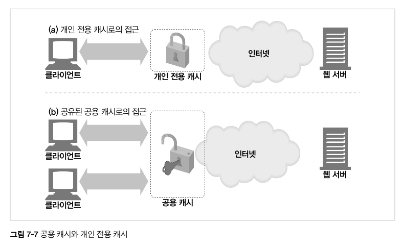

### 7.6.1 개인 전용 캐시

- 사용자 한명에게만 할당된 캐시, 개인만을 위한 캐시
- 웹 브라우저는 개인 전용 캐시를 내장하고 있다

### 7.6.2 공용 프락시 캐시

- 프락시 캐시는 로컬 캐시에서 문서를 제공하거나, 사용자의 입장에서 서버에 접근한다. 공용 캐시는 여러 사용자가 접근하기 때문에 불필요한 트래픽을 줄일 수 있다
- 공유된 공용 캐시는 자주 찾는 객체를 단 한번만 가져와 모든 요청에 대해 공유된 사본을 제공함으로써 네트워크 트래픽을 줄일 수 있다.

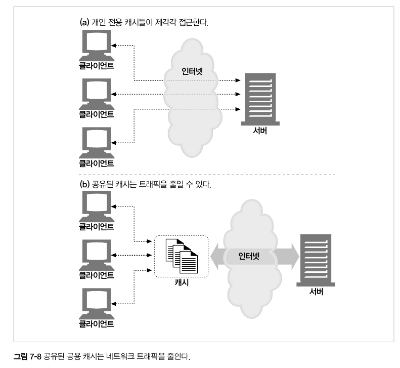

## 7.7 캐시 처리 단계

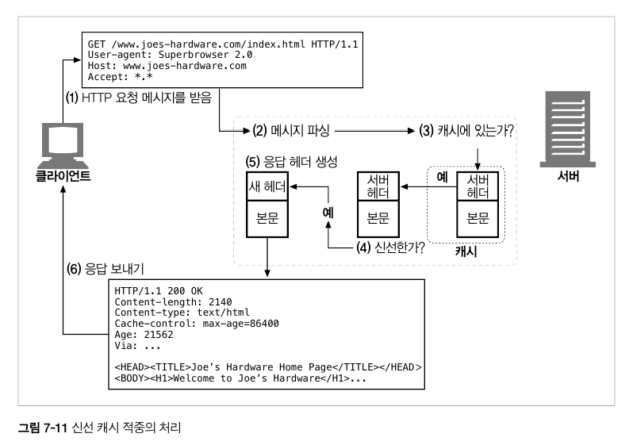

### 요청 받기

- 캐시는 네트워크로부터 도착한 요청 메시지를 읽는다
- 고성능 캐시는 여러개의 들어오는 커넥션들로부터 데이터를 동시에 읽어들이고 메시지 전체가 도착하기 전에 트랜잭션 처리를 시작한다

### 파싱

- 메시지를 파싱하여 URL과 헤더들을 추출한다
- 요청 메세지를 여러 부분으로 파싱하여 헤더 부분을 조작하기 쉬운 자료구조에 담는다

### 검색

- 로컬 복사본이 있는지 검사하고 사본이 없다면 사본을 받아온다
- 캐시는 URL을 알아내고 해당하는 로컬 사본이 있는지 검사한다
  - 없다면 원서버나 프락시에서 가져오거나 실패를 반환한다
- 캐시된 객체는 서버 응답 본문과 원서버 응답 헤더를 포함하고 있으므로, 캐시 적중 동안 올바른 서버 헤더가 반환될 수 있다.
- 캐시된 객체는 얼마나 캐시가 오래되었는지, 얼마나 자주 사용되었는지 등의 메타데이터를 포함하고 있다

### 신선도 검사

- 캐시는 캐시된 사본이 충분히 신선한지 검사하고 신선하지 않다면 변경사항이 있는지 서버에게 물어본다

### 응답 생성

- 캐시는 새로운 헤더와 캐시된 본문으로 응답 메시지를 만든다
- 캐시된 서버 응답 헤더를 토대로 응답 헤더를 생성한다

### 발송

- 네트워크를 통해 응답을 클라이언트에게 돌려준다

### 로깅

- 선택적으로 로크파일에 트랜잭션에 대해 서술한 로그 하나를 남긴다
- 대부분의 캐시는 로그 파일과 캐시 사용에 대한 통계를 유지한다. 각 캐시 트랜잭션이 완료된 후 캐시는 통계 캐시 적중과 부적중 횟수를 갱신하고 요청 종류, URL 그리고 무엇이 일어났는지를 알려주는 항목을 추가한다.

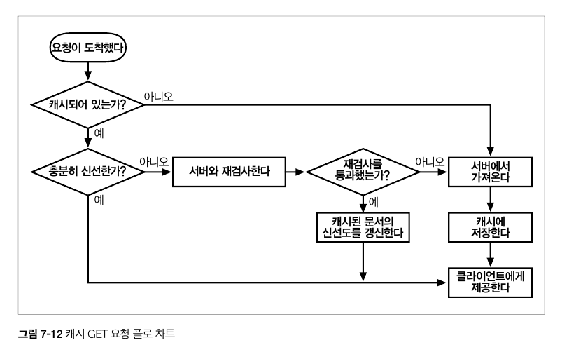

## 7.8 사본을 신선하게 유지하기

- 캐시된 사본 모두 서버의 문서와 항상 일치하는 것은 아니다.
- 문서들은 시간에 따라 변경되는데 오래된 데이터를 제공하는 캐시는 불필요하다.
- 따라서 캐시된 데이터는 서버의 데이터와 일치하도록 관리되어야 한다.
- HTTP는 **서버 재검사**라는 메커니즘을 가지며, 캐시된 사본을 서버와 충분히 일치하도록 유지한다.

### 7.8.1 문서 만료

- HTTP는 Cache-Control과 Expires라는 헤더를 이용해 원 서버가 각 문서에 **유효기간**을 붙일 수 있게 해준다
  
- 캐시 문서가 만료되기 전이라면 서버와의 접촉 없이 사본을 제공할 수 있다.
- 캐시 문서가 만료되면 서버와 문서에 변경 사항이 있는 지 검사해야하며, 변경 사항이 있으면 새로운 사본을 가져와 유효기간을 갱신해야 한다.

### 7.8.2 유효기간과 나이

- 서버는 `HTTP/1.0+ Expires`, `HTTP/1.1 Cache-Control: max-age` 응답 헤더를 이용해 유효기간을 명시한다.
- 이 두 응답 헤더는 같은 일을 한다. 그리고 절대 시간은 컴퓨터의 시계가 올바르게 맞추어져 있을 것을 요구한다.
  | 헤더 | 설명 |
  | ----------------------- | ------------------------------------------------------------------------------------------------------------------------------------------------------------------------------------------------------------------------- |
  | Cache-Control : max-age | max-age 값은 문서의 최대 나이를 정의한다. 최대 나이는 문서가 처음 생성된 이후부터, 제공하기에 더이상 신선하지 않다고 간주될 때까지 경과한 시간의 합법적인 최댓값이며, 단위는 초이다. ex) Cache-Control : max-age = 484200 |
  | Expires | 절대 유효기간을 명시한다. 만약 유효기간이 경과했다면 그 문서는 더이상 신선하지 않다. |

### 7.8.3 서버 재검사

- 캐시된 문서가 만료되었다는 것은 그 문서가 원 서버에 존재하는 것과 같은 지 다른 지 확인하는 **서버재검사**를 할 때가 되었다는 뜻이다.
- 재검사 결과 콘텐츠가
  - 변경되었다면 캐시는 그 문서의 새로운 사본을 가져와 오래된 데이터 대신 저장 후 클라이언트에게 보내준다
  - 변경되지 않았다면 캐시는 새 만료일을 포함한 새 헤더들만 가져와서 캐시 안의 헤더들을 갱신한다.
- 서버재검사는 신선하지 않은 콘텐츠는 제공하지 않으면서도, 서브 트래픽을 절약하고 사용자 응답 시간을 개선한다.
- HTTP 프로토콜은 캐시가 다음 중 하나를 반환하는 적절한 행동을 할 것을 요구한다
  - 충분히 신선한 캐시된 사본
  - 원 서버와 재검사되었기 때문에, 충분히 신선하다고 확신할 수 있는 캐시된 사본
  - 에러 메시지(재검사해야하는 원 서버가 다운된 경우)
  - 경고 메시지가 부착된 캐시된 사본(부정확하다면)

### 7.8.4 조건부 메서드와의 검사

- HTTP의 조건부 메서드는 재검사를 효율적으로 만들어준다.
- HTTP는 캐시가 서버에게 조건부 GET 요청을 보낼 수 있도록 한다.
- 조건부 GET이란 ?
  - 서버가 갖고있는 문서와 캐시가 갖고있는 문서 중 다른 경우에만 객체 본문을 보내달라고 하는 것
  - 조건부 GET은 GET 요청 메시지에 특별한 조건부 헤더를 추가함으로써 시작된다.
  - 조건부가 참인 경우에만 객체를 반환한다.
- HTTP는 다섯 가지 조건부 요청 헤더를 정의한다.
- 모든 조건부 헤드는 ‘If-’ 접두어로 시작한다.

| 헤더                       | 설명                                                                                                                                                                                                 |
| -------------------------- | ---------------------------------------------------------------------------------------------------------------------------------------------------------------------------------------------------- |
| If-Modified-Since : <data> | 만약 문서가 주어진 날짜 이후로 수정이 되었다면 요청 메서드를 처리한다. 이것은 캐시된 버전으로부터 콘텐츠가 변경된 경우에만 콘텐츠를 가져오기 위해 Last-Modified 서버 응답 헤더와 함께 사용된다.      |
| If-None-Match: <tags>      | 마지막 변경된 날짜를 맞춰보는 대신 서버는 문서에 대한 일련번호와 같이 동작하는 특별한 태그를 제공할 수 있다. If-None-Match 헤더는 캐시된 태그가 서버에 있는 문서의 태그와 다를 때만 요청을 처리한다. |

### 7.8.5 If-Modified-Since: 날짜 재검사

- 가장 흔히 쓰이는 캐시 재검사 헤더는 `If-Modified-Since`이며 IMS 요청이라고 불린다.
- 이 요청은 서버에게 리소스가 특정 날짜 이후로 변경된 경우에만 요청한 본문을 보내달라고 한다.
- 만약 문서가 주어진 날짜 이후로
  - 변경되었다면 `If-Modified-Since` 조건은 참이고, GET 요청은 평범하게 성공한다. 새 문서가 새로운 만료 날짜와 그 외 다른 정보들이 담긴 헤더들과 함께 캐시에게 반환된다.
  - 변경되지 않았다면 `If-Modified-Since` 조건은 거짓이고, 서버는 304 Not Modified 응답 메시지를 클라이언트에게 돌려준다. 효율을 위해 본문은 보내지 않는다.
- `If-Modified-Since` 헤더는 서버의 응답 헤더의 `Last-Modified` 헤더와 함께 동작한다.
- 원 서버는 제공하는 문서에 최근 변경 일시를 붙인다.
  ```idris
  If-Modified-Since : <캐시된 마지막 수정일>
  ```
  

### 7.8.6 If-None-Match: 엔터티 태그 재검사

- 최근 변경일시 재검사가 적절히 행해지기 어려운 상황이 몇 가지 있다. 이 경우 엔터티 태그 재검사를 이용할 수 있다.
  - 어떤 문서는 일정 시간 간격으로 다시 쓰여지는 경우, 실제로는 같은 데이터를 포함해 내용엔 변화가 없고 변경시각은 바뀔 수 있다.
  - 어떤 문서들의 변경은 전 세계의 캐시들이 그 데이터를 다시 읽어들이기엔 사소한 것일 수 있다. (철자, 주석 등)
  - 해당 페이지에 대한 최근 변경 일시를 정확하게 판별 불가하는 경우
  - 1초보다 작은 간격으로 갱신되는 문자를 제공하는 서버들의 경우 1초 정밀도는 충분하지 않다.
- 퍼블리셔가 문서를 변경했을 때 그는 문서의 엔터티 태그를 새로운 버전으로 표현할 수 있다.
- 엔터티 태그가 변경되었다면 200 OK 응답으로 새 콘텐츠를 새 ETag와 함께 반환하고, 변경되지 않았다면 304 Not Modified를 반환한다.


- 캐시가 객체에 대한 여러 개의 사본을 갖고 있는 경우, 그 사실을 서버에게 알리기 위해 하나의 헤더에 여러 개의 엔터티 태그를 포함시킬 수 있다.
  ```idris
  If-None-Match : "v2.6"
  If-None-Match : "v2.4", "v2.5", "v2.6"
  If-None-Match : "foobar", "Profiles in Courage"
  ```

### 7.8.7 약한 검사기와 강한 검사기

- 캐시는 캐시된 버전이 서버가 갖고 있는 것에 대해 최신인지 확인하기 위해 엔터티태그를 사용한다.
- 이 경우 엔터티 태그와 최근 변경일시는 둘 다 캐시 검사기이다.
- 서버는 때로 캐시된 사본을 무효화시키지 않고 문서를 살짝 고칠 수 있도록 허용하고 싶은 경우가 있다.
- HTTP/1.1은 콘텐츠가 조금 변경되었더라도 “그정도면 같은 것”이라고 서버가 주장할 수 있는 약한 검사기를 지원한다.
- 약한 검사기는 ‘W/’ 접두사를 이용한다. ex) ETag: W/”2.6”
- 강한 검사기는 콘텐츠가 바뀔 때마다 바뀐다.

### 7.8.8 언제 엔터티 태그를 사용하고 언제 Last-Modified 일시를 사용하는가

- HTTP/1.1 클라이언트는 서버가 엔터티 태그를 반환했다면 반드시 엔터티 태그 검사기를 사용해야한다.
- 서버가 `Last-Modified` 값만을 반환했다면 클라이언트는 `If-Modified-Since` 검사를 사용할 수 있다.
- 만일 둘 다 반환해 사용 가능하다면 `HTTP/1.0`, `HTTP/1.1` 캐시 모두 적절히 응답할 수 있도록 두 재검사 정책을 사용해야한다.
- `HTTP/1.1` 원 서버는 실현 불가능하지만 않다면 엔터티 태그 검사기를 보내야 하며, 이점이 있다면 약한 엔터티 태그 검사기를 보낼 수도 있다. 또 `Last-Modified` 값을 같이 보내는 것도 선호된다.
- `HTTP/1.1` 캐시나 서버가 `If-Modified-Since`와 `엔터티 태그 조건부 헤더`를 모두 받았다면 모든 조건에 부합하지 않는 한 `304 Not Modified`를 반환해선 안된다.

## 7.9 캐시 제어

HTTP는 문서가 만료되기 전까지 얼마나 오랫동안 캐시될 수 있게 할 것인지 서버가 설정할 수 있는 여러 방법을 정의한다. 아래는 우선순위로 나열된 것이다.

- 서버는
  1. Cache-Control : no-store 헤더를 응답에 첨부할 수 있다.
  2. Cache-Control : no-cache 헤더를 응답에 첨부할 수 있다.
  3. Cache-Control : must-revalidate 헤더를 응답에 첨부할 수 있다.
  4. Cache-Control : max-age 헤더를 응답에 첨부할 수 있다.
  5. Expires 날짜 헤더를 응답에 첨부할 수 있다.
  6. 아무 만료 정보도 주지 않고 캐시가 스스로 체험적인 방법으로 결정하게 할 수 있다.

### 7.9.1 no-cache와 no-store 응답 헤더

- HTTP/1.1은 신선도 관리를 위해 객체를 캐시하는 것을 제한하거나, 캐시된 객체를 제공하는 여러가지 방법을 제공한다.
- no-cache와 no-store 헤더는 캐시가 검증되지 않은 캐시된 객체로 응답하는 것을 막는다.

```idris
// 해당 응답에 대한 사본 제작 금지.
// 캐시는 클라이언트에게 no-store 응답을 전달하고 나면 객체를 삭제할 것이다.
Cache-Control : no-store

// 재검사 없이 캐시에서 제공 금지
Cahe-Control : no-cache

// HTTP/1.0+와의 하위호환성을 위해 포함됨
// 만일 HTTP/1.0 애플리케이션에 대응해야 하는 경우가 아니라면 Cache-Control : no-chache 사용해야됨
Pragma: no-cache
```

### 7.9.2 Max-Age 응답 헤더

- Cache-Control : max-age 헤더는 신선하다고 간주되었던 문서가 서버로부터 온 이후 흐른 시간이고, 초로 나타낸다
- s-maxage는 max-age처럼 행동하지만 공유된 캐시에만 적용된다.
- 서버는 maximum aging을 0으로 설정함으로써 캐시가 매 접근마다 문서를 캐시하거나 리프레시하지 않도록 요청할 수 있다.

### 7.9.3 Expires 응답 헤더

- 더이상 사용하지 않기를 권하는 Expires 헤더는 초 단위의 시간 댓니 실제 만료 날짜를 명시한다.
- HTTP를 설계한 사람들은 많은 서버가 동기화되어 있지 않거나 부정확한 시계를 갖고 있기 때문에, 만료를 절대시각 대신 경과된 시간으로 표현하는 것이 낫다고 판단했다.
- 신선도 수명의 근사값은 만료일과 생성일의 초단위 시간차를 계산해 얻을 수 있다.

### 7.9.4 Must-Revalidate 응답 헤더

- 캐시는 성능을 이해 만료된 객체를 제공하도록 설정할 수 있다.
- 만일 캐시가 만료 정보를 엄격하게 따르길 원한다면 `Cache-Control : must-revalidate` 를 사용할 수 있다.
- 이 응답 헤더는 캐시가 이 객체의 신선하지 않은 사본을 원 서버와의 최초의 재검사 없이는 제공하면 안된다는 의미이다.
- 캐시는 자유롭게 신선한 사본을 제공할 수 있는데 must-revalidate 신선도 검사를 시도했을 때 원 서버가 사용할 수 없는 상태라면 반드시 `504 Gateway Timeout error` 를 반환해야 한다.

### 7.9.5 휴리스틱 만료

- 만일 응답이 Cache-Control : max-age 헤더나 Expire 헤더 중 어느 것도 포함하지 않는다면 캐시는 경험적으로 최대 나이를 계산할 것이다.
- LM 인자 알고리즘은 유명한 휴리스틱 만료 알고리즘 중 하나인데, 문서가 최근 변경 일시를 포함하고 있다면 사용가능하다.
- 최근 변경 일시를 문서가 얼마나 자주 바뀌는지에 대한 추청으로 사용한다.
- 휴리스틱 만료 알고리즘 로직
  1. 캐시된 문서가 마지막으로 변경된 것이 상당히 예전이라면, 이는 안정적인 문서라는 것을 뜻하고 갑자기 바뀔 가능성이 크지 않기 때문에 캐시에 더 오래 보관되고 있어도 안전하다
  2. 캐시된 문서가 최근에 변경되었다면 자주 변경될 것이고 우리는 그것을 서버와 재검사하기 전까지 짧은 기간 동안만 캐시해야한다.
  3. 최근 변경일이 없다면 판단 근거가 없기 때문에 기본 신선도 유지기간으로 설정한다. 보통 한 시간 ~ 하루이다. 더 보수적이라면 0의 신선도 수명을 설정하여 캐시가 클라이언트에게 데이터를 제공할 때마다 신선한지 검사한다.
- LM 인자 알고리즘은 최근 변경 일시를 말해줬을 때의 시간차를 계산하고, 이 차의 일부를 취해 캐시 신선도 지속시간으로 사용한다.
  ```idris
  $마지막_수정_이후로_경과한_시간 = max(0, $서버의_Date - $서버의_Last_Modified);
  $서버_신선도_한계 = int($마지막_수정_이후로_경과한_시간 * $lm_인자);
  ```
  
- 일반적으로 휴리스틱 신선도 유지기간에 상한을 설정한다. 보통은 일주일이다.

### 7.9.6 클라이언트 신선도 제약

- 웹브라우저는 브라우저나 프락시 캐시의 신선하지 않은 콘텐츠를 강제로 갱신시켜주는 리프레시나 리로드 버튼이 있다.
- 이 버튼은 Cache-control 요청 헤더가 추가된 GET 요청을 발생시켜서, 강제로 재검사하거나 서버로부터 콘텐츠를 무조건 가져온다.
- 클라이언트는 Cache-Control 요청헤더를 사용해 만료제약을 엄격하거나 느슨하게 할 수 있다.
- 수동 리프레시 버튼과 같이 문서를 최신으로 유지할 필요가 있는 애플리케이션을 위해 Cache-Control 헤더를 사용해 만료를 더 엄격하게 할 수도 있다
- 한편 성능, 신뢰성, 비용 개선등을 위해 요구사항을 느슨하게 하고자 할 수도 있다.


### 7.9.7 주의할 점

- 문서 만료는 완벽한 시스템이 아니다. 퍼블리셔의 잘못으로 유효기간이 먼 미래로 설정된다면 만료 전까지 그 문서에 대한 어떤 변경도 캐시에 반영되지 않을 것 이다.
- 이런 이유로 많은 퍼블리셔가 유효기간을 길게 잡지 않는다.

## 7.10 캐시 제어 설정

### 7.10.1 아파치로 HTTP 헤더 제어하기

아파치 웹 서버는 HTTP 캐시 제어 헤더를 설정할 수 있는 여러 가지 메커니즘을 제공한다. 이 메커니즘들 중 많은 것이 디폴트로는 가능하지 않게 되어있어서 사용하려면 일단 활성화시켜야한다. 그 중 몇 가지는 아래와 같다.

- mod_headers
  이 모듈은 개별 헤더들을 설정할 수 있게 해준다. 한 번 이 모듈이 로드 되면 개별 HTTP 헤더를 설정할 수 있는 지시어를 이용해 아파치 설정 파일에서 설정을 추가할 수 있다.
- mod_expires
  적절한 만료 날짜가 담긴 Expires 헤더를 자동으로 생성하는 프로그램 로직을 제공한다. 이 모듈은 문서에 마지막 으로 접근한 날 혹은 수정한 날 이후의 일정 시안으로 유효기간을 설정하게 해준다.
- mod_cern_meta
  이 모듈은 HTTP 헤더들의 파일을 특정 객체와 연결시켜준다. 이 모듈을 켜면 제어하고자하는 파일에 각각 대응되는 메타파일들을 생성하게 되므로 각 메타파일에 원하는 헤더를 추가하면 된다

### 7.10.2 HTTP-EQUIV를 통한 HTML 캐시 제어

웹 서버는 제공할 문서에 올바른 캐시 제어 헤더들을 부여하기 위해 설정 파일들과 상호작용한다.

HTML 2.0은 <META HTTP-EQUIV> 태그를 정의했다. 이 선택적 태그는 HTML 문서의 최상단에 위치하여 문서와 연동되어야 하는 HTTP 헤더들을 정의한다.

```idris
<HTML>
	<HEAD>
		<TITLE> My Document </TITLE>
		<META HTTP-EQUIV= "Cache-control" CONTENT="no-cache">
	<HEAD>
	...
```

- 이 태그는 원래 웹 서버에서 사용되도록 의도된 것이지만 서버의 부하를 가중시키고, 설정값은 정적이고, HTML을 제외한 다른 타입의 파일은 지원하지 않기 때문에 이 기능을 지원하는 웹 서버나 프락시는 거의 없다.

## 7.11 자세한 알고리즘

### 7.11.1 나이와 신선도 수명

- 캐시된 문서가 제공하기에 충분히 신선한지 알려주려면 캐시는 캐시의 사본의 나이와 신선도 수명값만 계산하면 된다.
- 만약 캐시된 사본의 나이 < 신선도 수명 일 경우 제공하기 충분히 신선하다.
  ```idris
  $ 충분히 신선한가 = ($나이 < $신선도_수명);
  ```
  - 문서의 나이는 서버가 문서를 보낸 후 그 문서가 나이를 먹은 시간의 총합이다.
  - 문서의 신선도 수명은 아직 문서가 신선하다고 볼 수 있는 수명이다.
  - 클라이언트에 따라 약간 신선하지 않아도 받아들이려 할 수 있고(Cache-Control : max-stale), 조만간 신선하지 않게 될 문서 조차 받아들이려 하지 않을 수 있다.(Cahce-Control: min-fresh)
  - 캐시는 서버 만료 정보와 클라이언트 신선도 요구사항을 조합해서 최대 신선도 수명을 판별한다.

### 7.11.2 나이 계산

응답의 나이는 응답이 서버에서 생성되었을때부터 지금까지의 총 시간이다. 그 나이는 응답이 인터넷상의 라우터들과 게이트웨이들 사이를 떠돌아다닌 시간과 응답이 캐시에 머물러있던 시간을 포함한다.

```idris
$겉보기_나이 = max(0, $응답을_받은_시각 - $Date_헤더값)
$보정된_겉보이_나이 = max($겉보기_나이, $Age_헤더값)
$응답_지연_추정값 = $응답을_받은_시각 - $요청을_보낸_시각;

$문서가_우리의_캐시에_도착했을_때의_나이 = $보정된_겉보기_나이 + $응답_지연_추정값;
$사본이_우리의_캐시에_머무른_시간 = $현재_시각 - $응답을_받은_시각;

$나이 = $문서가_우리의_캐시에_도착했을_때의_나이 + $사본이_우리의_캐시에_머무른_시간;
```

1.  **겉보기 나이는 Date 헤더에 기반한다.**

- 모든 컴퓨터가 똑같이 정확한 시계를 갖고 있다면,캐시 된 문서의 나이는 단순히 현재 시간에서 서버가 문서를 보낸 시간(Date 헤더)을 뺀 겉보기 나이가 될 것이다.
  ```idris
  $겉보기_나이 = $응답을_받은_시각 - $Date_헤더값
  ```
- 모든 컴퓨터는 똑같이 정확한 시계를 갖고 있지 않다.
  > 클록 스큐 clock skew: 두 컴퓨터의 시계 설정 차이로 인한 문제클록 스큐 때문에 겉보기 나이는 종종 부정확하며 때로는 음수가 되기도 한다.
- 겉보기 나이가 음수가 될 경우 0으로 만들어야 한다.
  ```idris
  $겉보기_나이 = max(0, $응답을_받은_시각 - $Date_헤더값)
  ```

1. **점층적 나이 계산 (Age 헤더)**

- 문서가 프락시나 캐시를 통과할 때마다그 장치들이 Age헤더에 상대적인 나이를 누적해서 더하도록 한다.
- 이 방법은 서버 간의 시간 비교나, 종단 간의 시간 비교를 필요로 하지 않는다.
  Age 헤더 값은 문서가 프락시들을 통과하면서 점점 늘어난다.
- HTTP/1.1을 이해하는 어플리케이션은 문서가 각 어플리케이션에 머무른 시간과 네트워크 사이를 이동한 시간만큼 Age 헤더의 값을 늘려야 한다.
- 각 중간 어플리케이션은 자신의 내부 시계를 이용해서 쉽게 문서의 체류 시간을 계산할 수 있다.
- 비-HTTP/1.1 장치는 Age 헤더를 인식하지 못한다.

상대 나이값은 가장 큰 것(보수적)이 선택된다.

- 다른 서버에서 넘어온 Date 값이나 나이계산값은 실제보다 작게 계산된 값일 수 있기 때문이다.

```idris
$겉보기_나이 = max(0, $응답을_받은_시각 - $Date_헤더값)
$보정된_겉보이_나이 = max($겉보기_나이, $Age_헤더값)
$문서가_우리의_캐시에_도착했을_때의_나이 = $보정된_겉보기_나이
```

1. **네트워크 지연에 대한 보상**

- 느린 네트워크나 과부하가 걸린 서버에서 => 문서가 네트워크나 서버의 교통 혼잡에 긴 시간 동안 갇혀있었던 경우 상대 나이 계산은 문서의 나이에 대한 상당히 모자란 추정이 될 수 있다.
- Date헤더는 문서가 캐시로 옮겨가는 도중에 **얼마나 시간을 소비했는지** 말해주지 않는다.
  ```idris
  $겉보기_나이 = max(0, $응답을_받은_시각 - $Date_헤더값)
  $보정된_겉보이_나이 = max($겉보기_나이, $Age_헤더값)
  $응답_지연_추정값 = $응답을_받은_시각 - $요청을_보낸_시각;
  $문서가_우리의_캐시에_도착했을_때의_나이 = $보정된_겉보기_나이 + $응답_지연_추정값;
  ```

1. **캐시에 저장되면, 나이를 더 먹는다.**

- 문서에 대한 요청이 캐시에 도착했을 때,우리는 그 문서의 현재 나이를 계산하기 위해 그 문서가 캐시에 얼마나 오랫동안 머물렀는지 알 필요가 있다.
  ```idris
  $나이 = $문서가_우리의_캐시에_도착했을_때의_나이 + $사본이_우리의_캐시에_머무른_시간;
  ```

### 7.11.3 완전한 나이 계산 알고리즘

문서에 대한 요청이 캐시에 도착했을 때, 문서의 현재 나이를 계산하기 위해 그 문서가 캐시에 얼마나 오랫동안 머물렀는지 알 필요가 있다.

```idris
$나이 = $문서가_우리의_캐시에_도착했을_때의_나이 + $사본이_얼마나_오래_우리의_캐시에_있었는지;
```


### 7.11.4 신선도 수명 계산

캐시된 문서가 클라이언트에게 제공해주기에 충분히 신선한지 알아내려 시도하고 있다. 이 질문에 답하기 위해 우리는 캐시된 문서의 나이를 알아내고 서버와 클라이언트의 제약조건에 따라 신선도 수명을 계산해야한다.

- 어떤 문자의 신선도 수명은 문서가 특정 클라이언트에게 제공해주기에는 더이상 신선하지 않게 될 때까지 얼마나 오랜 시간동안 가져올 수 있도록 허용되는 지를 말해준다.
- 신선도 수명은 서버와 클라이언트의 제약조건에 의존한다.
- 서류철 속 보고서는 수년동안 신선한 상태를 유지하지만, 정기간행물이라면 다음번 출판일 전까지만 신간일 것이다.

### 7.11.5 완전한 서버 신선도 알고리즘

- 아래 코드는 서버 신선도 한계를 계산하는 펄 알고리즘이다. 이 알고리즘은 문서가 여전히 서버에서 제공되는 상황에서 도달할 수 있는 최대 나이를 반환한다.

```idris
sub 서버_신선도_한계 {
  local($휴리스틱, $서버_신선도_한계, $마지막으로_변경된_시각)

  $휴리스틱 = 0;
  if ($Max_Age_값이_설정되었나) { $서버_신선도_한계 = $Max_Age_값 }
  elsif ($Expires_값이설정되었나) { $서버_신선도_한계 = $Expires_값 - $Date_값 }
  elsif ($Last_Modified_값이_설정되었나) {
    $마지막으로_변경된_시각 = max(0, $Date_값 - $Last_Modified_값)
    $서버_신선도_한계 = int($마지막으로_변경된_시각 * $lm_인자);
    $휴리스틱 = 1;
  } else {
    $서버_신선도_한계 = $캐시_최소_수명_기본값;
    $휴리스틱 = 1;
  }

  if ($휴리스틱) {
    if ($서버_신선도_한계 > $캐시_최대_수명_기본값) $서버_신선도_한계 = $캐시_최대_수명_기본값
    if ($서버_신선도_한계 < $캐시_최소_수명_기본값) $서버_신선도_한계 = $캐시_최소_수명_기본값
  }
  return $서버_신선도_한계
}

```

- 아래 코드는 서버 신선도 한계를 가져와서 클라이언트의 제약에 맞게 수정하는 예이다.

  ```idris
  sub 클라이언트가_수정한_신선도_한계 {
    $나이_한계 = 서버_신선도_한계()

    if ($Max_Stale_값이_설정되었나) {
      if ($Max_Stale_값 == $INT_MAX) { $나이_한계 = $INT_MAX }
      else { $나이_한계 = 서버_신선도_한계() + $Max_Stale_값 }
    }
    if ($Min_Fresh_값이_설정되었나) {
      $나이_한계 = min($나이_한계, 서버_신선도_한계() - $Min_Fresh_값)
    }
    if ($Max_Age_값이_설정되었나) { $나이_한계 = min($나이_한계, $Max_Age_값) }
  }
  ```

- 전체 과정은 문서의 나이와 신선도 한계라는 두 가지 변수가 관련되어 있다.
- 만약 나이 < 신선도 한계 라면 충분히 신선하다

## 7.12 캐시와 광고

지금까지의 핵심은 **캐시는 성능을 개선하고 트래픽을 줄인다.** 즉, 캐시는 사용자들에게 더 좋은 경험을 제공해야한다.

### 7.12.1 광고 회사의 딜레마

- 콘텐츠 제공자는 캐시를 이용해 비용을 절감하며 광고를 사용자에게 더 잘 보여줌으로써 사용자가 더 많은 콘텐츠를 소비하고, 더 많은 광고를 보게 할 수 있다.
- 그러나 문제는 캐시는 원 서버가 실제 접근 횟수를 알 수 없게 숨길 수 있다는 것이다.
- 때문에 접근 횟수에 따라 돈을 벌고 있다면 … 슬플 것이다..

### 7.12.2 퍼블리셔의 응답

- 오늘날의 광고회사들은 캐시가 광고 시청수를 못가져가도록 광고를 CGI 게이트웨이를 통해 제공한다.
- 접근마다 광고 URL을 고쳐서 사용한다.
- 다만 이러한 접근은 캐싱의 긍정적 효과를 감소시킬 수 있습니다.

### 7.12.3 로그 마이그레이션

- 이상적인 해결책 하나는 서버로 요청이 가지 않도록 하는 것이다.
- 캐시는 결국 모든 적중 로그를 유지할 수 있고, 이 로그를 서버에게 나눠줄 수 있다.
- 적중 로그는 크기 때문에 옮기기도 힘들고 표준화가 안되어 조직되어 있지도 않다.

### 7.12.4 적중 측정과 사용량 제한

- **HTTP를 위한 간단한 캐시 적중량 측정과 사용량 제한 프로토콜**을 이용해 특정 URL에 대한 캐시 적중 횟수를 정기적으로 서버에게 돌려주는 Meter헤더를 추가한다.
- 이에 대해선 21장에서 자세히 다룰 것이다.
