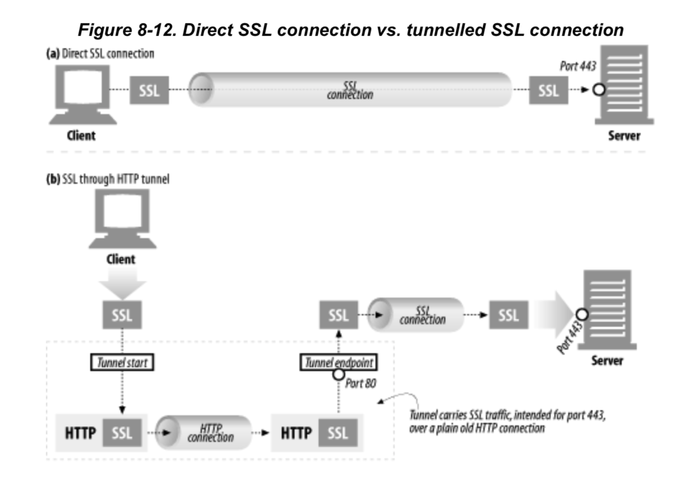

## 8.1 게이트웨이

- HTTP의 확장과 인터페이스가 발전함에 따라 웹에서 모든 리소스를 한 개의 애플리케이션으로만 처리할 수 없다는 것이 분명해졌다.
- 이러한 문제의 해결책으로서 리소스를 받기 위한 경로를 안내하는 역할인 게이트웨이 개념을 고안해냈다.
- **게이트웨이는 리소스와 애플리케이션을 연결하는 역할을 한다.**
- 애플리케이션은 게이트웨이에게 요청을 처리해달라고 할 수 있고 게이트웨이는 그에 맞게 동적인 컨텐츠를 생성하거나, 데이터베이스에 질의를 보내는 등의 응답을 할 수 있다.


- 위 그림을 보면 게이트웨이는 서버와 데이터베이스 중간역할을 하는 리소스 게이트웨이이다.
- 게이트웨이는 HTTP 클라이언트가 다른 프로토콜을 알 필요 없이 서버로 접속할 수 있도록, HTTP 트래픽을 자동으로 다른 프로토콜로 변환한다.


- (a)에서 게이트웨이는 FTP URL을 가리키는 HTTP 요청을 받는다. 게이트웨이는 FTP와 커넥션을 맺고, FTP서버에 적절한 명령을 전송한다. 클라이언트는 적절한 HTTP 헤더와 함께 HTTP를 통해서 문서를 받는다
- (b)에서 게이트웨이는 암호화된 웹 SSL을 통해 요청을 받고 요청을 해독해서 생성한 일반 HTTP요청을 목적지 서버로 전달한다.이런 보안 가속기는 원 서버에 고성능 암호화 기능을 제공할 목적으로 웹 서버의 바로 앞단에 위치시킬 수 있다.
- (c)에서 게이트웨이는 애플리케이션 서버 게이트웨이 API를 통해서 HTTP 클라이언트를 서버측 애플리케이션 프로그램에 연결한다. 웹에서 물건을 사거나 일기예보를 보거나 할 때 사실은 애플리케이션 서버 게이트웨이를 방문하는 것이다.

### 8.1.1 클라이언트 측 게이트웨이와 서버측 게이트웨이

- 웹 게이트웨이는 **한 쪽에선 HTTP로 통신**하고, **다른 한 쪽에선 다른 프로토콜로 통신**한다.
- 게이트웨이는 클라이언트 측 프로토콜과 서버 측 프로토콜을 빗금으로 구분해 기술한다.
  - HTTP 클라이언트와 NNTP 뉴스 서버 사이에 있으면 HTTP / NNTP 게이트웨이가 된다.
  - **서버 측 게이트웨이는 클라이언트와 HTTP로 통신**하고, **서버와는 외래 프로토콜로 통신**한다.
  - **클라이언트 측 게이트웨이는 클라이언트와 외래 프로토콜로 통신**하고, **서버와는 HTTP로 통신**한다.

## 8.2 프로토콜 게이트웨이

- 게이트웨이에도 HTTP 트래픽을 바로 보낼 수 있다.
- 보통 명시적으로 게이트웨이를 설정하여 트래픽이 게이트웨이를 거쳐 가게 하거나, 게이트웨이를 대리 서버로 설정할 수도 있다.
  

- 일반적인 HTTP 트래픽은 바로 원서버로 보낸다.
- FTL URL을 포함한 요청은 FTP 요청으로 변환하여 처리한 뒤 클라이언트에게 결과를 HTTP로 전송한다.

### 8.2.1 Http/\*: 서버 측 웹 게이트웨이

서버 측 웹 게이트웨이는 클라이언트로부터 HTTP 요청이 원 서버 영역으로 들어오는 시점에 클라이언트 측의 HTTP 요청을 외래 프로토콜로 전환한다.


- 위 그림 8-5에서 게이트웨이는 원 서버의 FTP 포트로 FTP 커넥션을 연결하고 FTP 프로토콜을 통해서 객체를 가져온다.
- 여기서 게이트웨이가 하는 역할
  - USER와 PASS 명령을 보내서 서버에 로그인한다
  - 서버에서 적절한 디렉터리로 변경하기 위해 CWD 명령을 내린다.
  - 다운로드 형식을 ASCII로 설정한다.
  - MDTM으로 문서의 최근 수정 시간을 가져온다.
  - PASV로 서버에게 수동형 데이터 검색을 하겠다고 말한다.
  - RETV로 객체를 검색한다
  - 제어 채널에서 반환된 포트로 FTP 서버에서 데이터 커넥션을 맺고, 데이터 채널이 열리는 대로 객체가 게이트웨이로 전송된다.

### 8.2.2 Http/Https: 서버 측 보안 게이트웨이

- 기업 내부의 모든 웹 요청을 암호화함으로써 개인정보보호와 보안을 제공하는 데 게이트웨이를 사용할 수 있다.


- 클라이언트는 일반 HTTP를 사용하여 웹을 탐색할 수 있지만, 게이트웨이는 자동으로 사용자의 모든 세션을 암호화할 것이다.

### 8.2.3 Https/Http: 클라이언트 측 보안 가속 게이트웨이


- HTTPS/HTTP 게이트웨이는 보안 가속기로 유명하다.
- 이 HTTPS/HTTP 게이트웨이는 웹 서버의 앞단에 위치하고, 보이지 않는 인터셉트 게이트웨이나 리버스 프락시 역할을 한다.
- 보안 HTTPS 트래픽을 받아서 복호화하고, 웹 서버로 보낼 일반 HTTP 요청을 만든다.
- 이런 게이트웨이는 원 서버의 부하를 줄여주기도 하지만, 게이트웨이와 원서버 간의 암호화하지 않은 트래픽을 전송하기 때문에 게이트웨이와 원 서버 간에 있는 네트워크가 안전한지 확인을 확실히 하고 사용해야 한다.

### 8.3 리소스 게이트웨이


- 애플리케이션 서버는 게이트웨이의 가장 일반적인 형태이다.
- 이 애플리케이션 서버는 HTTP를 통해서 클라이언트와 통신하고 서버 측에 있는 애플리케이션 프로그램에 연결하는 서버측 게이트웨이이다.
- 두 개의 클라이언트가 HTTP를 사용하여 애플리케이션 서버로 연결한다.
- 하지만 서버로부터 파일이 전송되는 대신, 애플리케이션 서버는 게이트웨이의 API(Application Programming Interface)를 통해 요청을 서버에서 동작하고 있는 애플리케이션에 전달한다.

  - 클라이언트 A의 요청을 받으면, 그 요청의 URI를 따라서 API를 통해 디지털 카메라 애플리케이션에 요청이 전송된다.
  - HTTP 응답 메시지는 최종 카메라 이미지를 감싸 클라이언트로 전송하고 클라이언트의 브라우저에 보인다.
  - 클라이언트 B의 URI는 전자상거래 애플리케이션을 가리킨다. 클라이언트 B의 요청은 서버 게잍웨이 API를 통해 전자상거래 소프트웨어로 전송되고 결과는 브라우저로 전송된다.
  - 전자상거래 소프트웨어는 클라이언트와 통신하며 사용자가 순차적인 HTML 페이지를 통해서 구매를 완료할 수 있게 한다.

- 최초의 API는 공용 게이트웨이 인터페이스, CGI (Common Gateway Interface)였다.
- CGI는 웹 서버가 사용하는 표준화된 인터페이스 집합이다.


- 게이트웨이를 통해야 받을 수 있는 리소스 요청이 들어오면, 서버는 핼퍼 애플리케이션을 생성하여 요청을 처리한다.
- 헬퍼 애플리케이션은 필요한 데이터를 전달받는다
- 전달받은 데이터는 요청 전체이거나 사용자가 데이터베이스에서 실행시키려는 질의 같은 것이다.
- 그 다음 바로 클라이언트에게 전달할 응답이나 응답 데이터를 서버에 반환한다.
- 이 프로토콜은 가장 오래되고 널리 쓰이는 CGI이다.

### 8.3.1 공용 게이트웨이 인터페이스 (CGI)


- CGI는 최초의 서버 확장이자 지금도 널리 쓰이는 서버 확장이다.
- 이는 동적인 HTML, 신용카드 처리, 데이터베이스 질의 등을 제공하는 데에 쓰인다.
- CGI 애플리케이션이 서버와 분리되면서 Perl, Tcl, C, 셸 언어를 포함한 많은 언어로 구현할 수 있게 되었다.
- CGI는 거의 모든 HTTP 서버가 지원한다.
- 사용자에게는 CGI가 내부에서 어떤 처리를 하는 지 보이지 않는다.
- 그리고 서버와 CGI 애플리케이션 간에 진행되는 처리 단계를 감춘다.
- URL에 ‘cgi’ 혹은 ‘?’ 같은 것을이 있다면 CGI 애플리케이션이 무언가 하고있다는 뜻이다.
- CGI는 거의 모든 리소스 형식과 서버의 접점에 있으면서 필요에 따라 어떤 변형이든 처리해내는 단순한 기능을 제공한다.
- 인터페이스는 문제가 많은 확장으로부터 서버를 보호한다는 점에서 훌륭하고 할 수 있다.
- 만약 문제가 있는 확장이 서버 자체에 들어가면 에러를 발생시키고 서버를 뻗게할 것이다.
- 그러나 이러한 분리때문에 성능에 관한 비용이 발생한다.
- 모든 CGI 요청마다 새로운 프로세스를 만드는 데 따르는 부하가 꽤 크고, CGI를 사용하는 서버의 성능을 제한하며 서버 장비에 부담을 준다.
  
- 이런 문제를 피하고자 새로운 CGI 형식인 Fast CGI가 개발되었다.

### 8.3.2 서버 확장 API

- CGI 프로토콜은 구동중인 HTTP 서버에 외부 인터프리터가 쉽게 접속할 수 있게는 해준다.
- 하지만 서버 자체의 동작을 바꾸고 싶거나 서버의 처리능력을 최고치로 끌어올리기 위해선 서버 확장 API가 필요하다.
- 서버 확장 API는 하나의 프로세스에서 여러 개의 스레드(Thread)를 생성해서 클라이언트의 요청을 처리한다.
- 확장 API는 프로그래머가 자신의 코드를 서버에 연결하거나 서버의 컴포넌트를 자신이 만든 것으로 교체해버릴 수 있게 하였다.

## 8.4 애플리케이션 인터페이스와 웹 서비스

- 두 애플리케이션을 연결하면서 생기는 까다로운 이슈 중 하나는 데이터를 교환하려는 두 애플리케이션 사이에서 프로토콜 인터페이스를 맞추는 일이다.

  방법 예시

  1. HTTP 확장
  2. HTTP 위에 프로토콜을 덧씌워 사용자 맞춤 정보를 교환
     → 19장에서 자세히 배울 예정

- 인터넷 커뮤니티는 웹 애플리케이션이 서로 통신하는데 사용할 표준과 프로토콜 집합을 개발했다.
  웹 서비스는 원래 웹 애플리케이션 그 자체를 의미하지만, 웹 애플리케이션의 통신에 사용되는 표준을 지칭하게 되었음.
  웹서비스는 SOAP( Simple Object Access Protocol) 을 통해 XML을 사용하여 정보를 교환한다. XML은 데이터 객체를 담는 데이터를 생성하고 해석하는 방식을 제공한다.
  SOAP는 HTTP 메시지에 XML 데이터를 담는 방식에 관한 표준이다.

## 8.5 터널

웹 터널이란?

HTTP 프로토콜을 지원하지 않는 애플리케이션에 HTTP 애플리케이션을 사용해 접근하는 방법을 제공한다.

웹 터널을 사용하면 HTTP 커넥션을 통해서 HTTP 가 아닌 트래픽을 전송할 수 있고, 다른 프로토콜을 HTTP 위에 올릴 수 있다.

웹 터널을 사용하는 가장 일반적인 이유

HTTP 커넥션 안에 HTTP가 아닌 트래픽을 얹기 위해서이다.

웹 터널을 사용하면 HTTP 트래픽만을 허락하는 방화벽이 있더라도, HTTP가 아닌 트래픽을 전송할 수 있다.

### 8.5.1 CONNECT로 HTTP 터널 커넥션 맺기

웹 터널은 HTTP의 CONNECT 메서드를 사용하여 커넥션을 맺는다.

CONNECT 메서드는 터널 게이트웨이가 임의의 목적 서버와 TCP 커넥션을 맺고 클라이언ㄴ트와 서버간에 오는 데이터를 무조건 전달하기를 요청한다.

- CONNECT 메서드가 어떻게 게이트웨이로 터널을 연결하는지
  
  1. (a) - 클라이언트는 게이트웨이에 터널을 연결하려고 CONNECT 요청을 보낸다
     - 여기서는 SSL 포트인 443 포트에 호스트명이 orders.joes-hardware.com인 곳으로 터널 연결 요청
  2. (b),(c) - TCP 커넥션이 생성됨

  3. (d) TCP 커넥션이 맺어지면, 게이트웨이는 클라이언트에게 HTTP 200 Connection Established 응답을 전송,

     이 시점에 터널이 연결된다. HTTP 터널을 통해 전송된 클라이언트의 모든 데이터는 위에서 맺은 TCP 커넥션으로 바로 전달되며,서버로부터 모든 데이터 역시 HTTP 터널을 통해 클라이언트에게 전달된다.
  위의 예시는 SSL 트래픽이 HTTP 커넥션을 통해 전송되는 SSL 터널을 묘사한 것이지만. CONNECT 메서드는 모든 서버나 프로토콜에 TCP 커넥션을 맺는데 사용할 수 있다.
- CONNECT 요청 / 응답

  **CONNECT 요청**

  CONNECT 요청문법은 시작줄을 제외하고 다른 HTTP 메서드와 같다. 요청 URI는 호스트명이 대신하며, 콜론에 이어 포트를 기술한다.

  ```tsx
  CONNECT home.netscape.com:443 HTTP/1.0
  User-agent : Mozila/4.0
  ```

  시작줄 다음에는 다른 HTTP 메시지와 같이, 추가적인 HTTP 요청 헤더 필드가 있거나 없다.

  보통 각 행은 CRLF로 끝나고, 헤더 목록의 끝은 빈 줄의 CRLF로 끝난다.

  **CONNECT 응답**

클라이언트는 요청을 전송한 다음 게이트웨이의 응답을 기다린다. 일반 HTTP 메시지와 같이 200 응답 코드는 성공을 뜻한다.

편의상 응답에 있는 사유구절은 ‘Connection Established’로 기술한다.

```tsx
HTTP/1.0 200 Connection Established
Proxy-agent : Netscape-Proxy/1,1
```

일반적인 HTTP 응답과 달리 Content-Type 헤더를 포함할 필요는 없다. 커넥션이 메시지 대신 바이트를 그대로 전달하므로, 콘텐츠의 형식을 기술하는 Content-Type 헤더를 포함할 필요가 없다.

### 8.5.2 데이터 터널링, 시간, 커넥션 관리

- 데이터 터널링

  터널을 통해 전달되는 데이터는 게이트웨이에서 볼 수 없어서, 게이트웨이는 패킷의 순서나 흐름에 대한 어떤 가정도 할 수 없다.

  터널이 일단 연결되면 데이터는 언제 어디로든 흘러가버릴 수 있으니. 클라이언트와 서버 모두 언제든지 패킷을 받을 준비를 해야한다.

- 시간
  클라이언트는 성능을 높이기 위해 CONNECT 요청 이후, 응답을 받기 전에 터널 데이터를 전송할 수 있다.
  서버에 데이터를 더 빨리 보낼 수 있지만, 게이트웨이가 요청에 이어서 데이터를 적절하게 처리할 수 있어야 한다.
  게이트웨이는 네트워크 I/O 요청이 헤더 데이터만을 반환해줄 거라고 가정할 수 없어서, 커넥션이 맺어지는 대로 읽어들인 대로 모든 데이터를 서버에 전송해야 한다.
  클라이언트는 인증 요구나 200 외의 응답이 왔을 때 요청 데이터를 다시 보낼 준비가 되어있어야 한다.
- 커넥션 관리
  터널의 끝단 어느 부분이든 커넥션이 끊어지면, 그 끊어진 곳으로부터 온 데이터는 반대편으로 전달된다.
  그다음 커넥션이 끊어진 쪽 반대편 또한 프락시에 의해서 연결이 끊어진다.
  커넥션이 끊긴 한쪽에 아직 전송하지 않은 데이터는 버려진다

### 8.5.3 SSL 터널링

웹 터널은 원래 방화벽을 통해서 암호화된 SSL 트래픽을 전달하려고 개발되었다.

웹 터널을 사용하면, SSL 트래픽을 HTTP 커넥션으로 전송하여 80포트의 HTTP만을 허용하는 방화벽을 통과시킬 수 있다.


이 터널링 기능은 HTTP 메시지에 암호화된 날 데이터를 담고, 일반 HTTP 채널을 통해 데이터를 전송한다.

터널은 HTTP가 아닌 트래픽이 포트를 제한하는 방화벽을 통과할 수 있게 해준다. 이는 보안 SSL 트래픽이 방화벽을 통과하는 데 유용하게 사용될 수 있다. 하지만 터널은 악의적인 트래픽이 사내료 유입되는 경로가 될 수도 있다.



### 8.5.4 SSL 터널링 vs HTTP/HTTPS 게이트웨이

- HTTP/HTTPS 게이트웨이 방식으로 암호화된 SSL 세션을 수행한다고 하면 몇가지 단점이 있다.
  1. 클라이언트 - 게이트웨이 사이에는 보안이 적용되지 않은 HTTP 커넥션이 맺어져 있다.
  2. 프락시가 인증을 담당하므로, 클라이언트는 원격 서버에 SSL 클라이언트 인증을 할 수 없다.
  3. 게이트웨이는 SSL을 완벽히 지원해야 한다.
- 이런 상황에서 SSL 터널링을 사용하면, 프락시에 SSL을 구현할 필요가 없다. SSL 세션은 클라이언트가 생성한 요청과 목적지 웹 서버 간에 생성된다.
  프락시 서버는 트랜잭션의 보안에는 관여하지 않고, 암호화된 데이터를 그대로 터널링 할 뿐이다.

### 8.5.5 터널 인증

HTTP의 다른 기능들은 터널과 함께 적절히 사용될 수 있다.

특히 프락시 인증 기능은 클라이언트가 터널을 사용할 수 있는 권한을 검사하는 용도로 터널에서 사용할 수 있다.

### 8.5.6 터널 보안에 대한 고려 사항들

터널 게이트웨이는 통신하고 있는 프로토콜이 터널을 올바른 용도로 사용하고 있는지 검증할 방법이 없다.

그러니까 터널 오용을 최소화하기 위해서, 게이트웨이는 HTTPS 전용 포트인 443같이 잘 알려진 특정 포트만을 터널링 할 수 있게 허용해야 한다.

## 8.6 릴레이

HTTP 릴레이는 HTTP 명세를 완전히 준수하지는 않는 간단한 HTTP 프락시다. 릴레이는 커넥션을 맺기 위한 HTTP 통신을 한 다음 바이트를 맹목적으로 전달한다.

- keep-alive hang 문제
  
  1. a. 클라이언트는 Connection: Keep-Alive를 헤더에 추가해서 릴레이에 keep-alive 커넥션을 맺기 원한다는 요청 메시지 전달, 이후 릴레이에서 응답을 기다림
  2. 릴레이가 HTTP 요청은 받지만, Connection 헤더를 이해하지 못하므로, 단순히 데이터를 서버로 넘긴다.
  3. b에서 릴레이된 HTTP 요청이 서버에 전달. 릴레이로부터 Connection : Keep-Alive 헤더를 받아서 서버는 릴레이가 keep-alive 하기를 바란다고 판단하여 c의 응답 헤더에 Connection : Keep-alive 전달
  4. 릴레이는 받은 그대로 데이터를 전달하기 때문에 d의 응답에 Connection:Keep-Alive 헤더 전달, 클라이언트는 a에서 전달한 keep-alive에 동의하고 있다고 추측함. 서버와 클라이언트는 keep-alive로 통신하고 있다고 믿지만 그중간에 릴레이는 아무것도 모름
  5. 릴레이는 원 서버가 커넥션을 끊기만을 기다리며 받은 데이터 전부를 클라이언트에게 전달. 하지만 원 서버는 릴레이가 커넥션을 계속 맺고 있기를 요청했다고 믿기때문에 커넥션을 오히려 끊지 않고, 커넥션이 계속 지속됨
  6. f에서 keep-alive를 통해 요청이 전달되지만, 같은 커넥션으로 또다른 요청이 오는 것을 릴레이는 예측하지 못함, 브라우저는 계속 돌지만 아무런 작업도 진행되지 않음.
