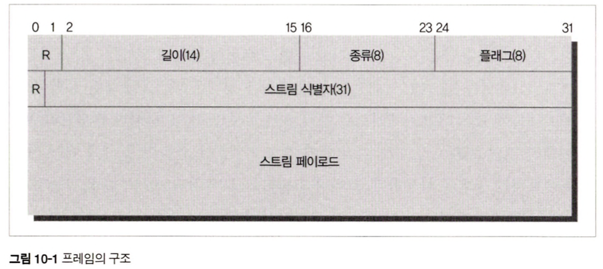

# 10장 HTTP/2.0

이 장에서는 HTTP/2.0에 대해 만들기 시작하게 된 배경, HTTP/1.1과의 주요 차이점, 현재까지 알려진 보안 이슈에 대해 이야기한다. HTTP/2.0 명세는 계속 고쳐지고 있는 중이므로, 이 의 내용은 HTTP/2.0 명세 내용과 차이가 있을 수 있다.

## 10.1 HTTP/2.0 등장 배경

- 성능적인 문제  
  HTTP/1.1 메시지 포맷은 구현의 단순성과 접근성에 주안점을 두고 최적화 되었다 보니 성능이 희생되는 부분이 있었다.

  커넥션 하나에 요청 하나 그에따른 응답 하나는 단순함 면에서는 더할나위 없지만, 응답을 받고난 이후에야 다음 요청을 보낼 수 있으므로 회전 지연을 피할 수 없었다.

  이 문제를 피하기 위해 병렬 커넥션, 파이프라인 커넥션 등이 도입되었지만, 성능 개선에 대한 근본적인 해결은 되지 못했다

- 새로운 프로토콜의 개발  
  회전 지연(latency)를 줄이기위해 로이 필딩은 WAKA, 마이크로소프트는 MicroSoft M+S , 구글에서는 SPDY 등의 새로운 프로토콜이 개발되기 시작하였다.

  SPDY는 헤더 압축을 통해 대역폭을 절약, 하나의 커넥션에 여러 요청 가능, 클라이언트의 요청이 없어도 서버가 능동적으로 리소스를 푸시하는 기능 등이 있다.

  HTTP 작업 그룹은 SPDY을 기반으로 HTTP/2.0을 설계하고 있으며, 2013년 현재 SPDY의 특징을 거의 유지하며 개발중이다.

## 10.2 개요

- TCP 커넥션 초기화
  HTTP/2.0은 서버와 클라이언트 사이의 TCP 커넥션 위에서 동작하나. 이때 TCP커넥션을 초기화 하는것은 클라이언트다.

- 프레임  
  HTTP/2.0 요청과 응답은 길이가 정의된(최대 16383바이트) 한개 이상의 프레임에 담긴다. 이때 HTTP 헤더는 압축되어 담긴다

- 스트림  
  프레임들에 담긴 요청과 응답은 스트림을 통해 보내진다.

  한개의 스트림이 한쌍의 요청과 응답을 처리한다. 하나의 커넥션 위에 여러개의 스트림이 동시에 만들어 질 수 있으므로, 여러개의 응답과 요청을 동시에 처리하는 것 역시 가능하다.

- 상호작용 모델 [요청 - 응답] 에서 [서버 푸시]  
  HTTP/2.0의 상호작용 모델은 기존의 요청-응답과는 약간 다른 서버 푸시 모델을 도입했다.

  이를 통해 서버는 클라이언트에게 필요하다고 생각하는 리소스라면 그에 대한 요청을 명시적으로 받지 않더라도 능동적으로 클라이언트에게 보내줄 수 있다.

- 메세지 의미 유지, 문법 변경  
  기존 웹 애플리케이션들과의 호환성을 최대한 유지하기 위해 HTTP/2.0은 요청과 응답 메시지의 의미를 HTTP/1.1과 같도록 유지하고 있다.

      같은 의미 표현
      헤더의 Content-Length : 본문의 길이 의미,
      상태코드 404 Not Found : 리소스 찾을 수 없음.

      문법 변경
      Content-Length -> .content.length
      404 Not Found -> .status 헤더에 표현

## 10.3 HTTP/1.1과의 차이점

### 10.3.1 프레임

HTTP/2.0에서 모든 메시지는 프레임에 담겨 전송된다. 모든 프레임은 8바이트 크기의 헤더로 시작하며, 뒤이어 최대 16383 바이트 크기의 페이로드가 온다.

- 프레임 헤더의 필드 설명

  - R: 예약된 2비트 필드, 값의 의미가 정의되어 있지 않고 반드시 0이어야 한다. 받는 쪽도 이 값을 무시해야 한다.
  - 길이 : 페이로드의 길이를 나타내는 14비트 unsigned integer, 이 길이는 프레임 헤더를 포함하지 않는다
  - 종류 : 프레임의 종류
  - 플래크 : 8비트 플래그, 플래그 값의 의미는 프레임 종류에 따라 다르다
  - R: 예약된 1비트 필드, 첫번째 R과 마찬가지로 값이 정의되어있지 않고 반드시 0이어야 한다. 받는쪽은 이 값을 무시해야한다.
  - 스트림 식별자 : 31비트 스트림 식별자, 특별이 0은 커넥션 전체와 연관된 프레임을 의미한다.

- 프레임 종류

      DATA, HEADERS, PRIORITY, RES_STREAM, SETTINGS, PUSH_PROMISE, PING, GOAWAY, WINDOW_UPDATE, CONTIUATION,

  총 10가지 프레임의 정의하며 페이로드의 형식이나 내용은 프레임의 종류에 따라 다르다

### 10.3.2 스트림과 멀티플렉싱

스트림은 HTTP/2.0 커넥션을 통해 클라이언트와 서버 사이에서 교환되는 프레임들의 독립된 양방향 시퀀스다.

- 스트림 동작 방식  
  한쌍의 HTTP 요청과 응답은 하나의 스트림을 통해 이루어진다. 클라이언트는 요청 시 새 스트림을 만들어 그 스트림을 통해 HTTP 요청을 보내고, 요청을 받은 서버는 같은 스트림으로 응답을 보낸다. 그리고 나면 스트림이 닫히게 된다

- 하나의 커넥션에 동시에 여러개의 요청이 가능하다.  
  HTTP/1.1의 경우 한 TCP 커넥션을 통해 요청을 보냈을때, 그에 대한 응답이 도착해야만 같은 커넥션으로 다시 요청을 보낼 수 있다

  여러개의 커넥션을 만들어서 회전 지연을 줄이려고 하지만 커넥션을 무한정 만들수 없으므로 latency를 피하기 어렵다.

  HTTP/2.0에서는 하나의 커넥션에 여러개의 스트림이 동시에 열릴 수 있다. 따라서 하나의 커넥션을 통해 여러개의 HTTP 요청이 동시에 보내질 수 있으므로 위와같은 문제를 해결할 수 있다.

- 스트림 우선순위  
  예를들어 사용자의 네트워크 대역폭이 충분하지 않을 때, 보다 중요한 리소스에 우선순위를 부여할 수 있다.(이미지 대신에 html)  
  하지만 우선순위에 따르는 것은 의무사항이 아니라 요청이 우선순위대로 처리되지 않을수 있다.

- 고유한 식별자  
  모든 스트림은 31비트의 무부호 정수로 된 고유한 식별자를 갖는다. 스트림이 클라이언트에 의해 초기화 되었을 경우 식별자는 반드시 홀수여야 하고, 서버라면 짝수여야 한다.

  새로 만들어지는 식별자는 이전에 만들어진 스트림과 예약된 스트림의 식별자보다 커야한다.  
  이 규칙을 어기는 식별자를 받았다면 에러코드가 PROTOCOL_ERROR인 커넥션 에러로 응답해야 한다.

- 일방적으로 생성  
  서버와 클라이언트는 스트림을 상대방과 협상 없이 일방적으로 만든다.

  이는 스트림을 만들 때 협상을 위해 TCP 패킷을 주고받느라 시간을 낭비하지 않아도 됨을 의미한다.

- 스트림 식별자 재사용 불가  
  HTTP/2.0 커넥션에서는 한번 사용한 스트림 식별자는 다시 사용할 수 없다.

  커넥션을 오래 사용해서 스트림에 할당할 수 있는 식별자가 고갈되기도 하는데, 커넥션을 다시 맺으면 된다.

- 블록 방지  
  동시에 여러개의 스트림을 사용하면 스트림이 블록될 우려가 있다는 주장이 있는데 HTTP/2.0은 WINDOW_UPDATE 프레임을 이용한 흐름 제어를 통해 스트림들이 서로 간섭해서 망가지는 것을 막아준다.

### 10.3.3 헤더 압축

- HTTP/1.1에서는 헤더가 아무런 압축 없이 그대로 전송되었다.  
  과거에는 웹페이지 하나에 대한 요청이 많지 않아서 헤더의 크기가 문제가 되지 않았지만, 요즘에는 웹페이지 하나에도 수백 수천번의 요청이 오고가므로 헤더의 크기가 회전 지연과 대역폭 양쪽에 실질적인 영향을 끼치게 되었다.

- 이를 개선하기 위해 헤더를 압축하여 전송  
  헤더는 HPACK 명세에 정의된 헤더 압축 방법으로 압축된디 헤더 블록 조각들로 쪼개져서 전송된다.  
  받는 쪽에서는 이 조각들을 이은 뒤 압축을 풀어 원래의 헤더 집합으로 복원한다.
- 압축 콘텍스트  
  HPACK은 헤더를 압축하고 해제할 때 압축 콘테스트를 사용한다. 오동작 하지 않으려면 항상 올바른 압축 콘텍스트를 유지해야 한다.  
  압축 콘테스트는 수신한 헤더의 압축을 풀면 이에 영향을 따라 바뀌게 된다.  
  송신측은 수신 측이 헤더의 압축을 풀어 그에 따라 압축 콘텍스트가 변경되었다고 가정하므로, 헤더를 받는 수신 측은 어떤 경우에서라도, 심지어 헤더를 쓰지 않고 버리는 경우에도 반드시 압축 해제를 수행해야 한다.  
  그럴수 없다면 COMPRESSION_ERROR와 함께 커넥션을 끊어야 한다.

### 10.3.4 서버 푸시

- 서버 푸시 기능  
  HTTP/2.0은 서버가 하나의 요청에 응답으로 여러개의 리소스를 보낼 수 있도록 해준다.  
  예를 들어 HTML 문서가 링크한 이미지, css파일, js등의 리소스를 클라이언트의 요청 없이도 푸시할 수 있다.

  이는 클라이언트가 HTML 문서 파싱 이후에나 필요한 리소스를 다시 요청하는 과정에서 발생하는 트래픽과 회전 지연을 줄여준다.

- 서버 푸시 과정  
  리소스를 푸시하려는 서버는 먼저 클라이언트에 자원을 푸시할 것임을 PUSH_PROMISE 프레임을 보내어 미리 알려주어야 한다. 클라이언트가 PUSH_PROMISE 프레임을 받게 되면 해당 프레임의 스트림은 클라이언트 입장에서 "예약됨(원격)" 상태가 된다.

  이 상태에서 클라이언트는 RST_STREAM 프레임을 보내어 푸시를 거절할 수 있다. RST_STREAM을 보내게 되면 그 스트림은 즉각 닫히게 된다.

  서버가 푸시하려고 하는 예약된 리소스를 클라이언트가 재요청 할 수 있으므로 스트림이 닫히기 전까지 클라이언트는 서버가 푸시하려고 하는 리소스를 요청해서는 안된다.

- 서버 푸시 이용 시 주의해야 할 점

  - 서버 푸시를 사용하기로 했더라도, 중간의 프락시가 서버로부터 받은 추가리소스를 클라이언트에게 전달하지 않을 수 있으며, 반대로 아무런 추가 리소스를 받지 않았음에도 클라이언트에게 추가 리소스를 전달할 수 있다.

  - 서버는 오직 안전하고, 캐시 가능하고, 본문을 포함하지 않은 요청에 대해서만 푸시할 수 있다.

  - 푸시할 리소느는 클라이언트가 명시적으로 보낸 요청과 연관된 것이어야 한다. 서버가 보내는 PUSH_PROMISE 프레임은 원 요청을 위해 만들어진 스트림을 통해 보내진다.

  - 클라이언트는 반드시 서버가 푸시한 리소스를 동일 정책(Same-origin policy) 에 따라 검사해야 한다.

  - 서버 푸시를 끄고 싶다면 SETTINGS_ENABLE_PUSH를 0으로 설정하면 된다.

## 10.4 알려진 보안 이슈

### 10.4.1 중개자 캡슐화 공격(Intermediary Encapsulation Attacks)

HTTP/2.0 메시지를 중간의 프락시나 HTTP/1.1 메시지로 변환할 때 메시지의 의미가 변질될 가능성이 있다.

HTTP/1.1과는 달리 HTTP/2.0은 헤더 필드의 이름을 값과 바이너리로 인코딩한다. 이는 HTTP/2.0은 헤더필드로 어떤 문자열(줄바꿈 문자열 포함)이든 사용할 수 있게 해준다. 이는 정상적인 HTTP/2.0 요청이나 응답이 불법적이거나 위조된 HTTP/1.1 메시지로 번역되는 것을 유발할 수 있다.

### 10.4.2 긴 커넥션 유지로 인한 개인정보 누출 우려

HTTP/2.0은 사용자가 요청을 보낼때의 레이턴시를 줄이기 위해 클라이언트와 서버 사이의 커넥션을 오래 유지하는 것을 염두에 두고 있다. 이것은 개인정보의 유출에 악용될 가능성이 있다.

예를 들어 사용자가 브라우저를 사용할 때, 이전에 그 브라우저를 사용했던 사용자가 무엇을 했는지 알아낼 가능성도 있다.
