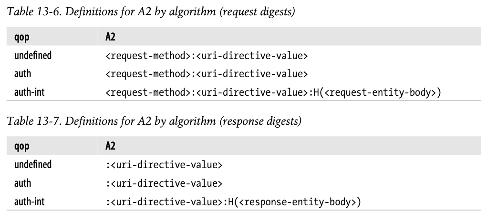

# 13장 다이제스트 인증

기본 인증은 편리하고 유연하지만 전혀 안전하지 않다.

다이제스트 인증은 기본 인증과 호환되는 더 안전한 대체제로 개발되었다. 다이제스트 인증은 널리 쓰이지는 않지만 그 개념은 보안 트랜잭션을 구현할 때 유용하다.

## 13.1 다이제스트 인증의 개선점

- 다이제스트 인증은 기본 인증의 가장 심각한 결함을 수정한 HTTP 인증 프로토콜이다

- 다이제스트 인증의 특징

  - 비밀번호를 절대로 네트워크를 통해 평문으로 전송하지 않는다.
  - 인증 체결을 가로채려는 악의적인 사람들을 차단한다
  - 구현하기에 따라 메시지 내용 위조를 막는것도 가능하다
  - 그외 몇몇 잘 알려진 형태의 공격을 막는다

- 다이제스트 인증이 가장 안전한 프로토콜은 아니지만, 기본 인증을 대체하기 위해 설계된 것이니만큼, 기본 인증보다 훨씬 강력하다.
  - 다이제스트 인증은 비밀번호 자체를 보호하는 것을 넘어서는 그 어떠한 비밀 보호도 하지 않는다. 요청과 응답 이외에는 나머지 누군가 엿보는 것이 가능하다.
  - 안전한 HTTP 트랜잭션을 위해서는 전송 계층 보안(TLS), 보안 HTTP(HTTPS)가 더 적합한 프로토콜이다.

### 13.1.1 비밀번호를 안전하게 지키기 위해 요약 사용하기

- 다이제스트 인증의 좌우명은, "절대로 비밀번호를 네트워크를 통해 보내지 않는다!" 이다.

  - 비밀번호를 보내는 대신, 비밀번호를 뒤섞은 지문(fingerprint) 또는 요약(digest)를 보낸다.
  - 클라이언트와 서버 모두 비밀번호를 알고 있으므로, 서버는 클라이언트가 보낸 요약이 비밀번호에 알맞게 대응하는지 검사할 수 있다.

- 다이제스트 인증 동작 과정(실제보다 간략함)

  1. 클라이언트가 보호된 문서를 요구한다.
  2. 서버는 클라이언트에게 사용자 이름과 요약된 형태의 비밀번호를 요구한다.(클라이언트에게 신원 인증 요구)
  3. 클라이언트는 비밀번호의 요약(digest)을 전달하여, 신원을 증명한다. 서버는 클라이언트가 보낸 요약과 서버가 스스로 계산한 요약이 일치하는지 확인하는 과정으로 신원을 확인한다.
  4. 클라이언트의 요약과 서버의 요약이 일치한다면, 클라리언트에게 문서가 제공된다. 요약 함수는 매우 긴 자릿수의 숫자를 만들어 내는 식이라 찍어서 맞추는것은 사실상 불가능하다.

  이 모든 과정에서 비밀번호는 결코 네트워크를 통해 전송되지 않는다.

### 13.1.2 단방향 요약

- 요약의 특징

  - 요약은 단방향 함수로 동작하고, 일반적으로 입력가능한 무한 가지의 입력값을 유한한 범위의 압축으로 변환한다.

    - 요약 중 하나인 MD5는 임의의 바이트 배열을 원래 길이와 상관 없이 128비트 요약으로 변환한다.

  - 요약 함수는 보통 암호 체크섬으로 불리며 단방향 해시함수이거나 지문함수 이다.

### 13.1.3 재전송 방지를 위한 난스(nonce) 사용

- 단방향 요약만 사용 시의 문제점

  단방향 요약은 비밀번호를 해독할 수 없게 만듬으로써 비밀번호 원본에 대한 보안을 지키지만, 그 요약 자체가 마치 비밀번호 처럼 사용되기 때문에, 중간에 해커가 요약을 가로채서 요청을 재전송면 보안에 대한 의미가 사라진다.

- 이런 재전송을 방지하기 위해 서버는 클라이언트에게 난스라고 불리는 증표를 건네준다
  - 난스는 대략 1밀리초 또는 매 인증마다 바뀌는 값이다
  - 난스를 비밀번호에 섞어서 요약하는 것으로 서버는 재전송 공격을 막을 수 있다.
  - 난스는 WWW-Authenticate 인증 요구에 담겨서 서버에서 클라이언트로 넘겨진다.

### 13.1.4 다이제스트 인증 핸드셰이크

HTTP 다이제스트 인증 프로토콜은 기본 인증에서 사용하는 것과 비슷한 헤더를 사용하는 강화된 버젼의 인증이다. 기존 헤더에서 몇몇 새 옵션이 추가되었고, 선택적인 헤더인 Authorization-Info가 추가되었다.


- 다이제스트 인증 핸드셰이크 요약
  1. 서버는 난스값을 계산한다
  2. WWW-Authenticate 인증요구 메시지에 난스값과 서버가 지원하는 알고리즘 목록을 함께 클라이언트에 전송한다
  3. 클라이언트는 알고리즘 선택 이후, 비밀번호와 그 외 데이터를 요약한
  4. 클라이언트는 Authorization 메시지에 요약을 담아 서버에게 돌려준다.
  5. 서버는 요약과 클라이언트가 선택한 알고리즘, 그 외 보조데이터를 받아 클라이언트가 했던 그대로 요약을 계산한다. 그다음 자신이 계산한 요약과 네트워크로 온 요약이 같은지 확인한다. 서버는 클라이언트가 다음번 요약을 올바르게 생성할 수 있도록 미리 다음번 난스를 계산하여 클라이언트에게 보내줄 수 있다.

## 13.2 요약 계산

다이제스트 인증의 핵심은 공개된 정보, 비밀 정보, 시한부 난스값을 조합한 단방향 요약이다. 이 요약이 어떻게 계산되는지 알아보자. 일반적으로 요약 계산은 간단하다.

### 13.2.1 요약 알고리즘 입력 데이터

요약은 다음 세 요소로부터 계산한다.

1. 단방향 해시 함수 **H(d)** 와 요약함수 **KD(s,d)** _//여기서 s는 비밀, d는 데이터를 의미_
2. 비밀번호 등 보안 정보를 담고 있는 데이터 덩어리 A1
3. 요청 메시지의 비밀이 아닌 속성을 담고 있는 데이터 덩어리 A2

A1과 A2는 요약을 생성하기 위해 H와 KD에 의해 처리된다

### 13.2.2 H(d)와 KD(s,d)알고리즘

다이제스트 인증은 여러가지 요약 알고리즘을 선택할 수 있다.  
제안으로는 MD5, MD5-sess('sess'는 세션을 뜻함)가 있고, 알고리즘을 정하지 않았다면 기본적으로 MD5가 기본값이다.

```
H(<데이터>) = MD5(<데이터>)
KD(<비밀>,<데이터>) = H(연결(<비밀>,<데이터>))
```

### 13.2.3 보안 관련 데이터 A1

A1으로 불리는 데이터 덩어리는 사용자 이름, 비밀번호, 보호 영역, 난스와 같은 비밀 보호 정보로 이루어져 있다.  
A1은 메시지 자체가 아닌 비밀 정보와만 관련되어있다.  
요약을 계산하기 위해 사용된다.

| 알고리즘 | A1                                                |
| -------- | ------------------------------------------------- |
| MD5      | A1 = <사용자>:<영역>:<비밀번호>                   |
| MD5-sess | A1 = MD5(<사용자>:<영역>:비밀번호):<난스>:<c난스> |

MD5는 모든 요청마다 단방향 해시를 실행한다, A1은 사용자 이름, 영역, 비밀번호를 콜론으로 연결한 것이다.
MD5-sess는 해시 계산 결과 뒤에 현재난스와 클라이언튼 난스를 붙인것이 A1이 된다.

### 13.2.4 메시지 관련 데이터 A2

A2로 불리는 데이터 덩어리는 URL, 요청 메서드, 메시지 엔터티 본문과 같은 메시지 자체의 정보를 나타낸다.  
A2는 메서드, 리소스, 메시지의 위조를 방지하기 위해 사용된다.  
요약을 계산하기 위해 사용된다

RFC 2617에서는 선택된 보호 수준(quality of protection, qop)에 따른 두가지 사용법을 정의한다.

- qop="auth" - HTTP 요청 메서드와 URL만 포함.
- qop="auth-int" - 메시지 무결성 검사를 제공하기 위해 메시지 엔터티 본문을 추가함.

| qop           | A2                                                  |
| ------------- | --------------------------------------------------- |
| 정의되지 않음 | <요청 메서드>:<uri 지시자 값>                       |
| auth          | <요청 메서드>:<uri 지시자 값>                       |
| auth-int      | <요청 메서드>:<uri 지시자 값>:H(<요청 엔터티 본문>) |

요청 메서드는 HTTP 요청 메서드, uri 지시자 값은 요청 줄에서 가져온 요청 Uri이다.

### 13.2.5 요약 알고리즘 전반

RFC 2617은 주어진 H, KD, A1, A2로 요약을 계산하는 두가지 방법을 정의한다.

| qop                | 요약 알고리즘                               | 비고             |
| ------------------ | ------------------------------------------- | ---------------- |
| 정의되지 않음      | KD(H(A1),<난스>:H(A2))                      | 없어질 예정      |
| auth 혹은 auth-int | KD(H(A1),<난스>:\<nc>:<c난스>:\<qop>:H(A2)) | 이 방법이 선호됨 |

펼쳐진 요약 알고리즘
| **qop** | 요약 알고리즘 |
| ------------------ | ------------------------------------------- |
| 정의되지 않음 | MD5(MD5(A1),<난스>:MD5(A2)) |
| auth | MD5(MD5(A1),<난스>:\<nc>:<c난스>:\<qop>:MD5(A2)) |
| auth 혹은 auth-int | MD5(MD5(A1),<난스>:\<nc>:<c난스>:\<qop>:MD5(A2)) |

### 13.2.6 다이제스트 인증 세션

어떤 보호 공간을 위한 WWW-Authenticate 인증요구에 대한 클라이언트 응답은 그 보호공간에 대한 인증세션을 시작하게 한다.

인증 세션은 클라이언트가 보호 공간의 다른 서버로부터 또다른 WWW-Authenticate 인증 요구를 받을 때까지 계속된다.'

클라이언트 라는 사용자 이름, 비밀번호, 난스, 난스 횟수 지시자(nc), 그리고 보호 공간 내 미래의 요청에 들어갈 Authorization 헤더를 만들기 위해 사용될 인증 세션과 연관된 알아보기 힘든 값들을 기억해야 한다.

난스가 만료되면, 서버는 난스 값이 낡은 것임을 감수하고 오래된 Authorizastion 헤더 정보를 받아들이는 것을 택할 수 있다.

아니면, 서버는 클라가 다시 요청을 보내도록 새 난스 값과 401을 반환할 수 있음. 이때 이 응답에 stale=true로 정의하여 서버는 클라에게 사용자 이름과 비밀번호를 새로 입력할 필요가 없게 한다.

### 13.2.7 사전(preemptive) 인가

클라아언트가 다음 난스가 무엇이 될지 미리 알고 있어서, 서버가 물어보기 전에 올바른 Authorization 헤더를 생성할 수 있다면 요청/인증요구 사이클을 생략할 수 있게 된다.


- 기본 인증에서, 브라우저는 클라이언트 데이터베이스를 통해 인증에 대한 정보를 저장하고, 다음 요청때 Authorization 헤더를 제대로 세팅할 수 있다.

- 난스 기술이 재전송 공격을 저지하기 위한 것이기 때문에 다이제스트 인증에서 사전 인가는 복잡하다.

- 서버가 임의의 난스를 생성하므로, 인증요구를 받기 전에는 클라가 무엇이 올바른 Authorization 헤더인지 알 방법이 없다

따라서 다이제스트 인증에서는 사전 인가를 할 수 있는 몇가지 방법을 제시한다.

1. 서버가 다음 난스를 Authentication-Info 성공 헤더에 담아서 미리 보낸다

   서버는 Authentication-Info 성공 헤더로 다음 난스 값을 미리 제공할 수 있음. 서버는 인증이 성공했을 때 200 OK 응답과 함께 헤더를 미리 보냄.

   ```
   Authentication-Info: nextnonce="<nonce-value>"
   ```

   이 다음 난스로 클라는 Authorization 헤더를 미리 만들어둘 수 있음. 이 방식이라면
   서버에 다중 요청을 pipelining하는 능력은 쓸모가 없어짐. 다음 요청을 보내기 전에 반드시 다음 난스 값을 받아야 하기 때문.

2. 서버가 짧은시간동안 같은 난스 재사용을 허용한다.

   예로 서버는 한 난스를 다섯 번, 혹은 10초간 재사용하도록 허용할 수 있음.
   클라는 자유롭게 Authorization 헤더와 함께 요청을 발행하여 파이프라이닝할 수 있음.

   난스가 만료되면 서버는 401 Unauthorized 인증요구를 보낼 것.
   이때 WWW-Authenticate:stale=true 지시어는 다음과 같이 설정됨.

   ```
   ` WWW-Authenticate: Digest realm="" nonce="" stale=true`
   ```

   난스를 재사용하면 재전송 공격이 성공하기 쉬워지므로 보안성이 감소됨.  
   난스 재사용의 수명은 오랫동안 재사용하도록 통제 가능하기 때문에 취약점과 성능 간의 트레이드오프가 있을 수 있음.

   카운터 증가나 IP주소 검사와 같이 다른 기능을 채택할 수 있으나 취약점을 제거할 수는 없음.

3. 클라이언트와 서버를 동기화하여 예측가능한 난스 생성 알고리즘을 사용한다.

   제3자가 쉽게 예측할 수 없는 공유된 비밀키에 기반하면서, 클라와 서버가 순차적으로 같은 난스를 생성할 수 있도록 동기화된 난스 생성 알고리즘을 사용하는 것도 가능

### 13.2.8 난스 선택

난스 내용은 구현 의존적이다. 그러나 성능 수준, 보안, 편의성은 현명한 선택에 달려있다.

RFC 2617에서는 가상의 난스 공식을 제안한다.

```
BASE64(time-stamp H(time-stamp ":" ETag ":" private-key))
```

    time-stamp - 서버에서 생성된 시간 혹은 반복 불가능한 값.
    ETag - 요청된 엔터티에 대한 ETag 헤더값.
    private-key - 서버만이 알고 있는 값.

서버는 클라이언트에게 인증 헤더를 받은 뒤, 위 공식에서 해시 부분을 재계산하고 클라이언트 인증 헤더의 난스와 일치하지 않거나 타임스탬프가 오래되었다면 요청을 거절한다. 이 방법으로 서버는 난스의 유효 기간을 제한할 수 있음.

ETag를 포함하면 갱신된 리소스에 대한 재요청을 방지한다. 클라이언트 IP주소를 난스에 포함해도 되지만, 클라이언트 요청은 여러 프락시를 거칠 수 있기에 proxy farms을 망가뜨릴 수 있고, IP주소를 쉽게 속일 수 있다.

재전송 공격을 방지하기 위해, 이전 난스나 요약을 받아들이지 않거나, POST와 PUT에는 일회성 난스나 요약을 사용하고, GET 요청에는 타임스탬프를 사용할 수도 있다.

### 13.2.9 상호 인증

- RFC 2617은 클라가 서버를 인증할 수 있도록 다이제스트 인증을 확장했다.  
  서버가 공유된 비밀 정보에 근거한 올바른 응답 요약을 생성할 수 있도록, c난스(클라이언트 난스)를 제공함으로써 가능해진다.

  이후 서버는 이 요약을 Authentication-Info 헤더를 통해 클라이언트에 전달한다.

- RFC2069 와의 하위호환성 문제로 인해 선택사항이긴 하지만, 보안이 상당히 개선되므로 이 상호 인증은 현대적인 클라이언트라면 구현할 것을 권한다.

  상호 인증은 qop 지시자가 존재할 경우 항상 수행하고, 없다면 수행하지 말아야 한디.

- 응답 요약은 메세지 본문 정보 A2가 다르다는 것만 제외하면 요청 요약과 같은 방법으로 계산할 수 있다.

  A2가 다른 이유는 응답에는 HTTP 메서드가 없고 메시지 엔터티 데이터가 다르기 때문.

* 알고리즘별 A2의 요청과 응답 차이
  
  응답에는 메서드가없다

* c난스 값과 nc 값은 반드시 이 응답에 대응하는 클라이언트 요청을 위한것이어야 한다.

  qop="auth", "auth-int"가 지정된 경우 반드시 응답 auth, c난스, 난스 횟수 지시자가 존재해야 한다.

## 13.3 보호 수준(Quality of Protection) 향상

- qop 필드는 요약 헤더의 세 가지 헤더 WWW-Authenticate, Authorization, Authentication-Info에 모두 존재할 수 있다.
- qop 필드는 클라이언트와 서버가 어떤 보호 기법을 어느 정도 수준으로 사용할 것인지 협상할 수 있게 해준다.

### 13.3.1 메시지 무결성 보호

- 무결성 보호가 적용되었을 때 계산되는 엔터티 본문은, 메시지 본문의 해시가 아닌 엔터티 본문의 해시이다.
- 송신자에 의해 어떠한 전송 인코딩이 적용되기도 전에 먼저 계산되고 그 후 수신자에 의해 제거된다.

### 13.3.2 다이제스트 인증 헤더

- 기본, 다이제스트 인증은 WWW-Authentication 헤더에 담겨 전달되는 인증요구와, Authentication 헤더에 담겨 전달되는 인기 응답을 포함한다.
- 다이제스트는 Authentication-Info 헤더를 추가했다.
- 3단계 핸드셰이크를 완성하고 다음번 사용할 난스를 전달하기 위해 인증 성공 후에 전송된다.

## 13.4 실제 상황에 대한 고려

### 13.4.1 다중 인증요구

- 서버는 한 리소스에 대해 여러 인증을 요구할 수 있다.
- 다양한 인증 옵션을 제공하는 경우, `가장 허약한 연결부분`에 대한 보안우려가 있다는 것이 명확하다.

### 13.4.2 오류처리

- 지시자나 그 값이 적절하지 않거나 요구된 지시자가 빠져 있으면, 응답은 400 Bad Request이다.
- 인증 서버는 uri 지시자가 가리키는 리소스가 요청줄에 명시된 리소스와 같음을 확인해야 한다.
- 반복된 실패에 대해서는 따로 기록해 두는 것이 좋다.

### 13.4.3 보호 공간(Protection Space)

- 영역 값은 접근한 서버의 루트 URL과 결합되어 보호 공간을 정의한다.
- 영역 값은 원 서버에 의해 할당되는 문자열이며 인증 제도에 추가적인 의미를 더한다.
- 보호 공간은 어떤 자격이 자동으로 적용되는 영역을 정한다.

### 13.4.4 URI 다시 쓰기

- 프락시는 가리키는 리소스의 변경 없이 구문만 고쳐서 URI를 다시 쓰기도 한다.
- 호스트 명은 정규화되거나 IP 주소로 대체된다.
- 문자들은 % escape 형식으로 대체될 수 있다.
- 서버로부터 가져오는 리소스에 영향을 주지 않는, 타입에 대한 추가 속성이 URI의 끝에 붙거나 중간에 삽입될 수 있다.

### 13.4.5 캐시

- Authorization 헤더를 포함한 요청과 그에 대한 응답을 받은 경우, 두 Cache-Control 지시자 중 하나가 응답에 존재하지 않는 한 다른 요청에 대해 응답을 반환해서는 안된다.

## 13.5 보안에 대한 고려사항

### 13.5.1 헤더 부당 변경

- 헤더 부당 변경에 대해 안전한 시스템을 제공하기 위해서, 양 종단 암호화나 헤더에 대한 디지털 서명이 필요하다.

### 13.5.2 재전송 공격

- 폼 데이터를 전송할 때 이전에 사용했던 자격을 재사용해도 문제없이 동작한다면, 큰 문제가 생기게 된다.
- 재전송 공격을 완전히 피하기 위해서는 매 트랜잭션마다 유일한 난스 값을 사용하는 것이다.
- 서버는 매 트랜잭션마다 난스와 함께 타임아웃 값을 발급한다.

### 13.5.3 다중 인증 메커니즘

- 클라이언트에게 항상 가장 강력한 인증제도를 선택하도록 한다.
- 가장 강력한 인증 제도만을 유지하는 프락시 서버를 사용한다.

### 13.5.4 사전 공격

- 전형적인 비밀번호 추측 공격이다.
- 비밀번호 만료 정책이 없고, 충분한 시간이 있고, 비밀번호를 크래킹할 비용을 치를 수 있다면, 비밀번호를 쉽게 수집할 수 있다.
- 크래킹하기 어렵도록 복잡한 비밀번호를 사용하고 괜찮은 비밀번호 만료 정책을 사용하는 것이 좋다.

### 13.5.5 악의적인 프락시와 중간자 공격

- 프락시중 하나가 악의적이거나 보안이 허술하다면 클라이언트는 중간자 공격에 취약한 상태가 될 수 있다.
- 프락시는 보통 정교한 프로그래밍 인터페이스를 제공하므로 그러한 프락시들을 이용하는 플러그인을 이용하여 트래픽을 가로채 수정하는 것이 가능하다.
- 이 문제를 해결하기에는 한계가 있으므로, 클라이언트가 가능한 가장 강력한 인증을 선택하도록 설정한다.

### 13.5.6 선택 평문 공격

- 보안이 허술하거나 악의적인 프락시가 트래픽 중간에 끼어든다면, 클라이언트가 응답 계산을 하기 위한 난스를 제공 할 수 있다.
- 응답을 계산하기 위해 알려진 키를 사용하는 것은 응답의 암호 해독을 쉽게 한다.
- 클라이언트가 서버에서 제공된 난스 대신 선택적인 c난스 지시자를 사용하여 응답을 생성할 수 있도록 설정하는 것이 좋다.

### 13.5.7 비밀번호 저장

- 다이제스트 인증 비밀번호 파일이 유출되면 영역의 모든 문서는 공격자에게 노출된다.
- 비밀번호 파일이 평문으로 된 비밀번호를 포함하고 있다고 생각하고 안전하게 보호한다.
- 영역 이름이 유일함을 보장한다.
