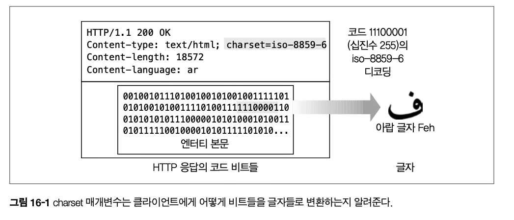
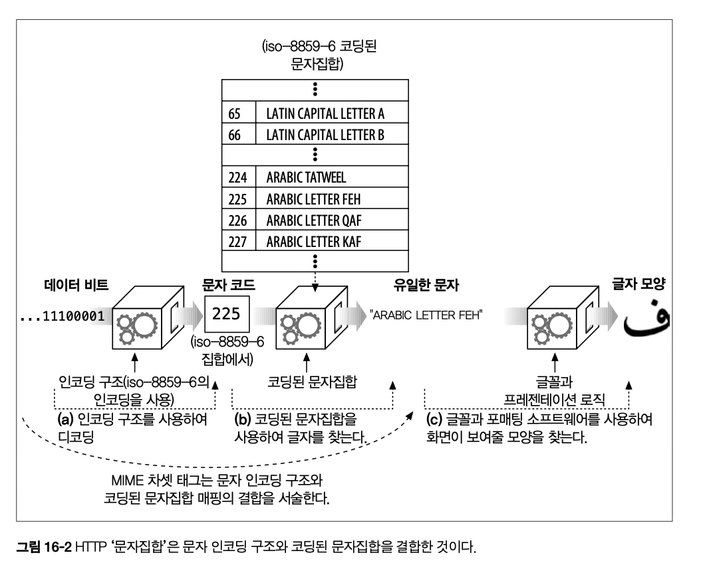
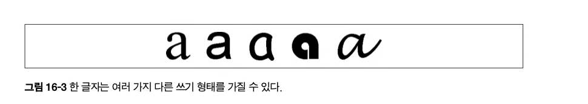
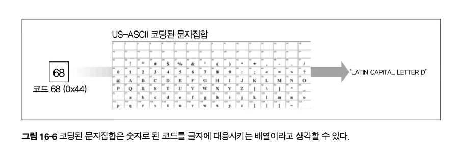
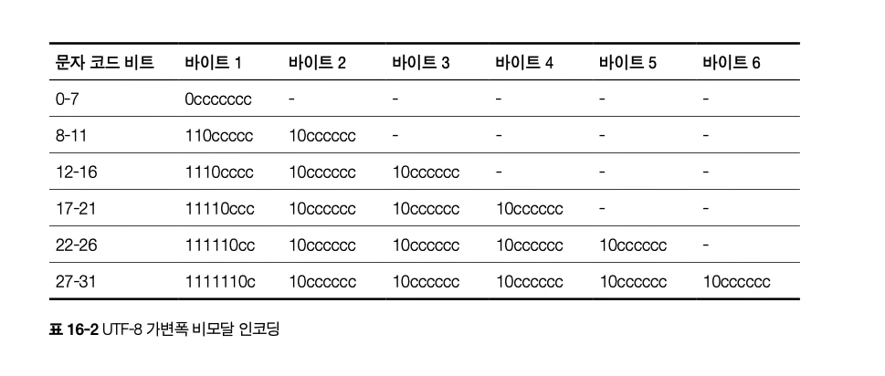

# 16장 국제화

매일 수십억 사람들이 수백가지 언어로 문서를 작성한다. 월드 와이드 웹의 비전에 부응하기 위해 HTTP는 여러 언어와 문자로 된 국제 문서들의 처리및 전송을 지원해야 한다

이 장에서는 두가지 구요 국제화 이슈인 문자집합 인코딩과 언어 태그를 다룬다

## 16.1 국제적인 콘텐츠를 다루기 위해 필요한 HTTP 지원

엔티티 본문는 비트에 불과하다

- HTTP 메시지는 어떤 언어로 된 컨텐츠든, 이미지, 동영상 혹은 그 외 다른 종류들의 정보도 실어 나를 수 있다. 엔티티 본문은 그저 비트에 불과할 뿐이다

비트들을 잘 이해하기 위해 서버에서 하는 일

- 서버는 클라이언트에게 각 문서의 문자와 언어를 알려줘서 비트들을 문자들로 풀어내고 클라이언트가 올바르게 문서를 처리하여 사용자에게 컨텐츠를 제공하도록 할 필요가 있다.

- 서버는 클라이언트에게 문서의 문자와 언어를 HTTP Content-Type charset 매개변수와 Content-Language 헤더를 통해 알려준다. charset 매개변수는 비트를 어떻게 올바른 글자들로 바꾸는지, Content-Language는 그 텍스트가 어떤 언어에 해당하는지 서술한다.

클라이언트에서 하는일

- 클라이언트는 서버에게 사용자가 어떤 언어를 이해할 수 있고, 어떤 알파벳의 코딩 알고리즘이 브라우저에 있는지 말해줄 필요가 있다.

- Accept-Charset과 Accept-Language 헤더를 통해 보낸다.

예시)

    Accept-Language : fr, en;q=0.8
      //프랑스어가 모국어, 영어도 사용하는 사용자, q는 품질인자. 기본값이 1.0인 영어보다 낮은 우선순위를 두었다.
    Accept-Charset : iso-8859-1, utf-8
      //브라우저는 iso-8859-1 서유럽어 차셋 인코딩, utf-8 유니코드 차셋 인코딩 사용가능

## 16.2 문자집합과 HTTP

이 절은 국제 알파벳 스크립트와 그들의 문자집합 인코딩에 대해 알아본다

### 16.2.1 차셋(Charset)은 글자를 비트로 변환하는 인코딩이다.

각 차셋 태그는 비트 와 글자간에 변환해주는 알고리즘을 명명한다.

      Content-Type: text/html; charset=iso-8859-6

- 이 Content-Type 헤더는 수신자에게 콘텐츠가 html파일임을 말해주고, 콘텐츠 비트들을 글자로 디코딩 하기 위해 8859-6 아랍 디코딩 기법을 사용하라고 말해준다.

  
  iso-8859-6은 8비트 11100001 을 아랍문자 Feh로 인코딩한다

### 16.2.2 문자집합과 인코딩은 어떻게 동작하는가

디코딩 알고리즘을 지칭하고 적용하는 표준화된 방법


- (a). 문서를 이루는 비트들은, 알고리즘을 통해 특정 문자로 식별될 수 있는 문자코드로 변환된다.
- (b). 문자 코드는 코딩된 문자집합(ex아랍문자, 일본문자들의 집합)의 특정 요소를 선택하기 위해 사용된다.

a와 b에서 사용되는 알고리즘은 charset 태그를 통해 결정된다.

국제화된 문자 시스템의 핵심 목표는 표현(시각적인 표현 방식) 과 의미(글자)를 분리하는 것이다.

- http는 문자 데이터 및 그와 관련된 언어, 차셋 라벨 전송에만 신경쓴다(의미)

- 글자를 어떻게 표현할 것인가 하는것은 사용자의 브라우저, 운영체제, 글꼴 등이 결정한다(표현)

### 16.2.3 잘못된 차셋은 잘못된 글자들을 낳는다.

클라이언트가 잘못된 charset 매개변수를 사용하면 클라이언트는 이상한 깨진 글자들을 보여주게 될 것이다.

### 16.2.4 표준화된 MIME 차셋 값

특정 문자 인코딩과 특정 코딩된 문자집합의 결합을 MIME 차셋이라고 부른다 HTTP는 표준화된 MIME 차셋 태그를 사용하고, 표준화된 차셋은 [IANA](https://www.iana.org/assignments/character-sets/character-sets.xhtml)에 등록되어 있다.

### 16.2.5 Content-Type charset 헤더와 META 태그

http 메시지 헤더에 Contet-Type에 MIME 태그가 명시적으로 나열되지 않았다면. 수신자는 문서의 콘텐츠로부터 문자집합을 추측하려 시도한다.

```html
<meta http-equiv="Content-Type" content="text/html; charset=iso-2022-jp" />
<meta lang="jp" />
```

문서가 html이 아니고 meta에 content-type 태그가 없다면 일반적인 패턴을 찾기 위해 실제 텍스트를 스캐닝하여 문자 인코딩을 추측한다

문자 인코딩을 추측하지 못했다면 iso-8859-1 인것으로 가정한다. [참고](https://emflant.tistory.com/91)

- html 기본 인코딩 charset, 7비트 ascii에 1비트 추가한 확장 인코딩, 여러가지 언어 커버 가능하지만 한글은 표현 못함

### 16.2.6 Accept-Charset 헤더

HTTP 클라이언트가 서버에게 정확히 어떤 문자 체계를 지원하는지 알려주는 헤더

## 16.3 다중언어 문자 인코딩에 대한 지침

이 장은 문자 체계와 표준에 대한 개관이다.

### 16.3.1 문자집합 용어

| 용어                 | 설명                                                                               |
| -------------------- | :--------------------------------------------------------------------------------- |
| 문자                 | 알파벳, 숫자, 기호 등 글쓰기 의 최소단위                                           |
| 글리프               | 하나의 글자를 표현하기 위한 획의 패턴이나 다른것들과는 구분되는 유일한 시각적 형태 |
| 코딩된 문자          | 우리가 글자를 다를수 있도록 각 글자에 할당된 유일한 숫자                           |
| 코드 공간            | 문자 코드 값으로 사용하려고 계획해둔 정수 범위                                     |
| 코드 너비            | 각 문자 코드의 고정된 크기의 비트개수                                              |
| 사용 가능한 문자집합 | 세상의 모든 글자의 부분집합, 세상 모든 글자에서 일부분 선택한것                    |
| 코딩된 문자집합      | 실제 글자들에 숫자로 된 문자코드를 대응시킨 것                                     |
| 문자 인코딩 구조     | 숫자로 된 코드들을 인코딩하고 디코딩하는 알고리즘                                  |

### 16.3.2 '차셋'은 형편없는 이름이다.

MIME 차셋 태그는 문자집합을 의미하는게 아니라. 데이터 비트를 고유한 문자의 코드로 매핑하는 알고리즘의 이름이다.

- 이것은 문자 인코딩 구조와 코딩된 문자집합의 개념을 합친것이다, 이미 출판된 표준이 존재하기 때문에 암묵적으로 사용한다, 표준문서를 읽을 때 정확히 무엇이 정의되어 있는지 알수 있도록 주의를 기울여야 한다.

### 16.3.3 문자

문자는 쓰기의 기본적인 구성요소다, 하나의 문자는 쓰기의 기본단위를 표현한다

문자는 글꼴이나 스타일에 독립적이다. 획의 패턴이나 스타일이 달라도 같은 글자라고 할 수 있다(글리프가 다르지만 같은 글자)



### 16.3.4 글리프(glyphs), 연자(ligatures), 표현형태

문자는 언어의 요소, 글리프는 글자를 그리는 특정한 방법

### 16.3.5 코딩된 문자집합

코딩된 문자집합은 보통 코드 번호로 인덱싱된 배열로 구현된다. 그 배열의 원소들은 문자들이다.



몇가지 중요한 코딩된 문자집합의 표준

- US-ASCII

  모든 코딩된 문자집합의 어머니 가장 유명한 코드집합

  0 ~ 127 7비트만 사용해서 문자를 표현

  HTTP 메시지에서는 ASCII 사용

- iso-8859

  국제적인 글쓰기를 위해 필요한 글자들을 추가한, US-ASCII의 8비트 확대집합

  1비트 추가했어도 모든 유럽글자를 담기에 충분하지 않아서 (아시아는 물론) 커스텀된 문자집합을 제공함.

- JIS X 0201

  아스키를 일본어 카타카나 반각문자를 더해 확장한 극단적으로 작은 문자집합.

- JIS X 0208 과 JIS X 0212

  JIS X 0208은 최초의 멀티바이트 일본어 문자집합

  JIS X 0212는 거기서 6607개의 문자 추가

- UCS

  국제 문자 세트, (Universal Charater Set), 전세계 모든 글자를 하나의 코딩된 문자집합으로 통합하려 노력하는 세계적인 표준

### 16.3.6 문자 인코딩 구조

문자 인코딩 구조는 숫자로 된 문자 코드를 콘텐츠 비트를로 변환하고 다른쪽에서는 다시 문자코드로 환원한다.

크게 세가지 종류로 구분된다

| 종류            | 설명                                                                                                                                                             |
| --------------- | ---------------------------------------------------------------------------------------------------------------------------------------------------------------- |
| 고정폭          | 각 코딩된 문자를 고정된 길이의 비트로 표현, 빠르긴 하지만 공간을 낭비할 수 있다                                                                                  |
| 가변폭 (비모달) | - 다른 문자 코드에 다른 길이의 비트 사용, <br> - 자주 사용하는 글자 비트를 줄일수 있고 국제문자는 여러 바이트를 사용해서 8비트 문자집합과 호환성 유지도 가능하다 |
| 가변폭 (모달)   | - 다른 문자 코드에 escape 패턴을 사용, <br> - 중첩된 여러가지 문자집합 전환에 사용될 수 있다. <br> - 처리하기 복잡하지만 복잡한 표기체계를 효과적으로 지원       |

인코딩 구조 살펴보기

| 이름        | 설명                                                                                                                                                                                                              |
| ----------- | ----------------------------------------------------------------------------------------------------------------------------------------------------------------------------------------------------------------- |
| 8비트       | - 8비트 고정폭 아이덴티티 인코딩, <br> - 각 문자 코드를 그에 대응하는 8비트값으로 인코딩한다.                                                                                                                     |
| UTF-8       | - 인기있는 USC를 위해 설계된 문자 인코딩 구조, <br> - 비모달 가변길이 인코딩을 사용한다. <br> - 첫 바이트의 선두 비트들은 문자의길이를 나타내고, 이후 바이트들은 각각 6비트의 코드 값을 담는다. 이후 그림 참조    |
| iso-2022-jp | - 일본어 문서를 위해 널리 사용되는 인코딩, <br> - 인코딩 콘텍스트는 네가지 미리 정의된 문자집합중 하나로 설정, 이스케이프 문자열을 통해 다른 집합으로 전환시켜준다                                                |
| euc-jp      | 또하나의 인기있는 일본어 인코딩                                                                                                                                                                                   |
| euc-kr      | 한글 인터넷 문서를 위해 널리 사용되는 가변길이 인코딩, <br> KS X 1003과 KS 1001 두가지 문자 집합 지원 <br> KS 1001은 2350자를 담는데 턱없이 모자르므로 한글 채움 문자 사용 <br> ex) 똠 == '(채움) + ㄸ + ㅗ + ㅁ' |

표준화된 문자 집합 목록은 부록 H를 참고,

UTF-8 인코딩 구조 자세히 살펴보기

- UTF-8 은 Universal Transformation Format의 약자이다

  

  아스키 코드 Z -> 문자 코드 90 -> 7비트, 코드가 0~128 안의 숫자이므로 1바이트로 인코딩 할 수 있다  
  첫 바이트의 선두 비트 0로 문자의 길이를 나타내고 나머지 7비트에 문자 코드 값을 담는다

      `0|1011010|`

  한국어 "가" -> U+AC00 -> 44032 -> 1010 110000 000000 총 16비트, 3바이트 사용

      `1110|1010 10|110000 10|000000`

  [변환 테스트 사이트](https://dencode.com/)
